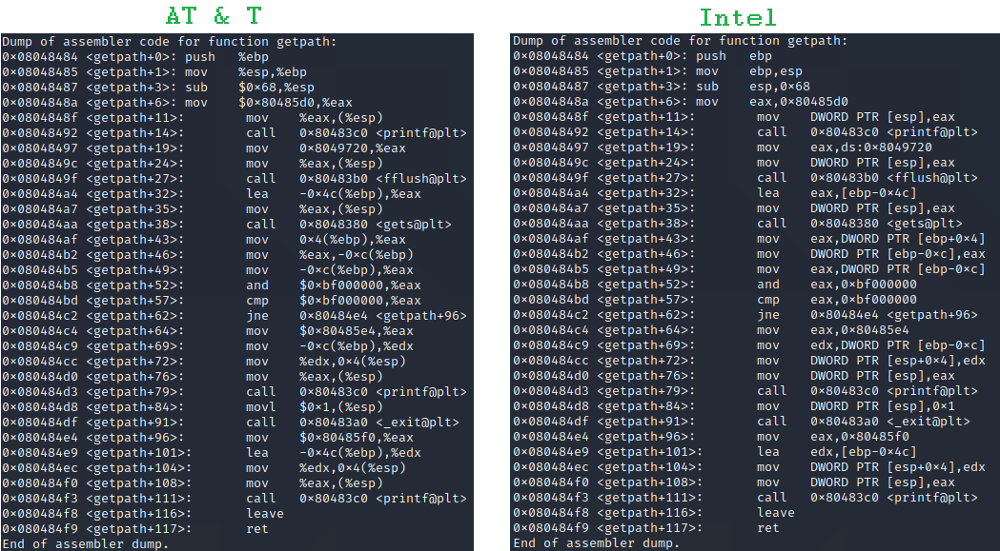

# Assembly

## Disclaimer

I'm still knew to this field, so i might not always use the rights terms. It's also possible that i generalize concepts specific to the few architecture i studied and vice-versa.

## Generalities

* Assembly is the language closest to the machine
  * As such, each type of processor has a different set of instructions \(such as `mov`, jumps, etc\) with different opcodes \(hex number identifying an instruction\)
* This page will mostly speak about **IA-32 architecture using the x86 instruction set** \(i'm not entirely sure of the terminology\)

## AT&T vs Intel syntax

* On x86 architecture, there's 2 different possible syntax to write assembly

* The list of differences is as follows :
  * Register reference  
    * AT & T  use `%` as a prefix  :`%esp`
    * Intel don't use any prefix : `esp`
  * Constant variable
    * AT & T use `$` as a prefix : `$10`, `$0x80485d0`
    * Intel don't use any prefix : `10`, `0x80485d0`
  * Offset
    * AT & T : `0x10(%esp)`
    * Intel : `[esp+0x10]`
  * Order of parameters
    * AT&T : `mov src,dest`
    * Intel : `mov dest,src`
  * Data size 
    * AT&T  use different suffix `movl ..`
    * Intel use different keywords words `mov DWORD PTR ...`
      * `DWORD` here means 4 bytes, while a `WORD` would be 2 bytes

## Registers

* Access to memory takes time, so processors have some internal memory called **registers** that are faster to access
* Their number depends on the architecture
* In IA-32 architecture, there's :
  * Ten 32-bit registers
  * Six 16-bit registers
  * These are divided in categories :
    * General, subdivided in :
      * Data
      * Pointer
      * Index
    * Control
    * Segment
  * Even if other architectures have more or less registers, some concept still exist, like the stack or instruction pointers
* 32-bits register are called "extended ...", like **extended instruction pointer** `(eip)`
  * The lowest \(rightmost\) 16-bits part will be called the `ip`
  * For some registers, like `eax`, it can be further divided. The high part of `ax` is `ah` and the low part `al`

### **Data**

* 32-bit registers that can be divided in 16-bits or 8-bits parts if needed
* `eax` Primary accumulator, used in I/O & arithmetic
* `ebx` Base register, used in index addressing
* `ecx` Count Register, used in iterative operations
* `edx` Data register, used along `eax` for long values

### Pointer

* 32-bit registers \(but actually only the rightmost 16 bits is used if i understood correctly\)
* `eip` Store the offset address of the **next instruction** to read
  * Appended to  `cs` it gives the absolute address within the code segment
  * `eip` is sometime called `pc` for _Program Counter_
* `esp` Store the offset address of **the top of the stack**
  * Appended to `ss` it gives the absolute address within the stack segment
* `ebp` Makes it easier to access the **function arguments** by storing the address pointed by **`esp`** at the start of the new function
  * Since `esp` will change during the course of the function, it can't be use reliably for that
  * We can also say it separate the stack area \(aka **stack frame**\) of the new function from the old one

### Index

* 32-bit registers that can be divided in 16-bits parts if needed
* Used for string operations
* `esi` Source index
* `edi` Destination index

### Control

* The control register contains flag bits that are set during arithmetic operations and then used in condition \(like jumps\)
* Possible flag \(in, to my opinion, most to less useful order\) :
  * **Zero Flag \(ZF\)** - Indicates if the result of an operation equal 0
    *  Also called the **Equal Flag** because it's used in compare instruction to see if two values are equal \(by subtracting them\)
  * **Interrupt Flag \(IF\)** - Enable \(with 1\) or disable \(with 0\) external interrupts, like from a keyboard
  * **Trap Flag \(TF\)** - Allows to single-step forward instruction for debugging
  * **Sign Flag \(SF\)** - Indicates the sign of the result of an operation \(1 if negative\)
  * **Parity Flag \(PF\)** - If the number of 1-bits in the result is even, it's set to 0, otherwise 1
  * **Carry Flag \(CF\)** - Contains either :
    * The carry of 0 or 1 from the high-order \(leftmost\) bit after an operation
    * The contents of the last bit of a shift or rotate operation
  * **Overflow Flag \(OF\)** - Indicates the overflow of the high-order \(leftmost\) bit after a signed operation 
  * **Direction Flag \(DF\)** - Determines direction when working with strings, 0 for left-to-right, 1 for right-to-left
  * **Auxiliary Carry Flag \(AF\)** - Contains the carry from bit 3 to 4 after an operation
* In the register, this is the position of the flags :

| 11 | 10 | 9 | 8 | 7 | 6 | 5 | 4 | 3 | 2 | 1 | 0 |
| :--- | :--- | :--- | :--- | :--- | :--- | :---: | :--- | :--- | :--- | :--- | :--- |
| O | D | I | T | S | Z |  | A |  | P |  | C |

* I don't know what the rest of the bits are used for

### Segment

* Specific area are reserved for the data, the code & the stack
* Six 16 bits registers keep the starting address of these segment
* `cs` for the **code segment**
* `ss` for the **stack segment**
* `ds` for the **data segment**
* `es`, `fs` & `gs` provides additional segment

## Instructions

* Each processor has a corresponding set of instructions that can be use with it
* Some have more than others, but some basic one exist in each \(or so i think\)
* I'll detail them here, however, the orders of parameters might change from one syntax to another, so check that. I'll just explain the general idea
* The args can be addresses, registers, function name, values, etc. Use what makes sense

| Instruction | Explanation |
| :--- | :--- |
| `push <arg1>` | Pushes arg1 to the stack, so decrement `sp` and writes arg1 at `sp` |
| `pop <arg1>` | Pops the stack to arg1, so set arg1 to `sp`and increment `sp` |
| `call <arg1>` | Calls a function, for that it pushes the current value of `ip` to the stack and then changes `ip` to arg1 |
| `ret` | Return \(aka exit\) a function, so pops the stack to `ip` |
| `mov <arg1>,<arg2>` |  Copy the value |
| `lea <arg1>, <arg2>` | Copy the address |
| `add <arg1>,<arg2>` | Performs addition between arg1 & arg2 |
| `sub <arg1>,<arg2>` | Performs subtraction between arg1 & arg2 |
| `cmp <arg1>,<arg2>` | Compares the arguments by subtracting arg2 from arg1 and set the flags \(for example the Zero Flag\) in consequence |
| `and <arg1>,<arg2>` | Performs bitwise and between arg1 & arg2 |
| `or <arg1>,<arg2>` | Performs bitwise or between arg1 & arg2 |

### Jump

* There's also a lot of jumps available
* They look at flags to decide what to do
* The syntax is `jmp <address | func_name>`
  * It will change `ip` to the given address
* Some of them are :
  * `jmp` Unconditional jump
  * `jz / je` Zero \(aka equal\)
  * `jnz / jne` Not zero \(aka not equal\)

## Disassemble

* Disassembling means converting back a binary to assembly code
* Some functions/instructions might not be written into memory when you launch a program \(they can be written from a loop afterwards for example\)
  * In this case, they won't be initially disassemble by your debugger, you need to do it explicitly afterwards \(with an online tool for example\)

## Sources

* Syntax : [web.mit.edu](http://web.mit.edu/rhel-doc/3/rhel-as-en-3/i386-syntax.html)
* Registers : [Tutorialspoint](https://www.tutorialspoint.com/assembly_programming/assembly_registers.htm)
* Instruction : excercises & experiments

