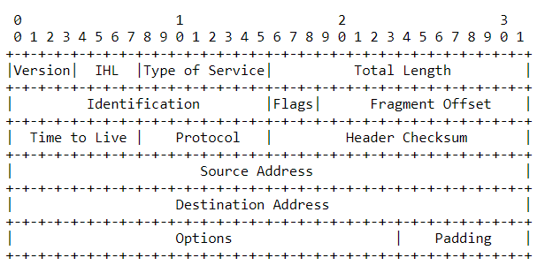

# Hacking : The Art of Exploitation Notes

## RFC notes

* The internet protocol uses four key mechanisms in providing its
   service:  Type of Service, Time to Live, Options, and Header Checksum.
  *  The Type of Service is used to indicate the quality of the service

      desired.  The type of service is an abstract or generalized set of

      parameters which characterize the service choices provided in the

      networks that make up the internet.  This type of service indication

      is to be used by gateways to select the actual transmission parameters

      for a particular network, the network to be used for the next hop, or

      the next gateway when routing an internet datagram.

  *   The Header Checksum provides a verification that the information used

      in processing internet datagram has been transmitted correctly.  The

      data may contain errors.  If the header checksum fails, the internet

      datagram is discarded at once by the entity which detects the error


* It's the Internet Protocol who decides where to route the data. At each stops, the local part \(the ethernet frame\) is removed, the content is passed to the IP module, which decide if it's for an application on this host or for somebody else, in which case it's decide what is the next hop, give to the Ethernet module this local address, which will re-create a local part and pass it to the first layer to move it


* The function or purpose of Internet Protocol is to move datagrams

    through an interconnected set of networks.  This is done by passing

    the datagrams from one internet module to another until the

    destination is reached.

* A distinction is made between names, addresses, and routes \[4\].   A

      name indicates what we seek.  An address indicates where it is.  A

      route indicates how to get there.  The internet protocol deals

      primarily with addresses.  It is the task of higher level \(i.e.,

      host-to-host or application\) protocols to make the mapping from

      names to addresses.   The internet module maps internet addresses to

      local net addresses.  It is the task of lower level \(i.e., local net

      or gateways\) procedures to make the mapping from local net addresses

      to routes.

* Addresses are fixed length of four octets \(32 bits\).  An address

      begins with a network number, followed by local address \(called the

      "rest" field\)

* Fragmentation of an internet datagram is necessary when it

      originates in a local net that allows a large packet size and must

      traverse a local net that limits packets to a smaller size to reach

      its destination.

  * An internet datagram can be marked "don't fragment."  Any internet

        datagram so marked is not to be internet fragmented under any

        circumstances.  If internet datagram marked don't fragment cannot be

        delivered to its destination without fragmenting it, it is to be

        discarded instead.

* The internet fragmentation and reassembly procedure needs to be able

      to break a datagram into an almost arbitrary number of pieces that

      can be later reassembled.  The receiver of the fragments uses the

      identification field to ensure that fragments of different datagrams

      are not mixed.  The fragment offset field tells the receiver the

      position of a fragment in the original datagram.  The fragment

      offset and length determine the portion of the original datagram

      covered by this fragment.  The more-fragments flag indicates \(by

      being reset\) the last fragment.  These fields provide sufficient

      information to reassemble datagrams.

  * The identification field is used to distinguish the fragments of one

        datagram from those of another.  The originating protocol module of

        an internet datagram sets the identification field to a value that

        must be unique for that source-destination pair and protocol for the

        time the datagram will be active in the internet system.  The

        originating protocol module of a complete datagram sets the

        more-fragments flag to zero and the fragment offset to zero.

  * To fragment a long internet datagram, an internet protocol module

        \(for example, in a gateway\), creates two new internet datagrams and

        copies the contents of the internet header fields from the long

        datagram into both new internet headers.  The data of the long

        datagram is divided into two portions on a 8 octet \(64 bit\) boundary

        \(the second portion might not be an integral multiple of 8 octets,

        but the first must be\).  Call the number of 8 octet blocks in the

        first portion NFB \(for Number of Fragment Blocks\).  The first

        portion of the data is placed in the first new internet datagram,

        and the total length field is set to the length of the first
     datagram.  The more-fragments flag is set to one.  The second portion of the data is placed in the second new internet datagram,

        and the total length field is set to the length of the second

        datagram.  The more-fragments flag carries the same value as the

        long datagram.  The fragment offset field of the second new internet

        datagram is set to the value of that field in the long datagram plus

        NFB.

  * To assemble the fragments of an internet datagram, an internet

        protocol module \(for example at a destination host\) combines

        internet datagrams that all have the same value for the four fields:

        identification, source, destination, and protocol.  The combination

        is done by placing the data portion of each fragment in the relative

        position indicated by the fragment offset in that fragment's

        internet header.  The first fragment will have the fragment offset

        zero, and the last fragment will have the more-fragments flag reset

        to zero.



* Headers :

  * The Version field indicates the format of the internet header.  This

        document describes version 4. \(4 bits\)

  * Internet Header Length is the length of the internet header in 32

        bit words, and thus points to the beginning of the data.  Note that

        the minimum value for a correct header is 5. \(4 bits\)

  * Read zype of service
  * Total Length:  16 bits
    * Total Length is the length of the datagram, measured in octets,

          including internet header and data.  This field allows the length of

          a datagram to be up to 65,535 octets.  Such long datagrams are

          impractical for most hosts and networks.  All hosts must be prepared

          to accept datagrams of up to 576 octets \(whether they arrive whole

          or in fragments\).  It is recommended that hosts only send datagrams

          larger than 576 octets if they have assurance that the destination

          is prepared to accept the larger datagrams.

    * The number 576 is selected to allow a reasonable sized data block to

          be transmitted in addition to the required header information.  For

          example, this size allows a data block of 512 octets plus 64 header

          octets to fit in a datagram.  The maximal internet header is 60

          octets, and a typical internet header is 20 octets, allowing a

          margin for headers of higher level protocols.
  * Identification:  16 bits
    * An identifying value assigned by the sender to aid in assembling the

          fragments of a datagram.
  * Flags:  3 bits
    , Various Control Flags.
    * Bit 0: reserved, must be zero
    * Bit 1: \(DF\) 0 = May Fragment,  1 = Don't Fragment.
    * Bit 2: \(MF\) 0 = Last Fragment, 1 = More Fragments.
  * Fragment Offset:  13 bits
    * This field indicates where in the datagram this fragment belongs.The fragment offset is measured in units of 8 octets \(64 bits\).  The
       first fragment has offset zero.
  * Time to Live:  8 bits
    * This field indicates the maximum time the datagram is allowed to

          remain in the internet system.  If this field contains the value

          zero, then the datagram must be destroyed.  This field is modified

          in internet header processing.  The time is measured in units of

          seconds, but since every module that processes a datagram must

          decrease the TTL by at least one even if it process the datagram in

          less than a second
  * Protocol:  8 bits
    * This field indicates the next level protocol used in the data

          portion of the internet datagram.  The values for various protocols

          are specified in "Assigned Numbers" \[9\].
  * Header Checksum:  16 bits
    * A checksum on the header only.  Since some header fields change

          \(e.g., time to live\), this is recomputed and verified at each point

          that the internet header is processed.

    * For purposes of computing the checksum, the value of the checksum field is zero.
  * Source Address:  32 bits
  * Destination Address:  32 bits
  * Add options details
  * Padding:  variable
    *  The internet header padding is used to ensure that the internet

          header ends on a 32 bit boundary.  The padding is zero.

* Fragmentation and Reassembly.
  * The internet identification field \(ID\) is used together with the

        source and destination address, and the protocol fields, to identify

        datagram fragments for reassembly.

  * The More Fragments flag bit \(MF\) is set if the datagram is not the

        last fragment.  The Fragment Offset field identifies the fragment

        location, relative to the beginning of the original unfragmented

        datagram.  Fragments are counted in units of 8 octets.  The
     fragmentation strategy is designed so than an unfragmented datagram has all zero fragmentation information \(MF = 0, fragment offset =
      0\).  If an internet datagram is fragmented, its data portion must be

        broken on 8 octet boundaries.
     This format allows 8192 fragments of 8 octets each for a

        total of 65,536 octets. 

  *  When fragmentation occurs, some options are copied, but others

        remain with the first fragment only.

  * Every internet module must be able to forward a datagram of 68

        octets without further fragmentation.  This is because an internet

        header may be up to 60 octets, and the minimum fragment is 8 octets.

  * Every internet destination must be able to receive a datagram of 576

        octets either in one piece or in fragments to be reassembled.

  * The maximum sized datagram that can be transmitted through the

          next network is called the maximum transmission unit \(MTU\).


* Type of Service
  *  Precedence.  An independent measure of the importance of this

        datagram.

  * Delay.  Prompt delivery is important for datagrams with this

        indication.

  * Throughput.  High data rate is important for datagrams with this

        indication.

  * Reliability.  A higher level of effort to ensure delivery is

        important for datagrams with this indication.


* Internet protocol errors may be reported via the ICMP messages


## PLT & GOT

* Since a program could use a function in a shared library many times, it’s useful to have a table to reference all the functions. Another special section in compiled programs is used for this purpose—the procedure linkage table \(PLT\). This section consists of many jump instructions, each one corresponding to the address of a function. It works like a springboard—each time a shared function needs to be called, control will pass through the PLT.
  * the procedure linking table is shown to be read only.
  * they aren’t jumping to addresses but to pointers to addresses
  * These addresses exist in another section, called the global offset table \(GOT\), which is writable. These addresses can be directly obtained by displaying the dynamic relocation entries for the binary by using objdump.
  * . Another advantage of overwriting the GOT is that the GOT entries are fixed per binary, so a different system with the same binary will have the same GOT entry at the same add

## GDB

* One elegant solution to this problem is to attach to the process after it’s already running. In the output below, GDB is used to attach to an alreadyrunning tinyweb process that was started in another terminal. The source is recompiled using the -g option to include debugging symbols that GDB can apply to the running process. 
  * reader@hacking:~/booksrc $ ps aux \| grep tinyweb root 13019 0.0 0.0 1504 344 pts/0 S+ 20:25 0:00 ./tinyweb reader 13104 0.0 0.0 2880 748 pts/2 R+ 20:27 0:00 grep tinyweb reader@hacking:~/booksrc $ gcc -g tinyweb.c 
  * reader@hacking:~/booksrc $ sudo gdb -q --pid=13019 --symbols=./a.out 
  * Using host libthread\_db library "/lib/tls/i686/cmov/libthread\_db.so.1". Attaching to process 13019 /cow/home/reader/booksrc/tinyweb: No such file or directory. A program is being debugged already. Kill it? \(y or n\) n Program not killed.

## Bash commands

```text
reader@hacking:~/booksrc $ $(perl -e 'print "uname";') 
Linux 
reader@hacking:~/booksrc $ una$(perl -e 'print "m";')e
Linux
```

* `seq` in bash
  * for i in $\(seq 1 3 10\)
* The nm command lists symbols in object files. This can be used to find addresses of various functions in a program

