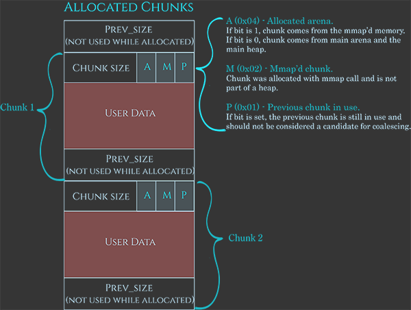

# Draft

## Introduction

* Stands for _Memory Allocation_
* It's a function that wraps syscall to allocate \(reserve\) memory on the heap for the user
  * In order to do that, it adds metadata in front of the space
  * The combo of metadata + space is called a **chunk**
* When the memory isn't needed anymore, it must be **freed** to make it available for something else
  * Give to `free` a pointer returned by `malloc` and the likes
* There's multiple implementations of `malloc`, for example :
  * Google Chrome's _PartitionAlloc_ 
  * FreeBDS's _jemalloc_
  * _ptmalloc`,`_ based on _dlmalloc ****_\(Doug Lea's malloc\)
  * **glibc's malloc**, which this summary concentrate on
* To explain the process of allocation and free, i must first explain bins & arenas

## Bins

* The freed chunk are stored into list, called bins, of different types :
  * Single linked list :
    * Unsorted bin
    * tcache bins
    * Fast bins
  * Double linked list :
    * Small bins
    * Large bins
  * This enable different optimization
* **Small** bins :
  * There's a small bin for every size up to 512 \(by multiple of 8\)
    * I wasn't able to verify that number
  * Because of that, the chunk are automatically sorted by size and fast to retrieve
* **Large** bins :
  * It's not doable to have a bin for every possible size
  * So instead of having a size/bin like small bins, large one have a range-of-size/bin
  * This range grows with time, meaning that for example the first large bin will have a range of sizes of 32 bytes, while the last ones might have a range in the thousands
* The **unsorted** bin :
  * There's only one
  * Before being sorted in the right bin, the chunks are put in this one because chunks are often freed just to be allocated again directly
* **Fast** bins :
  * These are the fastest to use
  * They keep small recently freed chunks to re-use them for the same reason of the unsorted bin
* **TCache** \(per thread cache\) bin
  * The process for a thread to obtain the heap lock is long, so to avoid that each threads has some tcache bin
  * They function like fast bins

## Arenas

* For multi-threads applications, we need to prevent race condition
* Before, they simply locked the whole heap for each operation, but it wasn't very efficient
* Now there's **arenas**, with each their own heap, they're independent from each other
* Process for each new thread :
  * Try to find an arena that isn't tied to a thread and tie the new thread to it
  * If there isn't one, create a new one
  * If the limit is reached, tie the new thread to an existing arena, they'll share it

### Subheap


I'm not happy with this part


* The main arena and it's heap are stored in memory directly after the program code
  * They're extended at the start with `sbrk`
* New arenas are created with `mmap` with the flag `PROT_NONE` set to indicate that the space only need to be reserved, not allocated
* After that, we can extend them by changing the flag to `PROT_READ` or `PROT_WRITE`
* Memory structure :

## Chunk structure

### Allocated

* The meaning of the 3 flags :
  * `A` Specify if the chunk is in the main arena or an allocated one
  * `M` Specify if the chunk was allocated with `mmap` and therefore not part of the heap
  * `p` Specify if the previous chunk is allocated or free, in order to know if it can be merged with this one on a free

### Freed

* The flags are the same as for the allocated chunks
* The free space is used to store pointers & ......

## Process

### Allocation

* If there's a chunk of the corresponding size in a **tcache bin**, return it
* If the request is **enormous**, allocate a chunk off-heap via `mmap`
  * Set the `M` flag
* Otherwise, search for an existing chunk of the right size in this order :
  * Search in **fast** & **small bins**
    * Start with the fast ones
    * **Fill the tcache** bins as you go through them
    * Return on the first correspondence
  * Search in the **unsorted bin**
    * **Free** the entries in the **fast** bins \(which will place their merged chunk in the unsorted bin\)
    * **Fill** **the** **small**/**large** bin as you go through it
    * Return on the first correspondence
  * Search the **large bins**
* If there's no existing chunk of the right size, create a new one from the **top of the heap**
  * If it's not big enough, extend it with `sbrk`
  * If it can’t be extended, create a discontinuous extension using `mmap`
    * Set the `A` flag accordingly
* If all else fails, return `NULL`

### Free

* Subtract the metadata's size to the address to retrieve the real address of the allocated chunk
* Do some **checks** :
  * The allocation is aligned
  * The size is possible \(not too small/large, wrongly aligned or overlapping reserved space, etc\)
  * The chunk lies within the boundaries of the arena
  * The chunk isn't already marked as free by the next chunk `P` flag
* Then, do as follow :
  * If it fits into a **tcache bin**, store it there
  * If the M flag is set, use `munmap`
  * Otherwise obtain the arena heap lock and :
    * If the chunk fits into a **fast bin**, put it there
    * If the chunk is superior to a given size, **merge** **the** **fast** **bins** and put the resulting chunks in the **unsorted** **bin**
    * **Merge** the chunk backward then forward and then either :
      * Absorb it into the heap if it's near the end of it
      * Place it into the **unsorted bin**

## Rules for dev

* To prevent simple vulnerabilities, devs needs to follow those rules :

* In C++, we use `new` instead of `delete`, but the logic is the same

## phrack article

* These articles speaks about that :
  * [Once upon a free\(\)](http://phrack.org/issues/57/9.html)
  * [Malloc des-maleficarum](http://phrack.org/issues/66/10.html)
  * [The house of lore](http://phrack.org/issues/67/8.html)
  * [Advance Doug Lea's malloc exploits](http://phrack.org/issues/61/6.html)
  * [Yet another free\(\) exploitation technique](http://phrack.org/issues/66/6.html)

## Source

* [Azeria's lab](https://azeria-labs.com/heap-exploitation-part-1-understanding-the-glibc-heap-implementation/)

