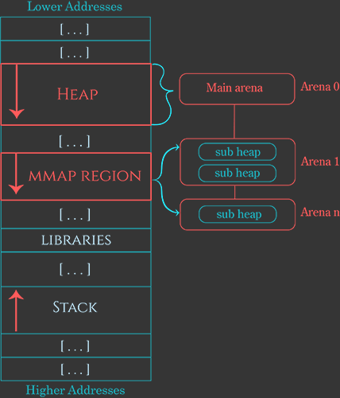

# Draft

## Misc

* Previous chunk is in use - if set, the previous chunk is still being used by the application, and thus the prev\_size field is invalid. 
  * Note - some chunks, such as those in fastbins \(see below\) will have this bit set despite being free'd by the application. This bit really means that the previous chunk should not be considered a candidate for coalescing - it's "in use" by either the application or some other optimization layered atop malloc's original code

## Introduction

* _malloc_ stands for _Memory Allocation_
* It's a function that wraps syscall to allocate \(reserve\) memory on the heap for the user
* There's multiple implementations of `malloc`, for example :
  * Google Chrome's _PartitionAlloc_ 
  * FreeBDS's _jemalloc_
  * _ptmalloc_ \(pthreads malloc\)_,_ based on _dlmalloc ****_\(Doug Lea's malloc\)
  * **glibc's malloc** \(based on ptmalloc\), which this summary concentrate on
* Before explaining the process in itself, i need to explain some concepts

## Arenas

* With multi-threads applications, we need to prevent race condition
  * Instead of simply locking the heap for each operation, it's divided in multiple **arenas** that are independent from each other
* An arena is a structure that contains :
  * A pointer to the next arena
  * Pointers to its bins \(see below\)
  * Pointers to its heaps
* The initial arena uses the program heap, while the others uses `mmap` 'ed ones
  * There's a static pointer to the initial arena
* For each new thread :
  * Search for an arena that isn't already tied to a thread
  * If there isn't one, create a new one
  * If the limit is reached, tie the new thread to an existing arena, they'll share it
* By default, the maximum number of arenas is 8 \* number of CPUs in the system
* Each thread has a cache \(called a **tcache**\) containing a few bins that can be accessed without locking the arena
  * There's a limit to how many chunks are kept in each tcache bin

### Subheap


I'm not happy with this part


* The main arena and it's heap are stored in memory directly after the program code
  * They're extended at the start with `sbrk`
* New arenas are created with `mmap` with the flag `PROT_NONE` set to indicate that the space only need to be reserved, not allocated
* After that, we can extend them by changing the flag to `PROT_READ` or `PROT_WRITE`
* Memory structure :

## Chunks

* The memory is divided into **chunk**, which contains metadata about the chunks followed by some memory space
  * `malloc` returns a pointer to the space
* In an **allocated** chunk, the space is reserved for the user to use
* A **free** chunk is available for allocation, and its space contains further data about other free chunks
* \`\`

* The meaning of the 3 flags :
  * `A` Allocated arena \(0x04\) - Specify if the chunk is in the main arena or an allocated one
  * `M` Mmap'ed chunked \(0x02\) - Specify if the chunk was allocated with `mmap` and therefore not part of the heap
  * `P` Previous chunk is in use \(0x01\) - Specify if the previous chunk is allocated or free, in order to know if it can be merged with this one on a free

* Also, the last word in a free'd chunk contains a copy of the chunk size \(with the three LSBs set to zeros, vs the three LSBs of the size at the front of the chunk which are used for flags\).
  * Within the malloc library, a "chunk pointer" or _mchunkptr_ does _not_ point to the beginning of the chunk, but to the last word in the previous chunk - i.e. the first field in mchunkptr is not valid unless you know the previous chunk is free.

## Bins

* Instead of storing freed chunk into a single list, they're stored into multiple list of different types, called bins, to enable optimization strategies
* **Small** & **large** bins are sorted by size
  * There's a small bin for each size up to x \(by multiple of 8\)
  * There's a large bin for each range of size up to x
    * The range grows with time, meaning that the 1st large bin might contains chunk between x  and x+60 bytes, while following ones might contain chunks between x and x+1000 bytes
  * They're double linked to allow **merging** adjacent chunks
* Oftentimes, chunks are freed just to be allocated again soon after with the same size, in which case the process of sorting a chunk in the right bin is a waste of time. To prevent that, 2 types of bins are used :
  * **Fast bins** store recently freed small chunk
    * I think that like for small bins, there's one for each size up to a certain one
    * In fast bins, chunks are never merged, so there's no need for them to be double-linked
  * The **unsorted** bin : chunks are put here before `malloc` either sort them in small/large bins or directly re-use them
  * **Tcache bins** are like fast bins but they're stored in the cache of a thread, so that it doesn't need to lock the arena to access them

## Process

### Allocation

* If there's a chunk of the corresponding size in a **tcache bin**, return it
* If the request is large enough, allocate a chunk off-heap via `mmap`
  * Set the `M` flag
  * The threshold is by default dynamically chosen
* Otherwise, search for an existing chunk of the right size in this order :
  * Search in **fast** & **small bins**
    * Start with the fast ones
    * If there's multiple chunk of the right size, **fill the tcache** bins with them
    * Return on the first correspondence
  * Search in the **unsorted bin**
    * **Free** the entries in the **fast** **bins** \(which will place their merged chunk in the unsorted bin\)
    * **Fill** **the** **small**/**large** **bins** as you go through the unsorted one
    * Return on the first correspondence
  * Search the **large bins**
* If there's no existing chunk of the right size, create a new one from the **top of the heap**
  * If it's not big enough, extend it with `sbrk`
  * If it can’t be extended, create a discontinuous extension using `mmap`
    * Set the `A` flag accordingly
* If all else fails, return `NULL`

### Free

* Give to `free` a pointer returned by `malloc` and the likes
  * Free mark a chunk as free to be used again, but it doesn't give back that memory to the OS
* Subtract the metadata's size to the address to retrieve the real address of the allocated chunk
* Do some **checks** :
  * The allocation is aligned
  * The size is possible \(not too small/large, wrongly aligned or overlapping reserved space, etc\)
  * The chunk lies within the boundaries of the arena
  * The chunk isn't already marked as free by the next chunk `P` flag
* Then, do as follow :
  * If it fits into a **tcache bin**, store it there
  * If it fits into a **fast bin**, store it there
  * If the M flag is set, use `munmap`
  * Otherwise obtain the arena heap lock and :
    * If the chunk is superior to a given size, **merge** **the** **fast** **bins** and put the resulting chunks in the **unsorted** **bin**
    * **Merge** the chunk backward & forward and then either :
      * Absorb it into the heap if it's near the end of it
      * Place it into the **unsorted bin**

## Rules for dev

* To prevent simple vulnerabilities, devs needs to follow those rules :

* In C++, we use `new` instead of `delete`, but the logic is the same

## phrack article

* These articles speaks about that :
  * [Once upon a free\(\)](http://phrack.org/issues/57/9.html)
  * [Malloc des-maleficarum](http://phrack.org/issues/66/10.html)
  * [The house of lore](http://phrack.org/issues/67/8.html)
  * [Advance Doug Lea's malloc exploits](http://phrack.org/issues/61/6.html)
  * [Yet another free\(\) exploitation technique](http://phrack.org/issues/66/6.html)

## Source

* [Azeria's lab](https://azeria-labs.com/heap-exploitation-part-1-understanding-the-glibc-heap-implementation/)

