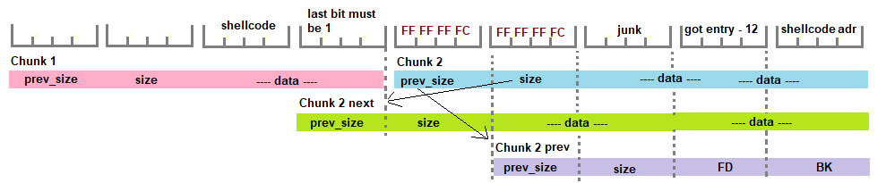

# Malloc vulnerabilities

## Use after free

* Like its name indicate, this vulnerability appears if a variable is used after having been freed
* The "free" space will be allocated again at one point, and when the variable is used again, the data it points too will be the one of another variable \(which we might control\)

## Unlink exploit

* This vulnerability only exist in old version of the glibc malloc
* You'll need 2 allocations next to one another, and a buffer overflow in the 1st one
* If we free an allocated chunk next to another free one, they're merged together
  * Before merging them, the already freed chunk is `unlink()` \(aka removed\), from the double linked list :

```c
#define unlink(P, BK, FD) {   \
  FD = P->fd;                 \
  BK = P->bk;                 \
  FD->bk = BK;                \
  BK->fd = FD;                \
}
```

* `->fd` & `->bk`  are both members of the `malloc_chunk` structure
  * They're respectively written at +8 & +12 bytes from the start of the structure
* The idea is to change the 2nd chunk in a way that makes it possible to abuse the **`unlink()`** function and write arbitrary data at both `FD->bk` & `BK->fd`
  * More precisely, we **overwrite** the `prev_size` and `size` member of the second chunk
    * `prev_size` Determine the size of the previous chunk and if its allocated
    * `size` Determine our since, and therefore the offset to the next chunk
    * We generally can't write `\0` because `strcpy()` and such are used, so we must use negative value \(since they're big unsigned values\)
  * So start by writing `-4` \(**`FFFFFFFC`**\) to both field, and i'll explain the rest with the image :



* When the 2nd chunk is freed, the **`size`** is used to calculate the address of the next chunk
  * Since it's `FFFFFFFC` \(-4\), it's 4 byte before our chunk, in a fake chunk that superposed with ours
  * It will then read the last bit of the `prev_size` member of the next chunk to check if our chunk is indeed allocated
  * Which is why **the last bit before the 2nd chunk must be 1**
* Then, it'll check the last bit of _his_ **`prev_size`**to determine if the previous one is freed
  * It's not in reality, but we make it think so by setting it to 0
  * Since it consider it free, it'll want to merge it with our chunk
  * So it uses its `prev_size` member to calculate the address of the previous chunk
    * The `prev_size` is subtracted to the chunk address, but since ours is `FFFFFFFC` \(-4\), it considers its +4 byte after our chunk
* In this fake previous chunk, we write 2 addresses in what would be the **`FD`** & **`BK`** fields
  * Both must be writable, so the heap and the `.got` are interesting choices
  * The idea is to write the address of our shellcode in lieu of the `.got` entry of some function
  * We subtract 12 from the `.got` entry address, because `BK` \(our shellcode address\)  will be written by `unlink()` at `FD->bk` so FD+12
  * In the same manner, the address of our shellcode + 8 will be overwritten by `unlink()` so you either need a short one, or a jump to after the overwrite
  * The shellcode can be written in the data of the 1st chunk for example

## Sources

* [Medium](https://medium.com/@airman604/protostar-heap-3-walkthrough-56d9334bcd13)
* [aryx.me](https://www.ayrx.me/protostar-walkthrough-heap#toc-3)
* [Liveoverflow's](https://www.youtube.com/watch?v=iyAyN3GFM7A&list=PLhixgUqwRTjxglIswKp9mpkfPNfHkzyeN) binary exploitation series

\*\*\*\*

