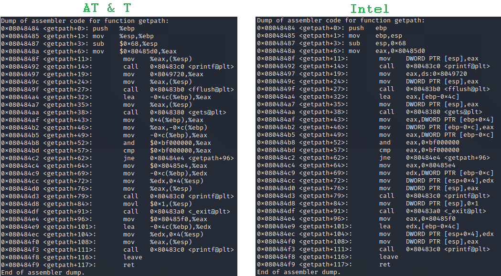

# Assembly

## Disclaimer

I'm still knew to this field, so i might not always use the rights terms. It's also possible that i generalize concepts specific to the few architecture i studied and vice-versa.

## Generalities

* Assembly is the language closest to the machine
* Each type of processor has a different set of instructions \(such as `mov`, jumps, etc\) with different opcodes \(hex number identifying an instruction\)
* This page will mostly speak about **IA-32 architecture using the x86 instruction set** \(i'm not entirely sure of the terminology\)

## AT&T vs Intel syntax

* On x86 architecture, there's 2 different possible syntax to write assembly



* The list of differences is as follows :
  * Register reference  
    * AT & T  use `%` as a prefix  :`%esp`
    * Intel don't use any prefix : `esp`
  * Constant variable
    * AT & T use `$` as a prefix : `$10`, `$0x80485d0`
    * Intel don't use any prefix : `10`, `0x80485d0`
  * Offset
    * AT & T : `0x10(%esp)`
    * Intel : `[esp+0x10]`
  * Order of parameters
    * AT&T : `mov src,dest`
    * Intel : `mov dest,src`
  * Data size 
    * AT&T  use different suffix `movl ..`
    * Intel use different keywords words `mov DWORD PTR ...`
      * `DWORD` here means 4 bytes, while a `WORD` would be 2 bytes
  * In intel `ds:0x..` explicitly specify to take the value at the address \(derefencing a pointer\) while AT&T leave it implied

## Instructions

* Each processor has a corresponding set of instructions that can be use with it
* Some have more than others, but some basic one exist in each \(or so i think\)
* I'll detail them here, however, **the orders of parameters might change** from one syntax to another, so check that. I'll just explain the general idea
* The args can be addresses, registers, function name, values, etc. Use what makes sense

### Stack-related

| Instruction | Explanation |
| :--- | :--- |
| `push <arg1>` | Pushes arg1 to the stack, so decrement `sp` and writes arg1 at `sp` |
| `pop <arg1>` | Pops the stack to arg1, so set arg1 to `sp`and increment `sp` |
| `call <arg1>` | Calls a function, for that it pushes the current value of `ip` to the stack and then changes `ip` to arg1 |
| `ret` | Return \(aka exit\) a function, so pops the stack to `ip` |

### Misc important

| Instruction | Explanation |
| :--- | :--- |
| `mov <arg1>,<arg2>` |  Copy the value |
| `lea <arg1>,<arg2>` | Copy the address \(like the address-of operator\) |
| `int <value>` | Trigger the specified interrupt |
| `xchg <arg1>,<arg2>` | Swap the 2 values |

### Operation

| Instruction | Explanation |
| :--- | :--- |
| `add <arg1>,<arg2>` | Performs addition between arg1 & arg2 |
| `sub <arg1>,<arg2>` | Performs subtraction between arg1 & arg2 |
| `inc <arg1>` | Increment arg1 |
| `dec <agr1>` | Decrement arg1 |

### Condition

| Instruction | Explanation |
| :--- | :--- |
| `cmp <arg1>,<arg2>` | Compares the arguments by subtracting arg2 from arg1 and set the flags \(for example the Zero Flag\) in consequence |
| `and <arg1>,<arg2>` | Performs bitwise and between arg1 & arg2 |
| `or <arg1>,<arg2>` | Performs bitwise or between arg1 & arg2 |
| `xor <arg>,<arg2>` | Performs bitwise xor between arg1 & arg2 |

* There's also a lot of jumps available
* They look at flags to decide what to do
* The syntax is `jmp <address | func_name>`
  * It will change `eip` to the given address
* Some of them are :
  * `jmp` Unconditional jump
  * `jz / je` Zero \(aka equal\)
  * `jnz / jne` Not zero \(aka not equal\)

## Code

Assembly code can look like that

```text
helloworld.asm

section .data    ; Data segment
msg     db "Hello, world!", 0x0a    ; The string and newline char

section .text    ; Text segment
global _start    ; Default entry point for ELF linking

_start:

 ; SYSCALL: write(1, msg, 14)
 mov eax, 4    ; Put 4 into eax, since write is syscall #4.
 mov ebx, 1    ; Put 1 into ebx, since stdout is 1.
 mov ecx, msg    ; Put the address of the string into ecx.
 mov edx, 14     ; Put 14 into edx, since our string is 14 bytes.
 int 0x80      ; Call the kernel to make the system call happen.
 
 ; SYSCALL: exit(0)
 mov eax, 1    ; Put 1 into eax, since exit is syscall #1.
 mov ebx, 0    ; Exit with success.
 int 0x80      ; Do the syscall.
```

## Disassemble

* Disassembling means converting back a binary to assembly code
* Some functions/instructions might not be written into memory when you launch a program \(they can be written from a loop afterwards for example\)
  * In this case, they won't be initially disassemble by your debugger, you need to do it explicitly afterwards \(with an online tool for example\)

## Interrupts

* Interrupts stop the flow of the program and give its control to another device \(when the device finished what it has to do, it'll give the control back\)
* Some interesting ones :
  *  `0xCC` Breakpoint, it's a trap to debugger, meaning that when it's raised, control is pass to the debugger
  * `0x80` System calls, it uses some registers :
    * EAX : which syscall
    * EBX, ECX & EDX : 1st, 2nd, 3rd arguments of the syscall

## Tools

* `nasm -f elf <file.asm>` Create an ELF object file
  * By default, it will be named `<source_file_name>.o`
* `ndisasm` Disassembler

## Sources

* Syntax : [web.mit.edu](http://web.mit.edu/rhel-doc/3/rhel-as-en-3/i386-syntax.html)
* Exercises & experiments

