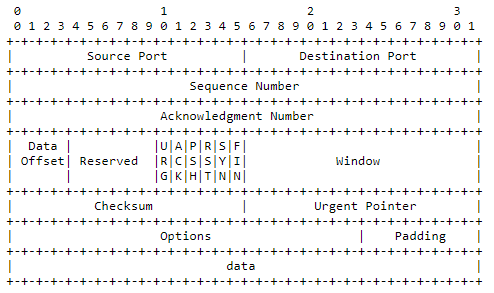

# Clean TCP 2

## Generalities

* More complex and reliable than UDP but slower
* It's base functionalities are :
  * **Data Transfer** : Transfer a continuous stream of bytes in each
     direction between its users
  * **Reliability** : Recovery from damaged, lost, duplicated, or delivered out of order data
  * **Flow Control**
     :  Provides a means for the receiver to govern the amount of data
     sent
  * **Multiplexing** : Allow for many processes within a single host to use TCP
     simultaneously
  * **Connections** : Since data is transferred as a stream and different information needs to be kept for the other functionalities to work, TCP uses the concepts of a connection
  * **Precedence & Security** : Security and precedence can be set
* TCP speaks on one hand to applications, and on the over to protocols of the underlying layer
  * A minimum set of call is expected for the TCP/Application interface :
    * OPEN
    * CLOSE
    * SEND
    * RECEIVE
    * STATUS
  * There's no expectation for the TCP/Protocols interface, except that **asynchronous** dialogue must be possible
    * TCP can work with a wide variety of protocols, and i'll explain some general concepts, but this summary is primarily focused on TCP over IP
* It's a **connected** protocol since it consider the data sent as a stream
* TCP implementations follow a general principle of robustness:  be
   conservative in what you do, be liberal in what you accept from
   others

## Connection

* The data stream between 2 entities is represented by a connection
  * They're uniquely identified by the pair of sockets on each side
* There's no restriction on a particular connection being
   used multiple times
  * New instances of a connection are called incarnations of it

### Sequence numbers

* All bytes of a connection are assigned a **sequence** number from a random **Initial Sequence Number** \(ISN\)
  * The ISN is chosen from a 32-bits clock incremented every ~4 microseconds
  * As such, it''ll cycle after 4.55 hours
  * Since the Maximum Segment Lifetime \(MSL\) is 2 min, the ISN should be unique 
* The seq number of a **segment** is the one of its first byte of data
  * Since the **SYN** request consume a number, the first byte of data of a connection has a seq number of ISN+1
* An ACK segment does not consume a seq number
* Since a connection can be used multiple times, we mustn't use seq numbers that may be in segments still in transit
  * Generally, the previously used number is stored so it's not a problem
  * But after recovering from a **crash** without knowledge of the previously used number, the system must keep quiet for the MSL duration to assure that sequence number will be unique

### Acknowledgement number

* The **acknowledgment** number is used to confirm the reception of data
* It's value is the next **sequence** number that the receiver will use
  * An ack of X means that all bytes up to but not including X have been received
* It is sent along every segment except for the inital SYN
* An ack does not guarantee that the data has been
   delivered to the end user, but only that the receiving TCP has taken
   the responsibility to do so
* When a
   segment is sent, a copy of it is put on a **retransmission queue** with a timer
  * When acknowledgment for that data is received, the
     segment is deleted from the queue  
  * If the acknowledgment is not
     received before the timer runs out, the segment is retransmitted

### Three-Way Handshake

* To establish a connection, each side must synchronize it's sequence number with the other
  * This is done with a process called the **Three-Way Handshake**
  * It still works if the two system simultaneously attempt it
  * The synchronization segment can already carry data, the receiving end will just put them into a buffer until the connection is established


* The principle reason for the three-way handshake is to prevent old

    duplicate connection initiations from causing confusion. 


* For sequence number
   purposes, the SYN is considered to occur before the first actual data

    byte of the segment in which it occurs

  * While the FIN is considered to occur after the last actual byte octet in a segment in which it

      occurs

  * The segment length \(SEG.LEN\) includes both data and sequence
     space occupying controls
  * When a SYN is present then SEG.SEQ is the
     sequence number of the SYN.

* There's also a flag that says that urgent data is coming down the stream. What the receiving end is supposed to do with this information is not specified, but it should try to prioritize this data
* they likewise need to close it afterwards to free the resources used to keep its information
* ```text
   1.  CLOSED                                               LISTEN

    2.  SYN-SENT    --> <SEQ=100><CTL=SYN>               --> SYN-RECEIVED

    3.  ESTABLISHED <-- <SEQ=300><ACK=101><CTL=SYN,ACK>  <-- SYN-RECEIVED

    4.  ESTABLISHED --> <SEQ=101><ACK=301><CTL=ACK>       --> ESTABLISHED

    5.  ESTABLISHED --> <SEQ=101><ACK=301><CTL=ACK><DATA> --> ESTABLISHED
  ```

### Transmission Control Block \(TCB\)

* Disclaimer : I didn't understand if the RFC said to implement it exactly like that, of if it was an example
* Information about a connection are stored inside a TCB, some of them are :
  * Local and remote socket numbers
  * Security & precedence
  * Pointers to :
    * The user's send & receive buffers
    * The retransmit queue
    * The current segment
  * Variables concerning the sent sequence number :
    * SND.UNA - "send unacknowledged
      "
    * Next sequence number
    * Window for segment sent
    * Urgent pointer
    * SND.WL1 - Segment sequence number used for last window update
    * SND.WL2 - Segment acknowledgment number used for last window
       update
    * ISS : Initial Send Sequence number 
  * Receive Sequence Variables
    * Next acknowledgment number
    * Window for segment received
    * Received urgent pointer
    * IRS     -  Initial Receive Sequence number
  * Current Segment Variables
    * SEG.SEQ - Segment sequence number
    * SEG.ACK - Segment acknowledgment number
    * SEG.LEN - Segment length
    * SEG.WND - Segment window
    * SEG.UP  - Segment urgent pointer
    * SEG.PRC - Segment precedence value

### Window

* The receiving TCP specify a window that is the number of bytes starting with the
   acknowledgment number, that it can receive
* Note that when the receive window is zero no segments should be

    acceptable except for ACK

  *  Thus, it's  possible to
     maintain a zero receive window while transmitting data and receiving

      ACKs

    * However, even when the receive window is zero, a TCP must

        process the RST and URG fields of all incoming segments

### Reset & Error handling

* Reset \(RST\) close a connection, the receiver state influence the response :
  * If it's in the LISTEN state, it ignores it
  * If it was in LISTEN and now is in SYN-SENT, it goes back to listen
  * Any other state : it goes to CLOSED
* An RST uses the ack number of the segment it responds to as it's seq number, not the one it should be using \(in case the two ends are de-synchronized\)
  * If the received segment ACK field is not set, it will : 
    * Use 0 as it's seq number
    * Set its ack number to the received segment seq number + length
* RST are sends when :
  * Any segment other than RST is received on a CLOSE connection
  * Any segment with non-matching security settings is received
    * Except if our SYN hasn't yet been acknowledged, then we must try to match the setting or send an RST
  * The connection is in a non-synchronized state and the ack number of the received segment is wrong
* When a connection in a synchronized state receive a segment with an unacceptable ack number, it must return an empty ACK segment with the correct seq and ack fields
  * The connection remains in the same state

## Calls

* An OPEN call is used to create a connection, it can be either : 
  * Active : Actively sending a request to a system to start a connection
  * Passive : Waiting \(listening\) for an incoming request
    * We can specify from whom we await a connection, or accepts any
* The SEND call is used to send data
  * Since the connection is a constant stream of data, they're not given to the application after each new segment arrived
  * Instead, it is placed into a buffer
  * The receiving end can decide when to give the data to the application waiting for it
  * Except if the **PUSH** flag is set, telling the receiving end to immediately push \(give\) the data to the application
* The CLOSE call signifies that there isn't any more data to send
  * A user who does a CLOSE call can continue to RECEIVE until the other side CLOSE too
  * All incoming & buffered data will be push before closing \(and retransmitted if needed\)
  * After a CLOSE call, a FIN segment is sent and the state is changed to FIN-WAIT-1
    * An ACK to the FIN is expected, if it's not coming, the connection will change to the CLOSED state after a certain time
  * Closing a connection is done through a **Four-Way Handshake**
  * Process :
    * One side sends a FIN segment and enter the FIN-WAIT-1 state
    * The other one respond with an ACK
      * It can also send a FIN of its own, or continue to send data
      * The connection will be kept open until it does
      * It also expect an ACK to its FIN, when it's received, it goes to  the CLOSED state

## Headers



* Source Port : 16 bits
* Destination Port : 16 bits
* Sequence Number :  32 bits
* Acknowledgment Numbe r:  32 bits
* Data Offset :  4 bits
  * The number of 32 bit words in the TCP Header
  * Indicates where
     the data begins
* Reserved :  6 bits,
   reserved for future use, must be zero
* Control Bits :  6 bits \(from left to right\) :
  * Bit 0 - URG :  Urgent Pointer field significant
  * Bit 1 - ACK :  Acknowledgment field significant
  * Bit 2 - PSH :  Push Function
  * Bit 3 - RST :  Reset the connection
  * Bit 4 - SYN :  Synchronize sequence numbers
  * Bit 5 - FIN :  No more data from sender
* Window : 16 bits
  * The number of data octets beginning with the one indicated in the

        acknowledgment field which the sender of this segment is willing to

        accept
* Checksum : 16 bits
  * It's value is the 16-bits 1's complement of the 1's
     complement sum of all 16-bits words in the header & text
  * During computation of the checksum :
    * It's value is 0
    * Padding that won't be sent may be added 
  * A 96-bits pseudo header is also virtually prefixed \(it won't be sent along\) to the real header
    * It contains the source & destination addresses, protocol information and the TCP length \(without this pseudo headers\)
    * This protects against misrouted segments
* Urgent Pointer : 16 bits
  * The current value of the urgent pointer as a
     positive offset from the sequence number in this segment
  * The
     urgent pointer points to the sequence number of the octet following
     the urgent data
* Options : Variable
   & Optional
  * May or may not be present, but must be understood by all implementations
  * Their length is a multiple of 8 bits
  * There's either only the 1-byte option type or :
    * The 1-byte option type
    * Plus the 1-byte option length \(which takes the 2 bytes of type + length and the length of the data\)
    * Plus the option data
  * There's 3 possible options :
    * 0 : End of option list \(terminate the list in case it doesn't fall on the end of the header\)
    * 1 : No operation \(filler to align on a boundary for example\)
    * 2 : Maximum segment size
      * Only set with SYN segment
      * Optional, if it's not present any size is allowed
      * Length : 4 \(bytes ?\) 
* Padding : Variable & Optional

## States

* LISTEN : Waiting for a connection request
* SYN-SENT : Waiting for a matching connection request
   after having sent a connection request
* SYN-RECEIVED : Waiting for a confirming connection request acknowledgment after having both received and sent a connection request
* ESTABLISHED : An open connection, data received can be
   delivered to the user
* FIN-WAIT-1 : Waiting for a connection termination request
   from the remote or an acknowledgment of the connection
   termination request previously sent.
* FIN-WAIT-2 : Waiting for a connection termination request
   from the remote TCP.
* CLOSE-WAIT : Waiting for a connection termination request
   from the local user
* CLOSING : Waiting for a connection termination request
   acknowledgment from the remote TCP
* LAST-ACK : Waiting for an acknowledgment of the
   connection termination request previously sent to the remote TCP
   \(which includes an acknowledgment of its connection termination

      request\)

* TIME-WAIT : Waiting for enough time to pass to be sure
   the remote TCP received the acknowledgment of its connection
   termination request
* CLOSED : No connection state at all

