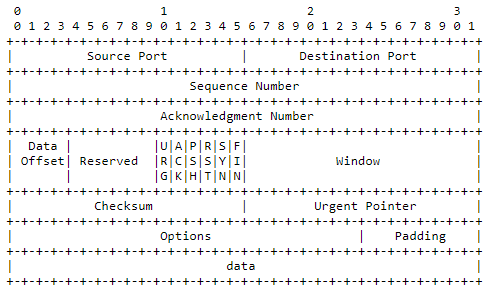

# Clean TCP - Transmission Control Protocol

## Generalities

* TCP can work over a wide variety of protocols for the underlying layer, and i'll explain some general concepts, but this summary is primarily focused on TCP over IP
* TCP speaks on one hand to applications, and on the over to protocols of the underlying layer
  * Some minimum functionalities are expected for the TCP/Application interface
  * There's no other expectation for the TCP/Protocols interface, except that asynchronous dialogue must be possible
* TCP implementations will follow a general principle of robustness:  be

    conservative in what you do, be liberal in what you accept from

    others.

* Those are the base functionalities :
  * Basic Data Transfer : transfer a continuous stream of bytes in each

        direction between its users

  * Reliability : Recovery from damaged, lost, duplicated, or

        delivered out of order data

    * This is achieved by assigning a sequence number to each byte transmitted, and requiring a positive acknowledgment \(ACK\)
    * If the ACK is not received within a timeout interval, the data is retransmitted
    * At the receiver, the sequence
       numbers are used to correctly order segments that may be received
       out of order and to eliminate duplicates.
    * Damage is handled by
       adding a checksum to each segment transmitted, checking it at the
       receiver, and discarding damaged segments

  * Flow Control
     :  Provides a means for the receiver to govern the amount of data
     sent by the sender.
    * This is done through a  "window" given with
       every ACK indicating a range of acceptable sequence numbers beyond
       the last segment successfully received.  The window indicates an
       allowed number of octets that the sender may transmit before
       receiving further permission.
  * Multiplexing : To allow for many processes within a single Host to use TCP
     simultaneously, it provides a set of
     ports within each host.
    * Concatenated with the network
       and host addresses from the internet communication layer, this forms
       a socket.
    * A pair of sockets uniquely identifies each connection.
 
    * That is, a socket may be simultaneously used in multiple
       connections.
  * Connections : see below
  * Precedence and Security : 

    * The users of TCP may indicate the security and precedence of their

        communication.  Provision is made for default values to be used when

        these features are not needed.

* Basic call to implement for the TCP/Application interface :
  * OPEN
  * CLOSE
  * \(PUSH\)
  * SEND
  * RECEIVE
  * STATUS

* Transmission is made reliable via the use of sequence numbers and

    acknowledgments. 

  * each byte of data is assigned a
     sequence number.  The sequence number of the first octet of data in a
     segment is transmitted with that segment and is called the segment

      sequence number. 

  * Segments also carry an acknowledgment number which

      is the sequence number of the next expected data byte of

      transmissions in the reverse direction.

  * When the TCP transmits a
     segment containing data, it puts a copy on a retransmission queue and
     starts a timer; when the acknowledgment for that data is received, the
     segment is deleted from the queue.  
    * If the acknowledgment is not
       received before the timer runs out, the segment is retransmitted.
  * An acknowledgment by TCP does not guarantee that the data has been

      delivered to the end user, but only that the receiving TCP has taken

      the responsibility to do so.

  * To govern the flow of data between TCPs, a flow control mechanism is

      employed.  The receiving TCP reports a "window" to the sending TCP.

    * This window specifies the number of octets, starting with the

        acknowledgment number, that the receiving TCP is currently prepared to

        receive.

## Connection

### TCB

* Disclaimer : I didn't understand if the RFC said to implement it exactly like that, of if it was an example
* Several information are kept about a connection, they're put in a **Transmission Control** **Block** \(TCB\)
* These are some of the info kept :
  * Local and remote socket numbers
  * Security & precedence of the connection
  * Pointers to :
    * The user's send & receive buffers
    * The retransmit queue
    * The current segment
  * Variables concerning the sent sequence number :
    * SND.UNA - The number of the first unacknowledged 
    * SND.NXT - send next
    * SND.WND - send window
    * SND.UP  - send urgent pointer
    * SND.WL1 - Segment sequence number used for last window update
    * SND.WL2 - Segment acknowledgment number used for last window
       update
    * ISS : Initial send sequence number 
  * Receive Sequence Variables

          RCV.NXT - receive next

          RCV.WND - receive window

          RCV.UP  - receive urgent pointer

          IRS     - initial receive sequence number

  * Current Segment Variables

          SEG.SEQ - segment sequence number

          SEG.ACK - segment acknowledgment number

          SEG.LEN - segment length

          SEG.WND - segment window

          SEG.UP  - segment urgent pointer

          SEG.PRC - segment precedence value


I don't know if i want to detail it like that or not


* Each connection is uniquely specified by a pair of sockets
   identifying its two sides.
* To communicate, system must first established a connection
  * And they need to close them to free the resources used for it when it's no longer useful

* An OPEN call is used to create a connection, it can be either : 
  * Active : Actively sending a request to a system to start a connection
    * If two system use active OPEN calls for each other at the same time, the connection will still be correctly established
  * Passive : Waiting \(listening\) for an incoming request
    * We can specify from whom we await a connection, or accepts any
* The process of establishing the connection in itself is called the **Three-Way Handshake**

\*\*\*\*

* The SEND call is used to send data
  * Since the connection is a constant stream of data, they're not given to the application after each new segment arrived
  * Instead, it is placed into a buffer
  * The receiving end can decide when to give the data to the application waiting for it
  * Except if the PUSH flag is set, telling the receiving end to immediately push \(give\) the data to the application

* There's also a flag that says that urgent data is coming down the stream. What the receiving end is supposed to do with this information is not specified, but it should try to prioritize this data

## Headers

* Source Port : 16 bits
* Destination Port : 16 bits
* Sequence Number :  32 bits
  * The sequence number of the first data octet in this segment \(except

        when SYN is present\). If SYN is present the sequence number is the

        initial sequence number \(ISN\) and the first data octet is ISN+1.
* Acknowledgment Number:  32 bits
  * If the ACK control bit is set this field contains the value of the

        next sequence number the sender of the segment is expecting to

        receive.  Once a connection is established this is always sent.
* Data Offset:  4 bits
  * The number of 32 bit words in the TCP Header.  This indicates where

        the data begins.  The TCP header \(even one including options\) is an

        integral number of 32 bits long.
* Reserved:  6 bits,
   reserved for future use, must be zero
* Control Bits:  6 bits \(from left to right\):
  * Bit 0 - URG :  Urgent Pointer field significant
  * Bit 1 - ACK :  Acknowledgment field significant
  * Bit 2 - PSH :  Push Function
  * Bit 3 - RST :  Reset the connection
  * Bit 4 - SYN :  Synchronize sequence numbers
  * Bit 5 - FIN :  No more data from sender
* Window : 16 bits
  * The number of data octets beginning with the one indicated in the

        acknowledgment field which the sender of this segment is willing to

        accept.
* Checksum : 16 bits
  * It's value is the 16-bits 1's complement of the 1's
     complement sum of all 16-bits words in the header & text
  * During computation of the checksum :
    * It's value is 0
    * Padding that won't be sent may be added 
  * A 96-bits pseudo header is also virtually prefixed \(it won't be sent along\) to the real header
    * It contains the source address, destination address, protocol information and the TCP length \(without this pseudo headers\)
    * This protects against misrouted segments
* Urgent Pointer : 16 bits
  * This field communicates the current value of the urgent pointer as a

        positive offset from the sequence number in this segment.  The

        urgent pointer points to the sequence number of the octet following

        the urgent data.  This field is only be interpreted in segments with

        the URG control bit set.
* Options : Variable
   & Optional
  * May or may not be present, but must be understood by all implementations
  * Their length is a multiple of 8 bits
  * There's either only the 1-byte option type or :
    * The 1-byte option type
    * Plus the 1-byte option length \(which takes the 2 bytes of type + length and the length of the data\)
    * Plus the option data
  * There's 3 possible options :
    * 0 : End of option list
      * Terminate the list in case it doesn't fall on the end of the header
    * 1 : No operation \(filler to align on a boundary for example\)
    * 2 : Maximum segment size
      * Only set with SYN segment
      * Optional, if it's not present any size is allowed
      * This option has a length of 4 \(bytes ?\)
* Padding : Variable & Optional

## States

* LISTEN : Represents waiting for a connection request
* SYN-SENT : Represents waiting for a matching connection request
   after having sent a connection request
* SYN-RECEIVED : Represents waiting for a confirming connection request acknowledgment after having both received and sent a connection request
* ESTABLISHED : Represents an open connection, data received can be
   delivered to the user
* FIN-WAIT-1 : Represents waiting for a connection termination request
   from the remote or an acknowledgment of the connection
   termination request previously sent.
* FIN-WAIT-2 : Represents waiting for a connection termination request
   from the remote TCP.
* CLOSE-WAIT : Represents waiting for a connection termination request
   from the local user
* CLOSING : Represents waiting for a connection termination request
   acknowledgment from the remote TCP
* LAST-ACK : Represents waiting for an acknowledgment of the
   connection termination request previously sent to the remote TCP
   \(which includes an acknowledgment of its connection termination

      request\)

* TIME-WAIT : Represents waiting for enough time to pass to be sure
   the remote TCP received the acknowledgment of its connection
   termination request
* CLOSED : Represents no connection state at all

