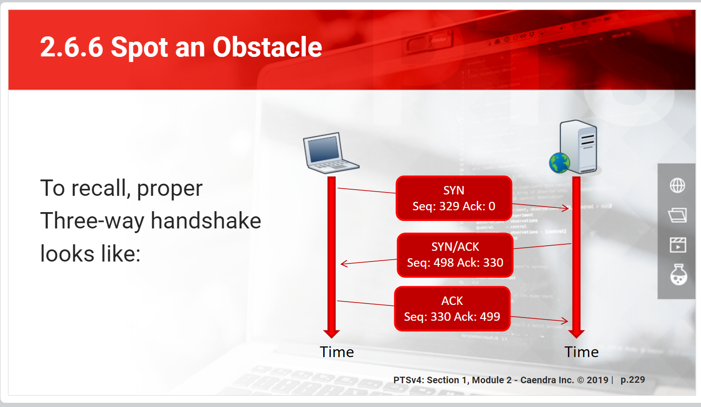

# Layer 4 - Transport

## Generalities

* Transfer of data is handled here 
* "A piece of transport layer data is called a _**segment**_"
* _Transport Control Protocol_ runs over IP but the name TCP/IP refers to the whole family of protocols related to these two : ICMP, UDP and even SCTP, ESP, AH, etc.
* Transport protocols run over both IPv4 & IPv6. The headers change but the concept remains the same.

## _ICMP - Internet Control Message Protocol_

* Low-level connectivity message between hosts \(availability, routing, status, errors, etc\)
* Every host implementing IP needs ICMP, it runs silently in the background
* It's often block for security reasons but that isn't useful because attackers can gain info in other ways and it might cause problems for you
* Transmit similar kind of message over IPv4 & IPv6 but internally very different
* Usage example :
  * **Ping** \(use **ICM Echo Request** & **Reply**\)
  * Datalink error message \(for example frame is too large\)
  * Tell traffic to go another way

## _UDP - User Datagram Protocol_

* Most minimal transport protocol \(0 verification/feedback\)
* UDP is used for applications that do their own data flow error management
* VPNs use it when they don't use VPN specific protocols like IPSec


headers : The UDP header, defined in RFC 768, is relatively tiny. It only contains four 16-bit values in this order: source port, destination port, length, and checksum.


### Flaws

* Called _connectionless_ because it considers each packet has being independent from the others, there's no notion of "data stream"
  * The packets have no defined order and won't react to others having problems
* The source of a packet is easily forged \(which is why they are often heavily filtered\)
* A host transmitting UDP segment has no way to tell if it actually reaches its destination

### Advantages

* It lets the applications build their own correction mechanisms tuned exactly to their needs
* It's really fast

## _TCP - Transmission Control Protocol_

* Carry data between hosts and includes error checking, congestion control and retransmission of lost data
* More complex than UDP
* _Connected_ protocol since it consider packets as a stream
* Application using TCP expects that exactly the traffic sent is delivered
* Includes much of the error handling UDP lacks :
  * The receiver acknowledges every packet received
  * The sender retransmits any packet not acknowledged
  * Packets have a specific order
    * Switches and routers might send them out of order but the receiver will re-arrange them back before transmitting to the application


header & flags : RFC 793

"The sequence number and acknowledgment number are used to maintain state. "

 "After the handshake, every packet in the connection will have the ACK flag turned on and the SYN flag turned off."

"Sequence numbers allow TCP to put unordered packets back into order, to determine whether packets are missing, and to prevent mixing up packets from other connections. When a connection is initiated, each side generates an initial sequence number. This number is communicated to the other side in the first two SYN packets of the connection handshake. Then, with each packet that is sent, the sequence number is incremented by the number of bytes found in the data portion of the packet. This sequence number is included in the TCP packet header. In addition, each TCP header has an acknowledgment number, which is simply the other side’s sequence number plus one."


### Handshakes

The _three-way handshake_ establish a connection between 2 hosts :

* `SYN-SENT` __: A _synchronization request_ \(SYN request\) is sent by the client
  * It comes from a random high-numbered port on the client to a specific port on the server
  * SYN flag turn on in the header
  * A random `seq` number is chosen
* `SYN-ACK`The server acknowledge the request __and respond with it's own SYN request
  * The `ack` number is the initial SYN `seq`  + 1
  * The request comes from the requested port on the server to the client source port
  * SYN and ACK flags turn on in the header
* `ACK` The client acknowledge the server SYN request, the connection is established
  * It also up the server request seq number by 1
  * ACK flag turn on in the header

* The OS forward the data stream to a program only after the three-way handshake is done
  * If the connection stops after it, the problem lies in the server program
  * If it fails before, the OS didn't complete the connection
* A **SYN flood attack** consist of sending lots of SYN request that never goes past the SYN-ACK stage
* When the server and client finished exchanging data, they use the **four-way handshake** to close the connection

### Failures

* If a server or firewall reject/block a connection, it generate a "connection refused" message on the client
* If the server simply ignores it, the client has a "connection timed out" message
* If the client or server has a problem during the connection, they can send a _TCP reset_ message
  * With that, they don't do the four-way handshake to close the connection

## Logical Ports

* TCP & UDP use _logical ports_ to multiplex connections between machines, permitting one host to serve different services to multiple hosts
* A service **binds** itself to a port
* A port is a number between 0 & 65'535
* TCP & UDP ports aren't the same \(but the range is\)
* Each internet service has a standard port defined by the _Internet Assigned Numbers Authority_ \(IANA\)
  * Ports between 49'152 & 65'53 aren't attributed to anything
* A connexion is defined by the IP address + port of the source and the IP address + port of the destination
  * In IPv4 it's written `ip:port`
  * In IPv6 `[ip]:port`

### Services File

* `/etc/services/` On Unix
* `C:\\Windows\System32\drivers\etc\services` On windows
* List services commonly used on the machine and ports normally used for them
  * Some programs use this file to see on what port they should bind on
  * `tcpdump` Use it to look up which services are running and on what
* 5 fields by line :
  * Name of the protocol
  * Port number
  * Transport protocol \(separated from the port number by a /\)
  * Other name of the service \(optional\)
  * `# Comments`
* You're not obligated to follow it and not doing it might be a bypass for badly configured firewalls
* However some programs/host won't accept certain port and you might get strange result by using non standard port

## Sockets

* Communication endpoint for processes
  * Abstraction that takes care of the detail of the transport layer
    * **Raw sockets** let you deal with it yourself, but they demand root access and are inconsistent across systems
  * They're kind of like pipes, but more complex
  * Processes \(for example a web server\)  open a socket on the port they listen to
    * One process can open any number of sockets as long as the OS doesn't object
    * An _open_ or _listening_ socket is waiting for a connection
    * It can accept any numbers of connections so long as all the clients have unique source IP addresses & ports
* 4 types, 2 most common :
  * **Stream** socket for TCP/IP
  * **Datagram** socket for UDP
* Sockets are identified via socket descriptors \(which are actually **file descriptor**\)
* Both Windows & Linux have **local sockets** : system entities on the filesystem or memory that accept connections from other programs
* One of the socket protocol is _Inter-Process Communication_ \(IPC\) which is contained entirely in memory

## Root User

* Most Unix systems only allows the root account to open TCP & UDP ports below 1024
  * Because those are normally assigned to the most popular & important Internet services
* Unprivileged users can run servers on higher port numbers
* If an intruder takes control of a software listening on a port, it gains the privilege of the user running the process -&gt; **Don't run processes listening to port as root**
* There's a trick to start as root and drop the privilege afterwards, etc, pto prevent that
* Windows doesn't reserved port for admin \(but there's a registry setting to enable that\) so you should never run a process as admin

## More Transport Protocol

* There's a lot more than just these 3 protocols and you can find a list in :
  * `C:\Windows\System32\drivers\etc\protocol`
  * `/etc/protocols` \(a lot of those are now out of date\).
* Each protocol has an assigned number used when analyzing & filtering packets

## Sources

* _Networking for Systems Administrators_ by Michael W. Lucas
* Pentesterlab
* Misc Research

