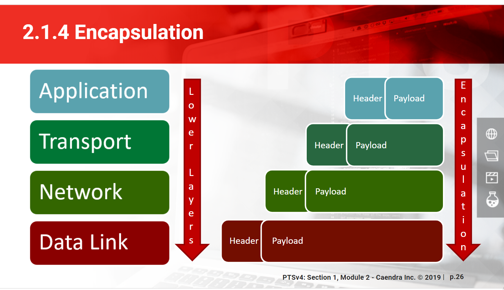

# Models

## Generalities

* 2 models divided by layers describe the hierarchy between network technologies, protocols, etc
  * Open System Interconnect \(OSI\) : 7 layers, detailed but not representative of real word implementation 
  * **TCP/IP** : 5 layers, more representative of the real world, I detail it here
* If an inferior layer doesn't work, the ones above won't either

## Layers

### 1 - Physical

The first layer is composed of the physical aspect, like cable, radio waves, etc

### 2 - Datalink

### 3 - Network

The network layer deals with choosing a path between two hosts \(**routing** them\), enabling them to transfer data to each other

### 4 - Transport

### 5 - Application

## Communication between layers

* Each layer communicates only with the 2 adjacent ones
* Data is **encapsulated** between each layer
  * The header + payload  becomes the payload part of the next layer


I need to write this somewhere else :

Information on the data link layer \(like the mac address\) change at each hop, while the ip address of the destination stays the same


## Sources

* _Networking for Systems Administrators_ by Michael W. Lucas
* Pentesterlab
* Misc Research

