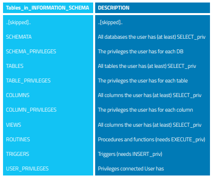

# Recon

## Social Info

* Any useful info on employees
* Linkedin, Facebook, Instagram, etc
* Crunchbase website
* whois database/cmd \(donne des infos sur le propriétaire d'un domaine\)
* Identify email pattern

## IP Space and domains

* Définir quelle range d'IP et domaines sont dans le scope.
* Pour énumérer tous les sous-domaines, on brute force des listes de noms plausibles
  * [https://dnsdumpster.com/](https://dnsdumpster.com/)
  * [https://github.com/aboul3la/Sublist3r](https://github.com/aboul3la/Sublist3r)

## Host discovery

* Quand on nous donne une range d'ip, on veut identifier quels sont les host live parmi toutes celles dispo.
* On peut faire du ping sweep \(pinger toutes les adresses de la range\) avec `fping` ou `nmap`

## Fingerprint the OS

* Une fois qu'on a une liste de live host, on veut savoir quel OS tourne dessus. Pour cela, on compare les réponses qu'on obtient à une db de signature.
* Offline sur une capture du traffic qu'on a prise, avec [https://lcamtuf.coredump.cx/p0f3/](https://lcamtuf.coredump.cx/p0f3/)
* Ou en direct avec `nmap`

## Port Scanning

* Permet de savoir quel port sont ouvert et les services qui écoutent dessus
* On fait cela avec `nmap` ou `massscan` \(qui est plus performant mais moins précis\)
* Plus l'infrastructure est grande, plus il est probable qu'un firewall filtre certaines requêtes

## Fingerprint web Server

* Dispo dans les _response header_, sous l’en-tête _Server_
* Si obfusqué, peut être déduit du format de la réponse
  * Ordre d'en-têtes différent
  * Réponse à une requête mal-formée différente
* Utiliser `httprint`

## Fingerprint server-side language

What language is used on the server : php, ruby, python, node, ..? Look at :

* Methods of concatenation
* Errors
* Request headers
* If you're already at a working command injection, try a language specific function/constant, like `str(True)` in python

## Fingerprint web application framework

* Dispo dans les _response header_
* Si obfusqué peut être déduit :
  * Du nom des cookies
  * De certains fichiers/dossiers présent
  * De commentaires
  * De meta tag html
  * etc

## Fingerprint base de données

On peut déterminer le _database management system_ \(DBMS\) par différents moyens :

* Les erreurs 
* Les techniques de concaténation
* Les commentaires

### Erreurs

> You have an error in your SQL syntax; check the manual that corresponds to your MySQL server version for the right syntax to use near ‘\’’ at line 1 MySql
>
> ORA-00933: SQL command not properly ended Oracle
>
> Microsoft SQL Native Client error ‘80040e14’ Unclosed quotation mark after the character string MS SQL Server
>
> Query failed: ERROR: syntax error at or near “’” at character 56 in /www/site/test.php on line 121. PostGre SQL

### Technique de concaténation

| DB Name | Contatenation |  |  |
| :--- | :--- | :--- | :--- |
| MySql | `‘test’ + ‘ing’` |  |  |
| SQL Server | `‘test’ ‘ing’` |  |  |
| Oracle | \`‘test’ |  | ’ing’\` |
| PostgreSQL | \`‘test’ |  | ’ing’\` |

### Commentaires

MySQL propose des commentaires qui sont ignorés par les autres DBMS mais pas par lui : `/*! and 1=0 */`. S’il réagit c’est donc que c’est un serveur MySQL.

### MySQl Information Gathering

* Version :
  * `@@version`
  * `VERSION()`
* Database name : `DATABASE()`
* La vue INFORMATION\_SCHEMA nous donne ce genre d’info :

## Error Response

On peut récupérer pas mal d'information dans les erreurs ou les réponses du serveur donc c'est intéressant de brute-force des noms de fichier et de tenter des connexions erronées à des db.

* Test network problems leading to the application being unable to access the database server
* Test authentication failure due to missing credentials

## Mapping

Le mapping consiste à énumérer dans un fichier toutes les informations qu’on peut trouver sur certains aspects du site, afin d’en comprendre le fonctionnement et de pouvoir y trouver une faille.

### Application Entry Points

Detail GET & POST request :

* Their parameters \(and hidden fields for POST\)
* If the request is authenticated or not \(i guess sent with cookies ?\)
* If it is done through SSL \(https\)
* Custom headers added

And their response :

* Check if cookies are set or modified
* Any redirects \(3xx\) or 400, 403, & 500 error codes
* Headers being passed

### Data/execution flow

3 approches possibles :

* Tous les chemins
* Suivre le flow des données \(et noter leur changement d’état\)
* Plusieurs instances concurrentes accédant aux même données

### Architecture

Partir d’un postulat simple et le contester au fur et à mesure. C’est lié au proxy, firewall, etc, donc je vais résumer ce qui est conseillé mais je comprends pas tout.

* Network scans on the web server to see if the ports are being filtered
* Network packet test for firewalls
* Analysis of web server banner for reverse proxy
* Checking if answers are what we expect \(might not be if a reverse proxy/firewall is present.. i believe\).
* Testing the response time to see if the request are cached by a reverse proxy
* Network load balancers are detected by comparing multiple request’s response to see if they go to different servers. \(For example the Date may change or the load balancer may add cookies/headers\)

### Cookie

* Quand sont-ils créés, utilisés et modifiés ? Que se passe-il si on accède à des pages sans ces cookies/ avec des valeurs différentes ?
* Lesquels ont la directive `Secure` ? Certains devraient-ils l’avoir mais ne l’ont pas ?
* Ont-ils la directive `HttpOnly` ?
* Sont-ils persistent et quels sont leur temps d'expirations ?
* Pour quels domaines/chemins sont-ils définis ?
* Quel paramètre de `Cache-Control` est utilisé \(pour HTTP/1.1 & HTTP 1.0\) ?
* Sont-ils encodés en Hex, Base64, MD5, etc ? Quel set de caractère est utilisé ?
* Ont-ils plusieurs partie distinctes ? L’une est-elle variable et l’autre changeante ? Changent-elles en fonction du temps, de l’adresse ip, du compte, etc ?
* Peuvent-ils être déduit par des procédés cryptographique ou par un brute-force raisonnable ?
* Peut-on prédire le prochain cookie si on a le procédé et le précédent cookie ?

## File discovery

Trouver tous les fichiers sensibles auxquels on peut avoir accès \(cela est fortement lié au _Forced Browsing_ de [Broken Access Control](https://zcugni.gitbook.io/notes/pen-test/broken-access-control-and-file-inclusion)\).

* Depending of the extension, a file might be either served \(shown\) or executed by the server \(without being shown\). However, by renaming/copying it, developers might involuntarily change this behavior \(`login.asp` =&gt; `login.asp.old`\).
* Guess unreferenced/old files name by looking at the published files name schema for logic. \(Aka, if edituser.asp exist, adduser.asp & viewuser.asp might as well, same for an app/user directory and an app/admin one\).

Interesting extension are :

* .zip, .tar, .gz, .tgz, .rar, ... : compressed files
* .txt, .pdf, .doc, .rtf, .xls, .ppt, ... : Office documents 
* .bak, .old and other extensions indicative of backup files \(for example: ~ for Emacs backup files\)
* etc

### Dorking / Indexed Files / Web Archives

Files might be wrongly indexed by browsers if the robot.txt file or html meta tag are not used correctly. We can find them by using _dorks_. \(I'm not sure of the exact definition but _dorking_ means using search query with special operators in browser, for example `:site` or `:cache`\).

Dorking can also be used in github to search for public sensible data. Some tools automate this but they can only search for users attached to the organization, it's a good idea to search for other employee on linkedin and check their github account.

De la même façon, les archives du web ont des fois des fichiers sensibles.

### Google Hacking

`site:` `intitle:` `inurl:` `filetype:` \(extensions\) AND, OR, \|, & `-` NOT

## General tips

* Look at comment/source code
* Look at `robot.txt` file

## Source

* [Owasp testing guide v4](https://owasp.org/www-project-web-security-testing-guide/assets/archive/OWASP_Testing_Guide_v4.pdf)

