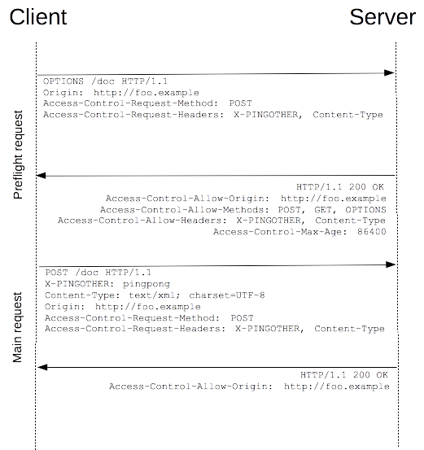

# SOP, CORS & CSRF

## SOP - Same Origin Policy

Doc : [https://developer.mozilla.org/fr/docs/Web/Security/Same\_origin\_policy\_for\_JavaScript](https://developer.mozilla.org/fr/docs/Web/Security/Same_origin_policy_for_JavaScript)

> La same-origin policy restreint la manière dont un document ou un script chargé depuis une origine peut interagir avec une autre ressource chargée depuis une autre origine.

2 pages ont la même origines si elles utilisent le même protocole \(http vs https\), le même hote et le même port.

Types d’échanges :

* Ecriture - globalement autorisée
  * Lien
  * Redirection
  * Formulaire
* Embarqués - en partie autorisé
  * `` \(les messages d’erreurs de syntaxe ne sont dispo que pour une même origine par contre\)
  * `<link rel=”stylesheet” href=”...”>` \(mais ils doivent avoir un header `content-type`. Restrictions en fonction des navigateurs\)
  * ``, `<video>`, `<audio>`
  * Plugins avec `<object>`, `<embed>`, `<applet>`
  * `@font-face` en fonction des navigateurs
  * `<frame>` & `<iframe>` \(peut être interdit avec un header\)

## CORS - Cross-Origin Resource Sharing

Doc : [https://developer.mozilla.org/en-US/docs/Web/HTTP/CORS](https://developer.mozilla.org/en-US/docs/Web/HTTP/CORS)

Permet au serveur d’autoriser certains échanges ne suivant pas la SOP grâce à des header qu’il rajoute dans sa réponse.

### Type d’headers \(dans la réponse du serveur\)

* `Access-Control-Allow-Origin : * | <origin>` : autorise des requêtes cross-origine venant de n’importe quel domaine ou d’un domaine spécifique.
* `Access-Control-Allow-Credentials : true (false if not specified)` : permet de faire des requêtes avec des cookies, si ce header n’est pas présent dans la réponse du serveur, celle-ci sera rejetée par le navigateur qui ne rendra pas le contenu de la réponse accessible à la page. \(Pour que ce header soit prit en compte, `Access-Control-Allow-Origin` doit obligatoirement spécifié une origine précise\).

\(+ toutes celles de réponse à un preflight, voir plus bas\).

### Requêtes “normales”

Les requêtes respectant ces conditions ne triggereront pas de preflight.

Méthodes acceptées :

* GET
* HEAD
* POST

Headers pouvant être spécifiés manuellement : 

* Accept
* Accept-Language
* Content-Language
* Content-Type
* DPR
* Downlink
* Save-Data
* Viewport-Width
* Width

Valeurs de Content-Type autorisées :

* application/x-www-form-urlencoded
* multipart/form-data
* text/plain

* No event listeners are registered on any _XMLHttpRequestUpload_ object used in the request. These are accessed using the `XMLHttpRequest.upload property`.
* No `ReadableStream` object is used in the request.
* Some additional restrictions by browsers.

### Preflight

Les autres requêtes sont jugées risquées et donc trigger un “preflight”. Cela consiste à d’abord envoyer une requête `OPTION` au serveur décrivant la requête finale que l’on compte faire pour vérifier qu’il l’accepte et si c’est le cas, la faire réellement.

header d’une requête `OPTION` :

* `Origin`
* `Access-Control-Request-Method` POST, GET, etc
* `Access-Control-Request-Headers` Name of the used headers, custom or not

header d’une réponse `OPTION` :

* `Access-Control-Allow-Origin`
* `Access-Control-Allow-Methods` POST, GET, etc
* `Access-Control-Allow-Headers` Name of the headers, custom or not
* `Access-Control-Max-Age` Lifetime of the option request, a preflight will need to be trigger again if it’s exceeded

Ces headers sont présents dans la requête du client pour décrire sa futur requête et dans la réponse du serveur pour décrire ce qu’il accepte.

## CSRF - Cross Site Request Forgery

Pour ces 2 attaques, l’utilisateur doit passer sur  _notre_  site, ayant soit une image ou un formulaire vicieux \(expliqué plus bas\) qui le feront charger des informations du site victime avec les cookies actuel de l’utilisateur.

### Attaque avec GET

Avec la SOP et les CORS, on peut envoyer depuis une autre origine une requête GET avec des cookies, et si le serveur ne l’accepte pas, nous ne verrons pas la réponse. Ce qui est une défense parfaite quand les requêtes GET sont utilisées de la bonne façon, c’est à dire uniquement pour lire/demander des données.

Si par contre, elles sont utilisées pour exécuter des actions \(aka delete, update, etc\), vu que la requête est réellement envoyée avec des cookies, l’action sera exécutée comme si la demande était légitime.

Par exemple :

Avec une url “[https://example.com/profile/delete](https://example.com/profile/delete)”, si on embed ça dans une image, tout utilisateur visitant le site \(et donc chargeant l’image et son lien\) visitera automatiquement cette page avec ces cookies \(car ils sont envoyés automatiquement avec la requête\) et supprimera donc accidentellement son compte.

### Attaque avec POST

Pour une attaque en passant par POST, il faut simplement créer un formulaire ayant comme action le lien cible et au moment de submit les cookies sont aussi envoyés avec la requête. On peut autosubmit la form avec du js.

La défense contre cela consiste à utiliser des CSRF tokens. Concrètement, cela consiste en un input caché ajouté à tous les formulaires du site contenant une valeur secrète et unique à cet utilisateur. Toute requête arrivant sans cette valeur ne sera pas prise en compte. Vu qu’avec la SOP les autres origines ne peuvent pas accéder aux données du site, ce token ne peut pas être récupéré par l’attaquant.

Par contre, si l’attaqueur trouve un moyen de le leak, c’est game over.

