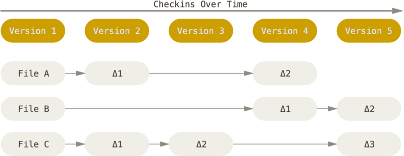
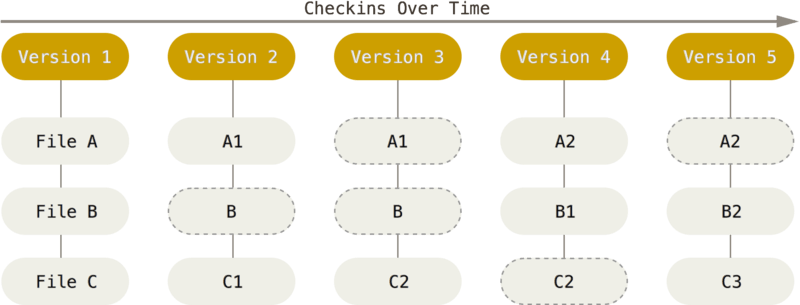
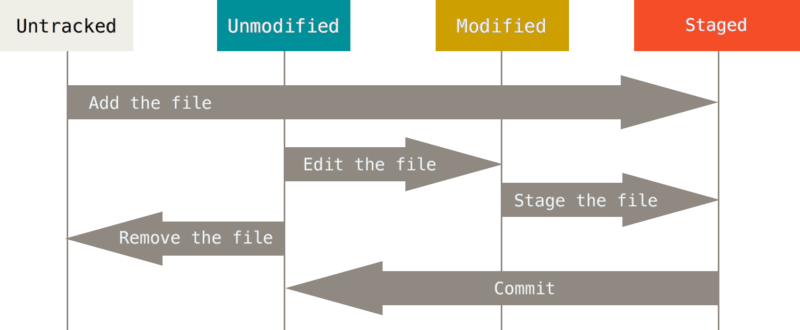
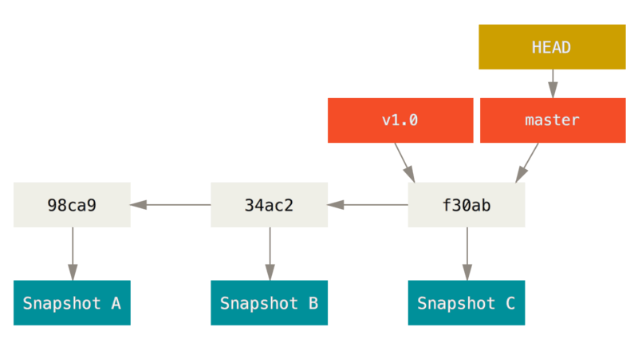
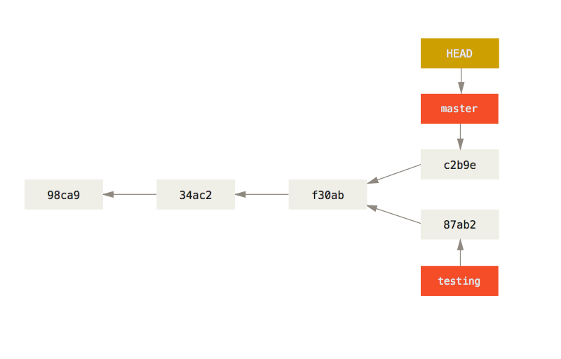

# Git

## Évolutions des gestionnaires de contrôles

La conservation de l’historique de modification a évoluée de ces manières :

* RCS : Conservée dans une base de donnée locale à chaque ordi \(ce qui rends la collaboration difficile\).
* CVS, SubVersion, Perfoce : Système de contrôle centralisé, avec une base de données qui disptach les dernières version à chaque utilisateur. \(Risquer car si la bdd/le serveur meurt, on perd tout. Et accès hors-ligne impossible\).
* Git : Stocker la base individuellement sur chacun des ordis. \(Je reviens sur les avantages après\).

## Historique de Git

Git a été créé pour travailler sur le Kernel Linux. A l’époque, les changements sur celui-ci étaient passé en patch, ils ont ensuite commencé à utiliser un programme propriétaire, puis quand la relation avec cette entreprise s’est détériorer, ils ont eu besoin d’en créer un de toute pièce.

Les objectifs de Git étaient les suivants :

* Rapidité
* Design simple
* Pensé pour permettre du développement parallèle \(avec plusieurs branches\)
* Complètement distribué
* Capable de supporter de gros projet

Ces objectifs ont été respectés et atteints.

## Fonctionnement de Git général

### Diff VS Snapshot

Comparé à la majorité des gestionnaires de version, Git ne sauve pas les différences des fichiers à chaque version, mais plutôt l’état des fichiers en eux-même \(snapshot\). \(Quand un fichier ne change pas, il conserve simplement la référence au fichier d’origine\).

Autres gestionnaires :

Git :

### Presque tout est fait en local

Vu que la base de données est sur chaque ordi, la majorité des interactions sont faites en local. On peut commit nos changements, explorer les anciens fichiers, créer des branches, etc. On ne se connecte au serveur que pour mettre en ligne nos modification et récupérer celles des autres.

### Sha-1

Git checksummed tous les fichiers en utilise le hash Sha-1. Il est donc impossible pour un fichier d’être modifié sans qu’il ne soit au courant.

### Processus

Les fichiers modifiés peuvent être ajouté à “l’index” \(ou “staging area”\), et au moment de commit, seuls les fichiers indexé seront effectivement pusher sur la bdd.

Plus précisément, les fichiers peuvent être dans 4 états différents :

* Untracked : Les changements ne sont pas surveillés
* Unmodified : Le fichier est tracked mais corresponds à la version de la bdd \(locale\)
* Modified : Le fichier est tracked, et des changements ont été repérés
* Staged : Les changements du fichiers ont été indexés et seront rajouté à la bdd \(locale\) au prochain commit.

Si des modifications ont été staged \(avec git add\) et que l’on remodifie le fichier, il faut l’add à nouveau. Sinon, seules les premières modifications \(déjà staged\) seront prises en compte.

## Anatomy of a commit / history

Quand on fait un commit, ça crée un objet de commit qui contient, entre autre, un pointeur vers “l'arbre” représentant le snapshot de ce qui est staged. Cet arbre est composé de pointeur liant un nom de fichier au checksum du-dit fichier. Les fichiers sont appelé “blob”.

L’objet commit contient aussi un pointeur vers son ou ses parents s’il y a. \(0 si c’est le premier, 1 en général ou plusieurs s’il vient d’un merge\).

## Branches

Une branche est simplement un pointeur vers un commit en particulier. Git garde dans HEAD un pointeur vers la branche courante.

Quand on crée un nouveau commit, la branche courante avance automatiquement pour le pointer :

Si on revient ensuite en arrière, qu’on change de branche, et qu’on commit de nouveaux changement, on aura créé 2 branches divergentes qui pourront être merge ou rebase :

Quand on déplace HEAD, les fichiers dans le dossier sont modifiés pour correspondre à la version du commit pointé.

La branche qui est pointée par HEAD est la branche qui est “checkout”.

Une “tracking branch” est une branche ayant une relation directe avec une autre, sa “upstream branch”. Quand on git pull depuis la tracking, git devine qu’on parle de l’upstream et de son serveur.

## Merge / Rebase

Quand deux commits ont un ancêtre commun mais diverge l’un de l’autre, on a deux options pour les ramener à un seul commit. Soit on les merge en choisissant quelles parties des deux on garde, soit on re-applique l’un des deux à l’autre.

Si on a cette situation de base :

### Merge

Le merge donnera ça :

Si on merge 2 branches qui ne divergent pas, mais donc l’autre est simplement en avance sur l’actuelle, on fait un “fast-forward merge”. Git se contente d’avancer le pointeur de la branche actuelle jusqu’au commit de l’autre.

### Rebase

Lancer `git rebase master` depuis “experiment” donne donnera ça :

\(Il faut quand même merge master après coup pour le fast-forward sur experiment\).

La règle général qu’il donne est

> Do not rebase commits that exist outside your repository and people may have based work on them.

S’il y a un conflit, il nous demandera de le gérer comme pour un merge.

### Cherry-pick

Un Cherry pick est comme un rebase d’un seul commit

### Philosophie

Pour ce qui est de choisir entre les 2, le but n’est pas le même. Avec merge, on veut garder une trace exacte de l’histoire du projet et du processus de modification, tandis qu’avec rebase, on veut plutôt avoir une vue globale et claire de comment le projet à été construit.

## Source

* Git's [book](https://git-scm.com/book/fr/v2)

