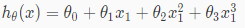
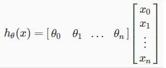
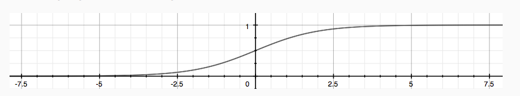
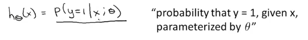
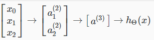
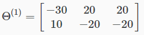
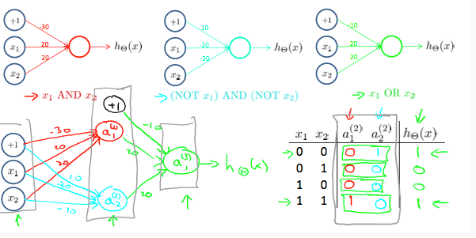
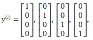

# Coursera

## Présentation

### Exemples d’utilisation

* Data mining
* Applications that we can’t program by hand
* Self-customizing programs
* Understanding human learning 

### Définitions

> Field of study that gives computers the ability to learn without being explicitly programmed. Arthur Samuel \(1959\)
>
> A computer program is said to learn from experience E with respect to some task T and some performance measure P, if its performance on T, as measured by P, improves with experience E. Tom Mitchell \(1998\)

“L’apprentissage” fait référence à l’action d’ajuster les paramètres pour améliorer les performances.

Le but d’un modèle est de ressortir, au moyen d’un training set, une hypothèse H qui permet de prédire y en fonction de x.

### Types

#### Supervised learning

On fournit à l’algo une “bonne réponse” pour chaque exemple donné, afin qu’il déduise les réponses pour de nouveaux exemples.

Il y a 2 types de supervised learning, Regression, qui consiste à trouver une valeur continue et Classification, qui consiste à trouver une valeur discrète.

#### Unsupervised Learning

On ne donne pas de “bonnes réponses” à l’algo, on lui fournit juste un set de données et on le laisse déduire les relations entres les données de lui-même.

Il y a 2 types d’unsupervised learning, le Clustering, qui consiste à séparer les données en catégories/groupes et le reste \(j’ai pas trop compris la différence\).

### Définitions

#### Notations du profs

| Notation | Signification |
| :--- | :--- |
| m | nb training examples |
| n | nb features x |
| x | input var/features |
| y | output/target var |
| \(x, y\) | 1 training example |
| \(x^\(i\)^, y^\(i\)^\) | training example of index i \(not exposition\) |
| x^\(i\)^ | all features of index i |
| x^\(i\)^~j~ | value of feature j at index i |

#### Hypothèse

Après avoir travaillé sur les données d'entraînement, l’algo ressort une fonction H \(appelée hypothèse\), qui permet de prédire des y en fonction de x. Cette fonction est une combinaison des thetas et des features \(x\). Tout le processus d’apprentissage permet de trouver la meilleure combinaison.

#### Les Thetas \(θ\)

Ils les appellent les paramètres, mais je les définirais plutôt comme les coefficients de chaque feature x correspondante, donc son importance dans l’équation. Et c’est eux qu’on modifie jusqu’à trouver un modèle adéquat.

θ~0~ est le coefficient de base de l’équation, \(la constante du coup non ?, celle qui, dans une fonction 2D, donnera la hauteur du point de départ sur y, donc l'origine si je mélange pas les termes\).

### Résumé

On a une hypothèse \(fonction\) qui prédit des y en fonction de x. On donne des coefficient à ces x, que l’on appelle théta. “L’apprentissage” consiste à trouver les meilleures valeurs de thétas pour prédire les y.

Pour cela, on crée une fonction de coût, qui va, d’une façon ou d’une autre, comparer nos prédictions avec celle attendues et noter la justesse de celle-ci. Plus cette fonction est basse, plus on est proche de la vérité.

L’idée est donc d’utiliser une 3ième fonction permettant de minimiser celle de coût, donc de trouver quel sont les thétas qui donne le “coût” le plus bas, aka, qui génère le moins d’erreur.

## Travailler les donnée

### Feature scaling

Le Gradient descent et d’autre algorithmes sont plus efficace si toutes les variables/features sont dans la même échelle de valeur. En général, on essaie de les ramener entre -1 et 1 \(mais si c’est un peu plus ou un peu moins ce n’est pas non plus dramatique\).

On peut faire cela de 2 façons :

* En divisant la valeur par le max
* En faisant une “mean normalization” :

$$
x = \frac{x - u}{s}
$$

u = la moyenne s = l’intervalle ou la “standard deviation” \(ce qui ne donnera pas exactement le même résultat, mais les 2 sont valables\).

### Combiner des données

Si on a une variable représentant la largeur d’une maison par exemple, et une autre représentant la longueur, on peut tout à fait choisir de les transformer en une seule variable représentant l’air, ce qui serait même plus adéquat.

### Changer le type de fonction utilisée

Si nos données ne peuvent pas être représentées par une droite, on peut changer le comportement ou la courbe de notre hypothèse en en faisant une fonction “quadratic, cubic ou root function”. \(entre autre\).

Par exemple, si notre hypothèse est _h~θ~\(x\) = θ~0~ + θ~1~x~1~_, on peut rajouter les carrés, cubes, etc, pour en faire une fonction cubique :

## Overfitting

Il est possible de paramétrer une hypothèse de façon à ce qu’elle soit trop parfaite pour le jeu de données d'entraînement, c’est ce qu’on appelle l’overfitting. Elle donne des résultats parfait pour l'entraînement, mais ne fonctionne pas bien sur des cas qu’elle ne connait pas, car elle fait des exceptions trop spécifique.

En général, on a de l’overfitting quand on a beaucoup de features \(x\).

### Solutions

1. Réduire le nombre de features \(ce qui peut être problématique quand elles sont réellement toutes importantes\):
   * Manuellement en réfléchissant à leur utilité
   * Model selection algorithm \(later in course\).
2. Régularisation \(fonctionne bien quand on a beaucoup de features toutes un petit peu importantes\)
   * Consiste à réduire leur importance, pour qu’elles ne soient prise en compte que dans les cas où elles ont un impact réel.

### Régularisation

Le but de la régularisation est d’ajouter une pénalité à chaque θ\(en les multipliant par un nombre\) de façon à ce qu’ils soient forcé d’être bas et ne se manifestent que quand ils ont un effet réel.

Par convention, on n’applique pas de pénalité à θ~0~. A vrai dire, on ne régularise que les thetas de 1 à 100, ce qui me semble très étrange et arbitraire, donc je ne suis pas sûre de le faire.

Si on exclue donc théta 0 et que l’on pénalise trop tout les autres, on va se retrouver avec une ligne horizontal, qui ne correspond donc pas du tout à ce que l’on veut. Il faut donc trouver une bonne valeur pour le “paramètre de régularisation” λ \(lambda\).

L’implémentation dépend du type de modèle, donc je la mettrais dans les sections correspondantes.

## Linear Regression

#### Hypothèse

L’hypothèse de base est celle-ci :

h~θ~\(x\) = θ~0~ + θ~1~x

En rajoutant un X0 qui vaut 1, on va pouvoir le calculer en utilisant des vecteurs:

h~θ~\(x\) = θ~0~ + θ^T^x

Pour arriver à cette forme vectorielle, on va prendre un exemple avec plusieurs features de l'hypothèse, par exemple ça : h~θ~\(x\) = θ~0~  _x~0~ + θ~1~_  x~1~ + θ~2~ \* x~2~

Ce que l’on peut aussi écrire comme plus haut \(et qui visuellement donne cela\) :

#### Fonction de coût

La fonction de coût utilisée est celle du Mean Squared Error, qui n’a qu’un seul minimum et qu’on utilisera donc avec le Gradient Descent.

## Logistic Regression

### Hypothèse

#### Equation

On veut forcer la prédiction entre 0 et 1, or une fonction permet de faire ça, la fonction “sigmoid” ou “logistique” :

$$
g(z) = \frac{1}{1 + e^{-z}}
$$

On va donc l’appliquer à notre hypothèse de base \(h~θ~\(x\) = θ^T^x\) en remplaçant z par celle-ci :

$$
h_θ(x) = \frac{1}{1 + e^{-θ^Tx}}
$$

ou, plus simplement :

h~\(θ\)~\(x\) = g\(θ^Tx\)

La fonction sigmoid g :

#### Interprétation

On lit le résultat de d'hypothèse comme la probabilité que y soit égale à 1 en fonction de x.

Mathématiquement parlant, on l'écrit comme ça :

#### Remarque

On appelle Decision Boundary la ligne \(qui peut avoir des formes étranges\) qui délimite une catégorie de l’autre.

#### Multiclass classification

Si on a plusieurs classes au lieu de juste 2, une des techniques utilisées est le one-vs-all \(ou one-vs-rest\). Pour chaque cas, on lance la Logistic Regression avec d’un côté une de nos catégories et de l’autre toutes les autres.

Puis pour faire la prédiction on se base sur celui qui a la plus haute probabilité.

#### Cost Function

On ne peut pas utiliser la Mean Squarred Error car la fonction sigmoid la rend non-convexe \(avec plusieurs minimum\), ce qui l’a rends inutilisable par le gradient descent. On utilise donc celle logarithmic, qu’on utilisera elle avec le Gradient.

## Neural Networks

### Notations

Θ^\(j\)^ : Matrices des paramètres permettant de passer d’une couche à une autre. Chaque ligne de cette matrice représente le vecteur de poids à appliquer à chaque entrée de la couche précédente pour donner une sortie.

a~\(i\)~^j^ : La neurone i dans la couche j

Un réseaux neuronaux à une couche d’input, une couche d’output et un nombre variable de couches intermédiaires, appelées “hidden layer” car ce qu’elles représentent n’est pas toujours très claire.

### Equation

On continue d’utiliser la fonction sigmoid, car il nous faut un résultat binaire représentant l’activation ou non d’une neurone.

la formule d’activation d’une neurone est celle-ci :

$$
a_i^j = g(Θ_{i, k0}^j * a_{k0}^{j-1} + Θ_{i, k1}^j * a_{k1}^{j-1} + ...)
$$

Ce qui n’est pas très lisible ainsi, mais en gros, la neurone i de la couche j est égale à la somme de chaque matrice de parametre \* chaque neurone de la couche précédente.

Le k représente le numéro de la neurone dans la couche précédente.

g représente la fonction sigmoid ou logistique.

### Exemple

Le plus simple est de mettre ces explications en pratique. Imaginons que nous voulons créer une logique de XNOR \(soit les deux, soit aucun des deux\).

On représente notre problématique ainsi :

X1 et X2 sont nos deux features normales, tandis que X0 est notre constante, qui vaut 1.

a1 représente dans notre exemple le cas AND et a2 le cas NOR. Notre matrice de paramètres pour passer des x aux a ressemble donc par exemple à cela :

a3 représente le OR, et ne s’activera que si a1 ou a2 s’activent. \(Quand elle s’active, elle renvoit donc 1, sinon 0\). \(Pour le coup je suis pas sûre de comprendre pourquoi on a besoin de a3 et pourquoi on passe pas directement des premiers a aux h..

Visuellement ça donne ça :

### Multiclass classification

Quand on a plusieurs neurone de sorties, on écrit nos résultat sous forme de vecteur. Admettons qu’on veuille savoir si on une image représente une moto, une voiture, un camion ou un piéton, notre résultat finaux seraient écrit de cette manière :

