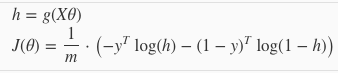

# Fonction de coûts

## Principe général

Ces fonctions permettent de comparer nos prédictions avec les prédictions attendues et donc “l’erreur” que nous avons. En les minimisant en testant différents coefficients, on peut arriver aux coefficients idéaux.

Elles se notent J\(θ~0~, θ~1~, ...\)

## Notation et remarque préalable

Ce résumé est bien sûr lié aux autres résumé de ml, il reprends donc les mêmes notations et principe.

### Notation

* Les coefficients, thétas, poids, paramètres représentent tous la même chose : la valeur avec laquelle sera multiplié un x
* Les x sont aussi appelés variable d’entrées, inputs, features, variable indépendantes
* Les y sont aussi appelés variables de sortie, output, prédiction, variable dépendantes

### Remarque

* Les “versions vectorielles” font référence à la forme de l’équation utilisant des vecteurs pour rendre les calculs plus efficace. Ceci est vu plus en détail dans le résumé de coursera
* Les “versions régularisées” font référence à la forme de l’équation avec la régularisation appliquée \(qui permet de feature scale différemment\) vu dans le résumé de coursera

## Squarred error function / Mean squarred error

h~θ~\(x~i~\) = Le résultat de l’hypothèse pour l’index i \(la prédiction pour la donnée i en gros\)

y~i~ = Le vrai résultat

On calcule la différence entre les 2, qu’on mets ensuite individuellement au carré. Puis on additionne toutes ces différences. \(Dans cet exemple, on prends la moitié du tout pour simplifier la tâche lors du calcul du gradient descent\).

Dans le schéma ci-dessous, les croix rouges sont les prédictions attendues, la droite celles faites, et les lignes bleues les différences \(qu’on additionne donc\).

### Version vectorielle

### Version régularisée

## Logarithmic Cost Function

J’ignore si elle a un nom, mais vu qu’elle utilise des logarithmes j’ai décidé de l’appeler ainsi.

Le but est que le coût égale 0 quand on a juste, et devienne énorme quand on a faux. Pour cela, on a 2 versions de l’équation, en fonction de si y vaut 1 ou 0.

Que l’on peut fusionner en une seule ligne :

Si on regarde bien, le premier terme vaut 0 si y est égal à 0, et le second 0 si y est égal à 1, donc à chaque fois uniquement un cas ne sera pris en compte.

### Version vectorielle

Ici, X est la matrice de tous les exemples, θ un vecteur de tous les thétas et g\(\) la fonction sigmoid/logistique.

### Version régularisée

La seconde somme permet d’exclure explicitement theta 0.

