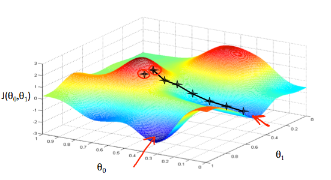
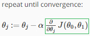
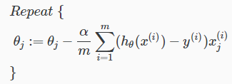
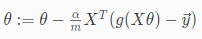
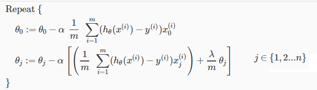
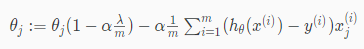
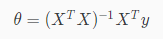
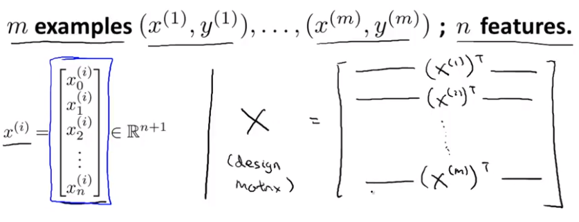
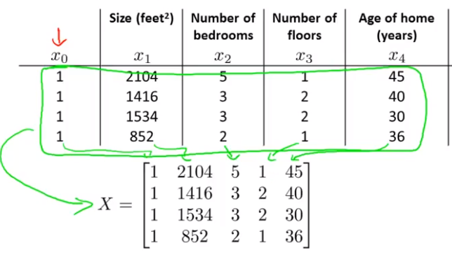
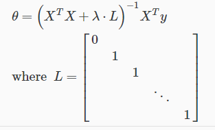

# Fonction de minimisation

## Principe General

Une fonction de minimisation permet de trouver le point le plus bas d’une fonction. On l’applique en général à des fonctions de coûts pour trouver les coefficients les plus efficaces.

Il en existe plusieurs, que je vais détailler ici.

## Notation et remarque préalable

Ce résumé est bien sûr lié aux autres résumé de ml, il reprends donc les mêmes notations et principe.

### Notation

* Les coefficients, thétas, poids, paramètres représentent tous la même chose : la valeur avec laquelle sera multiplié un x
* Les x sont aussi appelés variable d’entrées, inputs, features, variable indépendantes
* Les y sont aussi appelés variables de sortie, output, prédiction, variable dépendantes

### Remarque

* Les “versions vectorielles” font référence à la forme de l’équation utilisant des vecteurs pour rendre les calculs plus efficace. Ceci est vu plus en détail dans le résumé de coursera
* Les “versions régularisées” font référence à la forme de l’équation avec la régularisation appliquée \(qui permet de feature scale différemment\) vu dans le résumé de coursera

## Gradient Descent

### Principe

Si on a une cost function avec 2 thétas, on peut la représenter en 3 dimensions de cette façon-là :

La hauteur représentant donc le coût, et la position les 2 thétas. Le Gradient Descent va partir d’un point donné et chercher dans quelle direction il peut aller pour descendre le plus vite. En faisant ça en boucle, il arrive jusqu’à un minimum local \(on ne peut donc l’utiliser qu’avec une fonction convexe, n’ayant qu’un seul minimum\).

Appliquer du feature scaling au préalable rendra le gradient descent plus efficace.

### Type

Il existe 3 types de gradient descent :

* “Batch” où à chaque itération on utilise tout le set de données.
* Stochastic où on mets à jour les coefficients après chaque ligne du dataset.
* Un mix entre les deux où l’on mets à jour les coefficients après un nombre choisit de lignes.

Le stochastic et plus rapide et n’as pas besoin de minimum globale mais il est aléatoire donc on n’aura pas toujours le même résultat. **Remarque : Ce qui contredit l'idée de minimum globale donc je sais pas trop**

### Principe du calcul

:= représente une assignation α : on l'appelle ici le “Learning rate” et il représente la taille du pas que l’on fera. ∂ : représente une dérivée partielle \(tandis que d représenterait une dérivée complète\), mais osef, en gros c’est la dérivée.

* Le J\(\) doit être remplacé par la fonction de coût choisie, mais vu que les dérivées sont ensuite calculées, on ne l’a retrouve pas tel quelle dans l’équation.
* J’ignore ce que signifie “convergence”, mais au minimum la dérivée vaudra toujours 0, donc en gros on descends jusqu’à ce qu’on ne modifie plus.
* Attention : Il est important de modifier simultanément tous les thétas \(avec des variables temporaires du coup\), car les calculs dépendent de leur valeur à tous.
* Si `α` est trop large, on n’arrivera pas à descendre car les pas ne seront pas assez précis, mais s’il est trop petit, on mettra beaucoup trop de temps pour le faire. Il n’y a pas besoin d’adapter `α` au fur et à mesure car la dérivée se rapprochant de zéro, les pas deviendront d’eux-même plus petit.

### Equations

#### Équation avec les dérivées calculées

\(h\(\) sera donc différent en fonction du modèle implémenté.\)

#### Equation vectorielle

Ici c'était pour la logistique, avec donc g\(\) pour une fonction sigmoid. Il suffit d’enlever g\(\) pour la régression linéaire.

#### Equation régularisée

Version simplifiée :

Le terme

$$
1 - α \frac{λ}{m}
$$

sera toujours inférieur à 1, cela signifie donc qu’on réduit theta à chaque fois. Le reste est identique à l’équation de base. Et **on continue d’appliquer l’équation de base pour θ~0~**.

### Debug/Test

Une bonne façon de tester/debugger le gradient descent est de tracer \(“plot”\) la fonction J avec les nouveaux thetas trouvés à chaque itération du gradient. J est censé descendre assez efficacement puis arriver à un plat en bas, si elle monte c’est que notre learning rate est trop haute, tandis que si elle descend trop lentement, notre learning rate est trop basse.

## Normal equation

### Principe général

Pour certains types de fonction, on peut trouver leur minimum directement par calcul. Je ne vais par contre pas trop rentrer dans les détails car ça a trait au “Calculus”. Mais l’idée général c’est apparemment de “we will minimize J by explicitly taking its derivatives with respect to the θj ’s, and setting them to zero”.

### Matrice X

Pour créer la matrice X on fait ainsi \(on transpose chaque vecteur x dans la ligne correspondante. Un vecteur x est composé de toutes les valeurs de features d’une rangée.

Un exemple avec des valeurs :

### Remarque

Pour reprendre l’équation du dessus, l’idée est donc de prendre l’inverse du \(X^T^ \* X\) et de multiplier par X^T^ puis le vecteur y.

Faire l’inverse d’une matrice peut vite être assez coûteux comme calcul : O \(n^3^\).

On a pas besoin de faire du feature scaling avec cette méthode.

Si la matrice résultante de X^T^ \* X n’est pas inversible, c’est probablement car nous avons soit des variable redondantes \(la taille en feet et la taille en mètre par exemple\), soit plus de variable que d’exemple dans le training set. Pour le premier cas il faut les supprimer, et dans le second soit les supprimer soit utiliser la régularisation.

### Version régularisée

L est donc presque la matrice d’identité, du dimension \(n + 1\) , que l’on multiplie par lambda. Dans certain cas X^T^ \* X n’était pas inversible, mais en rajoutant le terme de régularisation, l’intérieur des parenthèses le sera toujours.

## Gradient Descent vs Normal Equation

Gradient Descent :

* A besoin de feature scaling
* Fonctionne que s’il n’y a qu’un seul minimum
* Scale bien avec n
* Nécessité du choisir le learning rate et de faire des itérations

Normal Equation :

* N’a pas besoin de feature scaling
* Ne fonctionne pas pour tout les cas
* Scale mal avec n à cause du calcul de l’inverse \(si on a plus de 10’000 features, ça devient problématique\)
* Immédiat du moment qu’on fait le calcul

## Other optimization algorithms

Gradient descent est couramment utilisé mais il en existe d’autre, plus \(beaucoup plus\) complexe, mais ayant d’autres avantages. On a par exemple pas besoin de choisir `α` \(learning rate\) pour eux, et ils sont généralement plus rapide.

Ce sont :

* Conjugate gradient
* BFGS
* L-BFGS 

