# Udemy Course Summary

## Notation et généralités

Il y a beaucoup de terme différents pour les mêmes choses :

* Les valeurs d’entrées/x/input/features/variables indépendantes sont les données que reçoit le modèle et à partir desquelles il doit faire une prédiction.
* Les valeurs de sorties/y/output/variables dépendantes sont soit les résultats attendu \(donc que l’on connaît déjà\), soit les prédictions faite par notre modèle.
* Les coefficients/poids/theta/paramètres sont les multiplicateur appliqués aux x et entraînés par notre modèle pour avoir l’équation la plus précise possible. Ils définissent des choses différentes d’un modèle à l’autre.
* Les fonctions de coûts permettent de déterminer “l’erreur” de notre modèle et sont détaillées dans un autre document.
* Les fonctions de minimisation et maximisation sont des fonctions permettant de trouver les paramètres réduisant ou augmentant le plus possible le résultat d’une fonction \(pour un set de données\) et sont détaillées dans un autre document.
* Les modèles sont un ensemble de procédés et de formule pouvant s’entrainer sur des données pour atteindre un meilleur résultat sur celle-ci.
* Les modèles de régression cherche à obtenir une valeur continue, tandis que ceux de classification une valeur discrète.
* Une “decision boundary” est la limite à laquelle on passe d’une valeur discrète à une autre.

## Préparation des données

### Données manquantes

Différentes strats possibles

* Suppression \(mais risque de perte d’informations importantes\)
* Remplacer par la moyenne
* Remplacer par la médiane
* Remplacer par la donnée la plus fréquente

### Encoder les données catégoriques

**Les données textuelles doivent être encodées en nombres** pour pouvoir être utilisées. Pour des données qui ont un poids inhérent, on peut leur appliquer des nombres croissant \(par exemple 1 pour la taille ‘S’ et 2 pour la taille ‘M’\).

#### Dummy Encoding

Pour les autres par contre, comme par exemple des pays, leur donner un tel nombre rendrait le modèle biaisé envers la plus élevée. Pour éviter cela, on utilise le “Dummy Encoding” qui consiste à créer un vecteur pour chaque catégorie remplis de 0 et de 1 en fonction de celle sélectionnée.

#### Dummy Variable Trap

**Pour chaque set de dummy variable créé, il faut en omettre une**, car sinon on se retrouve avec plusieurs variables s'influençant les unes les autres et cela réduit l’efficacité du modèle.

Par “chaque set”, je veux dire que si on crée 3 dummy pour représenter des pays et 4 pour représenter des couleurs, on va en enlever une du paquet de 3 et une du paquet de 4.

### Réduire le nombre de features

2 raisons pour le faire

* Simplifier la visualisation des prédictions sur un graphe, ce qui n’est possible qu’avec 2 variables d’entrée.
* Séparer les variables utiles du “bruit” \(le modèle sera moins précis s’il y en a\)

2 techniques pour le faire

* Feature selection \(détaillée dans le pdf “Eliminating features”\)
* Feature extraction \(détaillée ci-dessous\)

#### Features extraction

Le but de celles-ci est de créer de nouvelles features \(moins nombreuses\) à partir de celles qui existent déjà, de façon à ce qu’elles soient plus précise.

**Principal Component Analysis**

Concrètement, je comprends pas trop comment ca marche, mais en gros, ca permet de savoir quelles features agissent le plus sur la “variance” du dataset. Si on fait un modèle sur les 2 plus grandes, et qu’elles sont significatives, le modèle sera assez juste.

Remarque : le pca ne regarde que les features, et n’est donc pas influencés par les y, c’est donc une technique non supervisée.

**Linear Discriminant Analysis**

Le lda regarde et les x et les y pour trouver les nouvelles features qui séparent le mieux les classes des y. C’est donc une technique supervisée. \(Vu qu’on parle de classe, j’ignore si ça marche pour de la régression aussi\)

**Kernel PCA**

Le Kernel PCA reprend le principe du PCA, mais cette fois en ajoutant la technique du kernel pour augmenter la dimension des features et donc trouver, dans cette nouvelle dimension, les 2 les plus précises.

### Diviser les données en train/test

Afin d’éviter que le modèle n’apprenne trop sur les données fournies et qu’au final ce qu’il déduit ne puissent pas être utilisé sur des données un peu différentes, on divise nos données en deux parties, une pour l’entrainer et l’autre pour tester.

Le set de test fait en général entre 20 et 30% du set total, rarement plus.

### Feature Scaling

#### Explication

Pour éviter qu’une colonne de données n’ai plus de poids qu’une autre, il faut qu’elles soient sur la **même échelle**. Si ce n’est pas le cas, les modèles utilisant la distance euclidienne seront biaisé vers la plus grande. Pour les autres, les mettre à la même échelle les rends plus performant, ça vaut donc la peine de le faire.

#### Mise à échelle

Il y a différentes façon de mettre à l’échelle \(d’une manière utile pour le ML\), voici 2 des techniques \(il y en a plus sur wikipedia avec les avantages/inconvénients\) :

* Normalisation \(rescaling d’après Wiki\) `x = x - min(x) / max(x) - min(x)`
* Standardisation `x = x - mean(x) / stand(x)`

#### Variables catégoriques / Variable dépendantes

Il n’y a pas forcément besoin de mettre à l’échelle les valeurs catégoriques transformées en Dummy, vu qu’elles valent soit 0 soit 1 et qu’on perdrait en partie leur sens en le faisant. Mais le faire ne change pas beaucoup de choses non plus, donc au pire c’est pas grave.

Pour la variable de retour \(y\), la nécessité de la mettre à l’échelle va varier en fonction de la gamme de valeur qu’elle pourra avoir.

## Evaluer les performances

Une fois un modèle entrainé, on évalue ces performances contre d’autres modèles entrainés pour savoir lequel est le plus adapté. Pour cela, il y a différentes techniques.

### Visualisation

Visualiser les prédictions de chaque modèle pour voir quelles sont les meilleures.

### Confusion matrix

Quand on a trop de variables pour pouvoir visualiser les résultats, on fait cette matrice pour avoir un tableau représentant le nombre de prédictions correctes et fausses. Sur les lignes on place les résultats attendus et sur les colonnes les prédictions. Toutes les cases en diagonales sont donc des prédictions correctes.

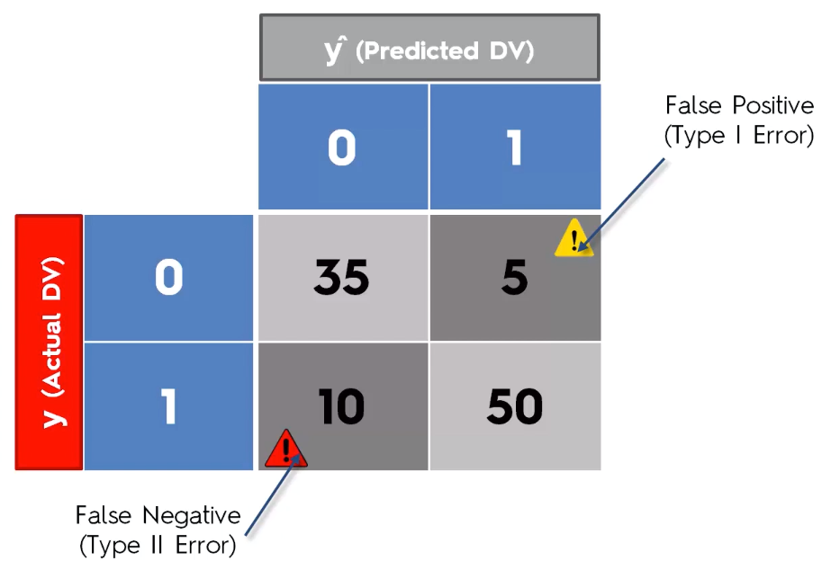

### K-Fold Cross Validation

Je suis pas 100% sure d’avoir compris, mais l’idée est de diviser le training set en K x K parties \(en général 10\) et, pour chaque rangées, l’entrainer sur K - 1 paquets de données et le tester sur le dernier. Ce qui permet \(pour 10 itérations\) d’avoir 10 tests de précision différents, et donc une idée plus général des performances de notre modèle.

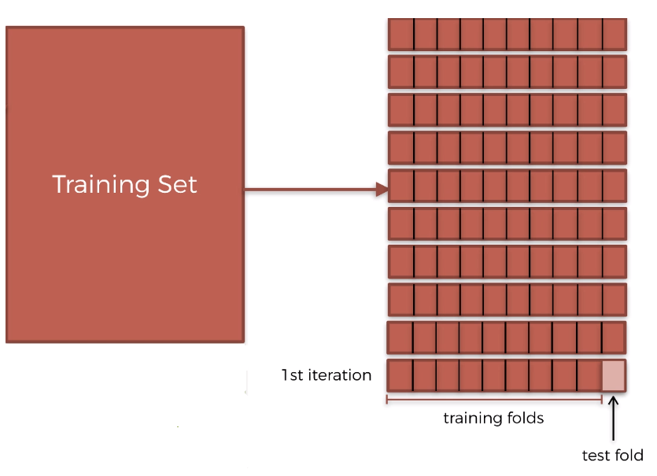

 **Remarque**  : Mais du coup il est entraîné sur bien moins de données, donc je trouve ça un peu étrange. L’autre truc que je comprends pas, c’est que du coup on utilise pas le test set, donc autant l’utiliser pour l'entraînement non ?

### Adjusted R Squared

Le R Squared :

$$
R^2 (1 - \frac{Mean Squarred Error Sum}{Average Error Sum})
$$

évalue les performance en récupérant la somme de la fonction de coût _Mean Squarred_ et en la divisant par une somme similaire, utilisant comme ligne de prédiction la moyenne et non l’équation de droite de notre modèle.

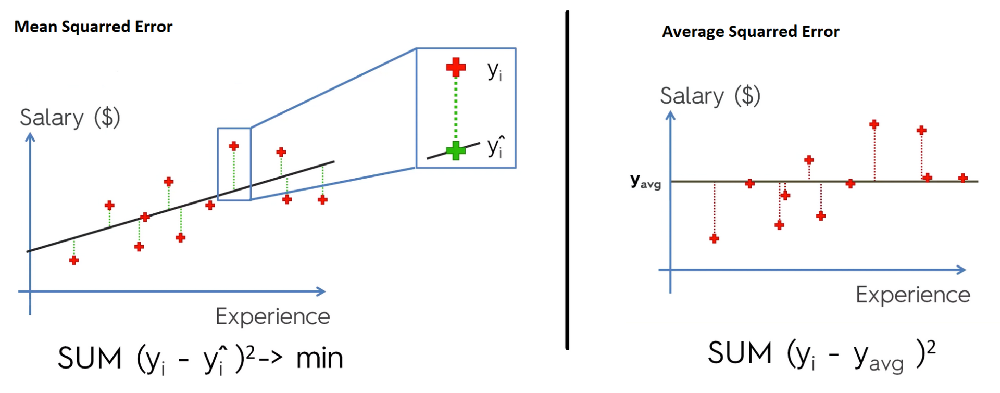

En soustrayant cela à 1, plus notre modèle à une bonne équation, plus il sera proche de 1.

Le problème, c’est que quel que soit la variable d’input que l’on ajoute, celui-ci se rapprochera de 1, car même si c’est aléatoire, il y a toujours une corrélation.

Pour éviter cela, on pénalise l’ajout d’une variable, ce qui nous donne l’équation du Adjusted :

$$
1 - (1 R^2) *  \frac{n - 1}{n - p -1})
$$

P : Nombre de variables indépendantes

N : Sample size \(nombre de données du coup ? \)

Ainsi, pour chaque nouvelle variable, la partie `1 - R^2^` augmente, tandis que la division diminue. Comme avant, plus le résultat est proche de 1, mieux c’est.

## Sélectionner le meilleur modèle et hyperparamètres

Il y a aussi 2 pdf comparant les avantages/inconvénients des différents modèles de classification et de régression.

Définir le type de problème :

* Régression : si le y est une variable continue
* Classification : si le y est une variable discrète/une catégorie
* Clustering : s’il n’y a pas de y

Pour savoir si notre problème est linéaire ou non et quels sont les meilleurs hyperparamètres \(les paramètres qui ne sont pas entraînés par notre modèle mais choisit par nous\), on va utiliser la technique du Grid Search.

C’est une fonction qui teste différents modèles avec différents hyperparamètres, comparent les résultats et nous informent du meilleur. \(Nous choisissons les modèles et paramètres à tester\).

## Interpréter les résultats

Si ces nombres sont positifs, cela signifie que pour une augmentation dans l’un, la variable dépendante augmentera aussi. Sinon, c’est la relation inverse.

La manière de lire la magnitude des coefficients sans risqué d’être biaisé par leur différentes unités est celle-ci \(avec cet exemple\): “_R.D.Spend a un plus grand impact sur le profit par unité d’R.D.Spend, que le Marketing Spend par unité de Marketing Spend_”.

La dernière chose à laquelle il faut faire attention, c’est que ces coefficients changeront si on rajoute ou enlève d’autre variables, ils ne sont pas absolus et ne donnent d’informations que pour cette combinaison de variables-ci.

## Regression

### Fonctionnement général

Le but est de trouver l’équation représentant le mieux les données. On définit pour cela une fonction de coût évaluant l’erreur de notre équation à laquelle on applique une fonction de minimisation \(en général Gradient Descent\).

### Linear

**Disclaimer** : Je sais pas si c'est pareil pour la poly et la logistique et il est pas entré dans les détails donc je connais juste les termes

#### Caractéristiques nécessaires

Pour pouvoir appliquer un algo/calcul de régression linéaire, il faut tout cela :

1. Linéarité
2. homoscédasticité
3. Normalité multivariée
4. Indépendance des erreurs
5. Peu de multicolinéarité

#### Equation

`y = b0 + b1 * x1 + bN * xN`

| Composant | Role |
| :--- | :--- |
| y | La variable dépendante |
| b0 | La constante |
| xN | Les variables indépendantes |
| bN | Les coefficients \(poids\) de ces variables |

Dans les calculs, on rajoute en fait un X0 qui vaut 1, car ça nous permet d’avoir le même nombre de coefficients que de X, et donc de les multiplier sous forme de vecteur \(ce qui est plus efficient\).

 **Remarque** : C'est quelque chose qu'on ne fait pas que pour la régression linéaire, faudrait le généraliser

### Polynomial Linear

$$
y = b0 + b1 * x1^1 + b2 * x1^2 + bN * x1^N
$$

| Composant | Role |
| :--- | :--- |
| y | La variable dépendante |
| b0 | La constante |
| x1 | _**La**_ variable indépendante \(avec exposants\) |
| bN | les coefficients \(poids\) de la combinaison variable/exposant |

#### Fonction de cout et minimisation

Peut-être la Mean Squarred aussi ? Et surement le gradient descent

### Logistic

Ce modèle applique la fonction sigmoid à celle de la régression linéaire pour forcer des résultats entre 1 et 0 \(représentant donc la probabilité d’une variable à faire partie d’une catégorie\). \(voir le résumé de coursera pour plus de détail\).

#### Fonction de coûts et minimisation

La fonction de coût utilisée est la “logarithmic” et le Gradient Descent pour la minimisation.

#### Plusieurs Classes

Si on a plusieurs classes au lieu de juste 2, une des techniques utilisées est le one-vs-all \(ou one-vs-rest\). Pour chaque cas, on lance la Logistic Regression avec d’un côté une de nos catégories et de l’autre toutes les autres.

Puis pour faire la prédiction on se base sur celui qui a la plus haute probabilité..

## K NN \(K-Nearest Neighbor\)

Quand on veut prédire la catégorie d’une nouvelle données, on choisit K de ces plus proches voisins et l’on choisit la catégorie majoritaire parmi eux. En général, on prends K = 5, et l’on utilise la distance euclidienne.

## SVM \(Support Vector Machine\)

### Principe de base

Le Support Vector Machine va se baser sur les 2 vecteurs de données les plus proches l’un de l’autre séparant les catégories. Toutes les autres données sont inutiles pour lui.

Son but est de trouver la limite équidistante entre ces deux points la plus grande possible \(la Maximum Margin\).

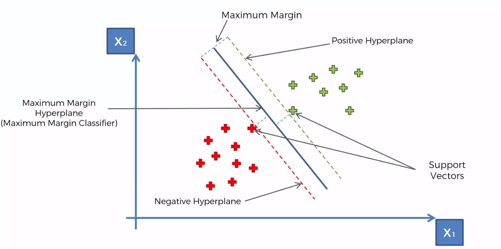

L’avantage d’un SVM par rapport à d’autres type de modèle, c’est qu’il se base sur les données les moins représentantes de leur catégorie et donc détecte les différences différemment de tous les autres se basant sur l’exemple parfait de chaque catégorie.

Dans les faits, on utilise toujours un kernel avec je crois.

### Kernel

Le kernel SVM permet de trouver une “decision boundary” pour des données qui ne sont pas linéairement séparables \(donc non séparable par une simple ligne\).

Pour cela, on a deux techniques.

#### Mapping to a higher dimension

Cette technique demande beaucoup de puissance de calculs et n’est donc pas recommandée.

L’idée est de transférer nos données sur une dimension supérieur ce qui les rends linéairement séparable \(\#magique\) afin d’utiliser le SVM.

Par exemple, avec des données sur une dimension, ça donne ça :

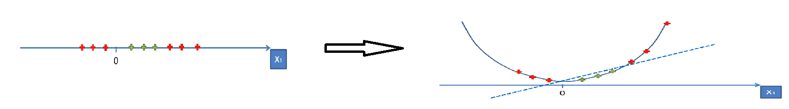

#### The Gaussian RBF \(Radial Basis Function\) Kernel

Cette méthode permet de simuler le mapping sur une dimension supérieur sans vraiment avoir à le faire \(je crois\).

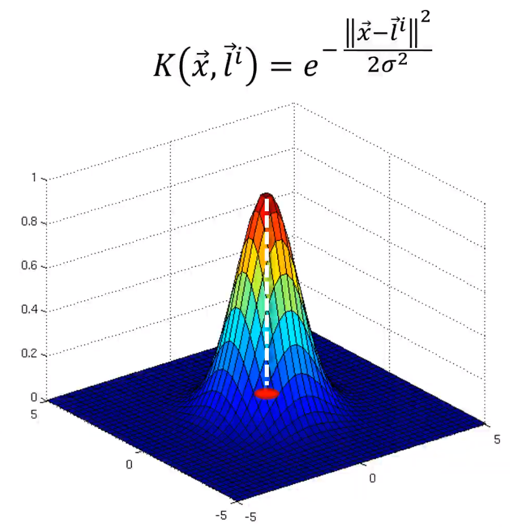

x : une donnée

l : le landmark \(le point de référence\)

Plus une donnée est loin du landmark, plus elle se rapproche de 0 \(verticalement parlant\). Le sigma définit la circonférence du cercle qui sépare les points d’une catégorie aux autres.

Le meilleur landmark est choisi mathématiquement par l’algo.

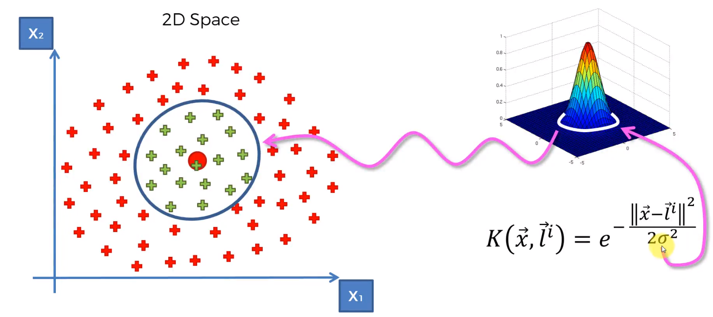

Pour un dataset plus complexe, on peut simplement utiliser plusieurs landmark, ce qui nous donne ceci \(les équations sont simplifiées\) :

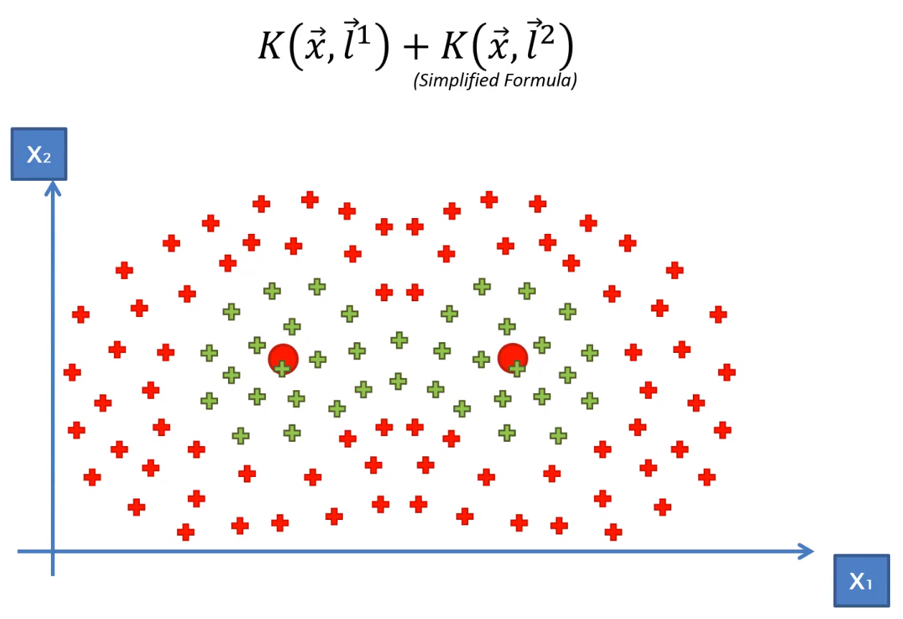

#### Autres types de kernel

Il y a d’autres types de kernel qui suivent plus ou moins la même logique \(avec un landmark\) mais qui le gèrent différemment. En fonction des situations certains sont mieux que d’autres.

Les 2 autres notables sont :

* Le sigmoid
* Le polynomial

### SVR

J’ai pas vraiment compris comment ça marchait, je sais que globalement, y’a aussi une idée de support vector et de maximum margin mais que c’est géré un peu différemment. Il utilise aussi un kernel.

## Decision Tree

### Principe

Un algo de decision tree va utiliser des maths lié à “L’information Entropy” pour séparer les données en zones \(de façon à ce que ces zones nous donnes le plus d’informations possible sur les données\). Pour de la classification, ce sera simplement des zones de catégories, tandis que pour de la régression, il fera une moyenne par zone qu’il assignera à toute nouvelle données correspondant à cette zone.

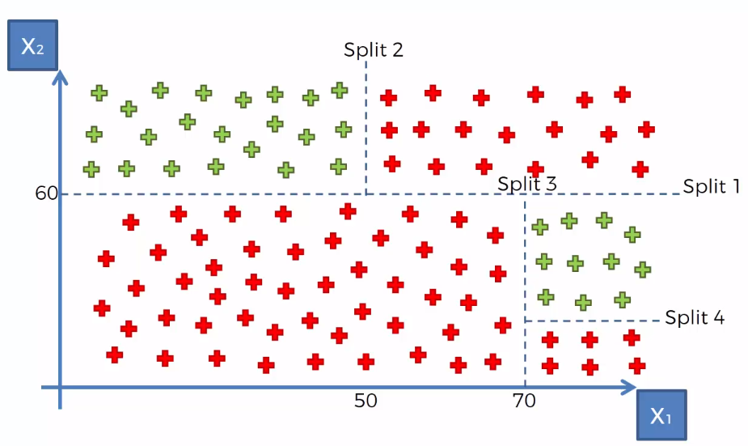

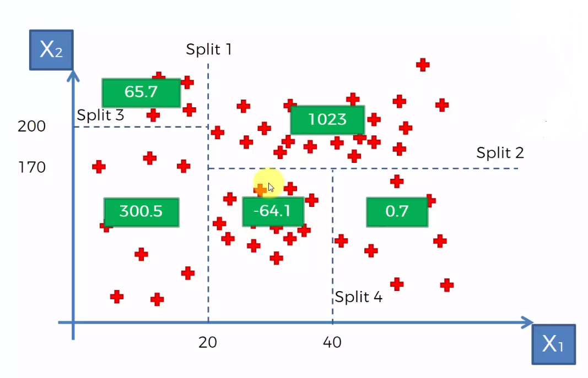

Les arbres en eux-même ressemblent à cela :

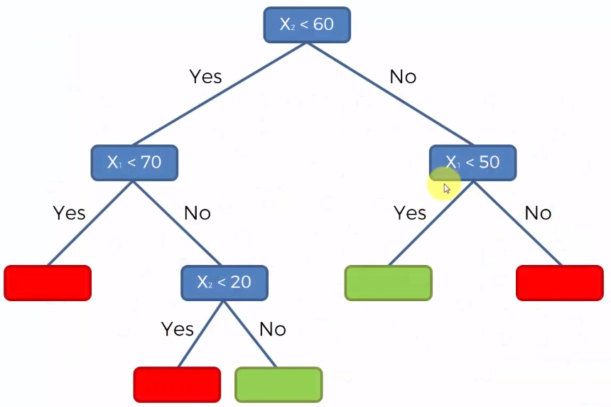

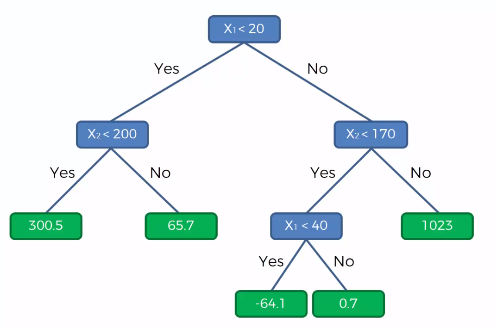

### Random Forest

Les decision tree en eux-mêmes sont assez peu utilisé car pas assez puissant et sujet à de l’overfitting. Par contre, les random forest sont appréciées.

L’idée est de prendre X données aléatoirement dans notre dataset et de créer un Decision Tree à partir de cela, puis de reprendre X données aléatoirement et de créer un autre Decision Tree, etc, jusqu’à ce qu’on en ai par exemple 500.

Une fois cela fait, pour une nouvelle donnée, on fait la moyenne de toutes les prédictions que nous donnerons chacun des Tree.

## Naive Bayes

### Théorème

Ce modèle se base sur le théorème de Bayes :

$$
P( A | B) = \frac{P(B | A)*P(A)}{P(B)}
$$

Si on remplace A par des outils défectueux et B par une machine fabriquant ces outils, le théorème permet de trouver la probabilité que le machine B donne des outils défectueux.

La “\|” se dit “given”, donc on lit ce théorème “Quelle est la probabilité d’avoir A given qu’ils sont B ?”.

| Symbole | Appelation |  |
| :--- | :--- | :--- |
| -P\(A\) | Prior Probability |  |
| P\(B | A\) | Likehood |
| P\(B\) | Marginal Likehood |  |
| P\(A | B\) | Posterior Probality |

En machine learning, le modèle s’appelle Naive Bayes car pour que le théorème soit exact il faudrait que les variables \(ici salary et age\) soient complètement indépendantes l’une de l’autre, ce qui est rarement le cas.

### Application

Pour l’application, je vais prendre ce set de données en exemple :

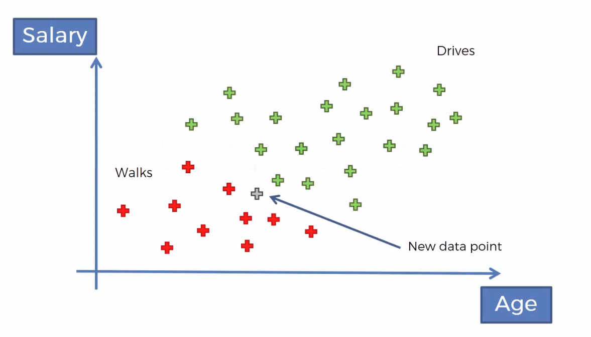

On va calculer les probabilité d’avoir une catégorie given X puis l’autre catégorie given X \(X représentant les infos de la nouvelle donnée\).

Donc pour Walks, on aura cette équation par exemple :

$$
P(Walks | X) = \frac{P(X|Walks)*P(Walks)}{P(X)}
$$

Puis on fait la même chose avec l’autre catégorie et on compare les probabilités de chacune. On prédit que la donnée sera dans la catégorie avec la plus grande probabilité.

Pour trouver chaque information de l’équation, on fait ceci :

**Prior Probability** :

$$
\frac{nb points A}{total nb points}
$$

**Marginal Likehood** : On définit un cercle qui représente les données similaire à la nouvelle, puis on applique un calcul :

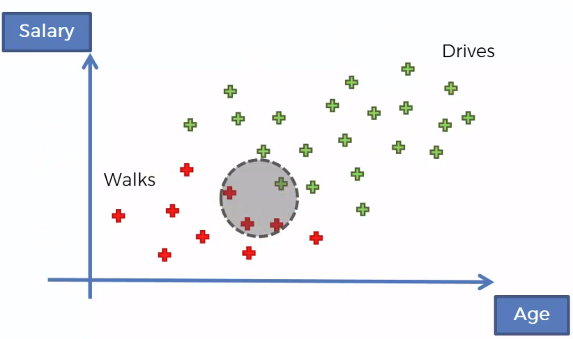

$$
\frac{nb points dans cercle}{total nb points}
$$

**Likehood** :

$$
\frac{nb A dans cercle}{total nb A}
$$

### Amélioration

Quand on calcule les probabilité par catégories given qu’elles soient X, le dénominateur P\(X\) à la même valeur quelle que soit la catégorie, donc \(si on veut juste les comparer\) on peut se passer de cette partie de l’équation.

## Artificial Neural Networks

### Principe général

Un réseau neuronal est composé de plusieurs couches : celle d’inputs, celle d’outputs et toutes les couches entre elles qu’on appelle les hidden layer.

Pour faire simple, on va appeler le lien entre une neurone et une autre neurone de la couche suivante un synapse. Même si dans le code, le “lien” n’existe pas vraiment, je préfère utiliser ce terme pour un soucis de visualisation. En effet, on applique un coefficient à chaque synapse, et non à chaque neurone. Ce que je veux dire par là, c’est que x1 -&gt; a1 n’aurait pas le même poids que x1 -&gt; a2.

Bref, on applique donc un coefficient à chaque synapse. La neurone qui reçoit va ensuite faire la somme de toutes les variables \* leur coefficients, puis va appliquer une fonction d’activation à ce résultat qui déterminera la valeur qu’enverra la neurone à la prochaine couche. Ce n’est pas forcément une valeur binaire, mais on peut simplifier en disant qu’elle détermine si la neurone s’active \(en envoyant 1\), ou reste inactive \(en envoyant 0\).

Le fait d’activer ainsi les différentes neurones des couches en fonction des valeurs initial s’appelle le Forward Propagation.

Pour faire apprendre au modèle, on va faire l’opposé, et remonter l’erreur sur tous les coefficients. C’est ce qu’on appelle du Back Propagation.

Vision simplifiée :

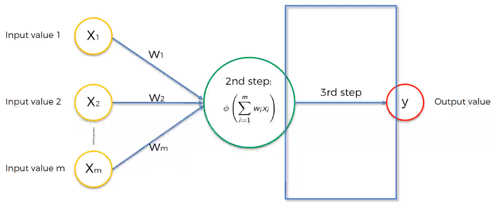

### Fonction d’activation

On peut utiliser plusieurs fonctions différentes, et ce n’est d’ailleurs pas toujours la même qu’on utilise entre chaque couche. La plus utilisée est apparemment la “rectifier”.

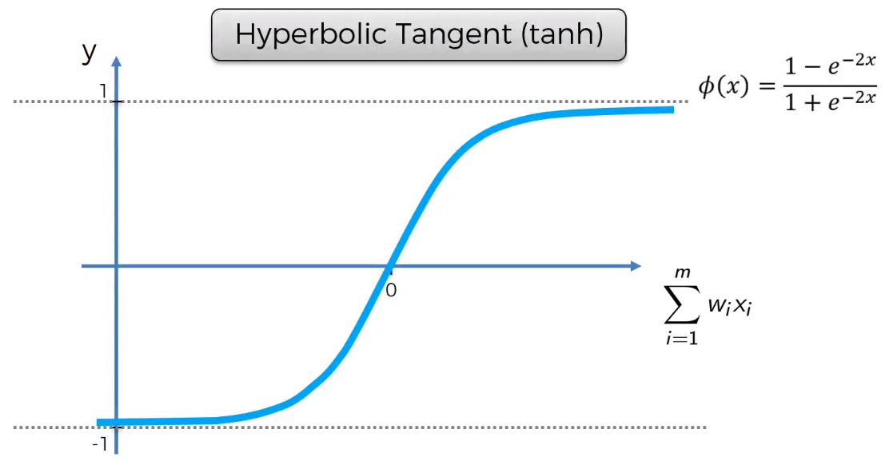

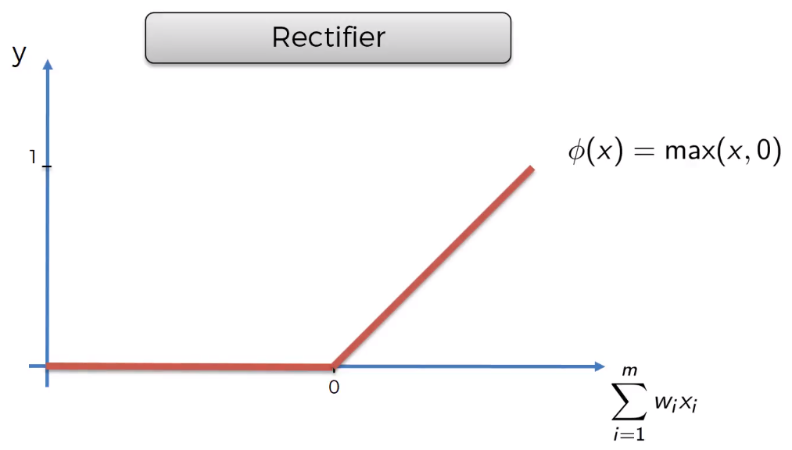

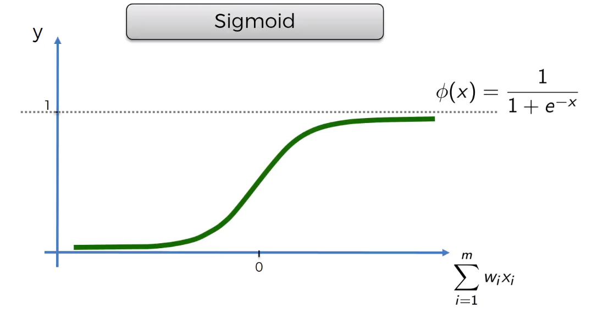

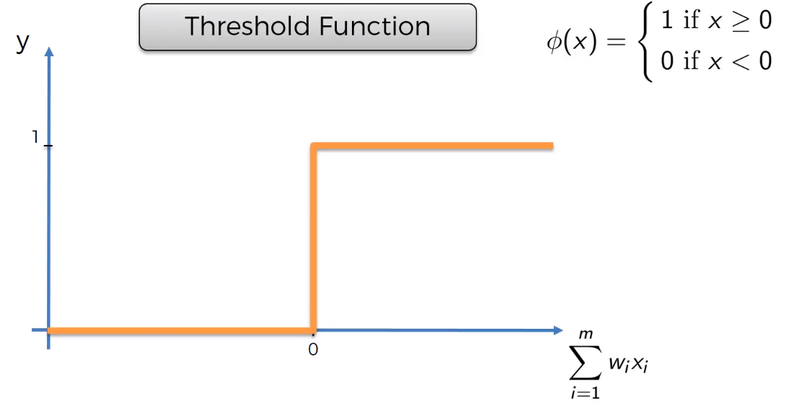

### Apprentissage

On donne des premiers coefficients aléatoire proche de 0 aux variables d’entrées. On lance une prédiction, puis on applique une cost function \(en général la Mean Squarred Error\) pour récupérer l’erreur. On applique à celle-ci une fonction de minimisation \(ici Gradient Descent\) et on renvoie les corrections en arrière pour mettre à jour les coeff.

**Remarque** : Je n’ai par contre pas compris si la Back Propagation englobe tout cela, ou juste le mise à jour des poids.

Tout ce processus s’appelle une Epoque, et on fait des milliers pour avoir un modèle prêt.

### Nombre de noeuds dans une hidden layer

On verra plus tard des techniques pour tester le nombre optimum, mais quand on l’ignore, le mieux est de faire la moyenne entre le nombre de noeud de l’input layer et celui de l’output layer.

## Convolutional Neural Networks

Les convolutional neural networks font de la classification d’image avec un réseau neuronal.

### Traitement de l’image

On va devoir passer par plusieurs étapes, la premières étant de diviser l’image en tableau de pixel ayant une valeur d’intensité entre 0 et 255. Pour des images en couleurs, on fait 3 tableaux, chacun indiquant l’intensité du pixel en rouge, vert et bleu.

#### Convolution Operation

Pour simplifier, imaginons que nous représentions ces intensités soit par un 0 pour blanc, soit par un 1 pour noir.

On va créer un “feature detector” \(aussi appelé filter\), en général de dimension 3x3. On va mettre certain de ces éléments à 0, et d’autres à 1 puis on l’applique au premier carré de 3x3 contenu dans notre image d’origine. On va compter chaque 1 placé au même endroit dans notre carré de 3x3 pris de l’image d’origine et notre feature detector, et mettre ce résultat dans un nouveau tableau. Puis on déplace notre carré de 3x3 sur l’origine d’une ou deux colonnes et on refait ce processus.

ça permet d’obtenir un tableau final qui est plus petit mais conserve quand même l’information des pixels. On va faire ça avec de nombreux feature detector différents pour avoir au final une “convolutional map”.

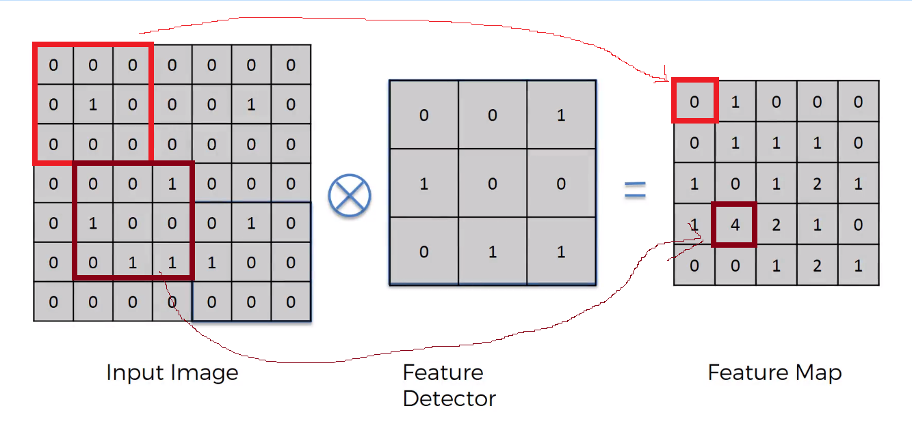

Chaque feature detector est censé représenter une feature particulière que l’on pourrait rechercher. Dans cet exemple, c’est celle du côté gauche du smiley.

#### ReLU Layer

Pour une raison ou une autre, le fait d’utiliser des feature detector peut induire de la linéarité dans l’image formée ainsi, ce que l’on suite éviter \(je suppose pour que chaque élément ressorte mieux et soit plus distinct des autres\).   Pour cela, on va appliquer la Rectifier Function à nos résultats.

#### Pooling

Pour que notre modèle ne dépende pas d’un angle précis d’image \(d’en face par exemple\), ni d’une dimension donnée, on va utiliser du Pooling, qui permet de mettre ensemble plusieurs pixel pour former un nouveau tableau représentant l’image \(qui sera donc plus petit\). \(On applique évidemment notre pooling sur les résultats des 2 étapes précédentes\).

On l’applique en général sur des blocs de 4 pixels et il y a en plusieurs sortes. Le Max Pooling prendre le pixel le plus intense du bloc, d’autre prennent par exemple la moyenne.

#### Flattening

Le flattening consiste à prendre nos tableaux résultants et à les transformer en une seule ligne. \(En mettant les lignes les unes après les autres\). C’est ensuite cette “liste” finale qui formera nos inputs.

J’ignore par contre dans quel ordre on gère les tableaux ? Est-ce qu’on les aplatit tous les uns après les autres ou la ligne du premier, puis la ligne du second, etc ?

#### Augmentation

Pour bien entrainer un model, il faut soit énormément d’images, soit augmenter le petit set d’images qu’on a. Cela signifie les transformer en les zoomant/dezoomant, inversant leur sens, décalant des pixels, etc, pour que le model est bien plus d’exemples et des exemples moins parfait.

Keras permet de faire cela assez simplement.

### Fonctionnement du réseau en lui-même

Comparé au réseau artificiel faisant de la régression, dans celui-ci, toutes les neurones sont toujours connectées. Pour le reste, c’est globalement pareil \(enfin, si on rentre pas dans les maths j’imagine, car la back propagation doit pas être identique\).

A la sortie, on a des probabilités pour chaque catégorie de ce qu’est l’image d’entrée. Mais c’est probabilités peuvent dépasser 100% \(dans leur total je veux dire\), donc on leur applique la “Softmax” fonction, qui les ramène dans une échelle de 100.

Finalement, on a plus tendance à utiliser la Cross-Entropy que le Mean Squared Error comme fonction de coût car celle-ci est plus efficace.

