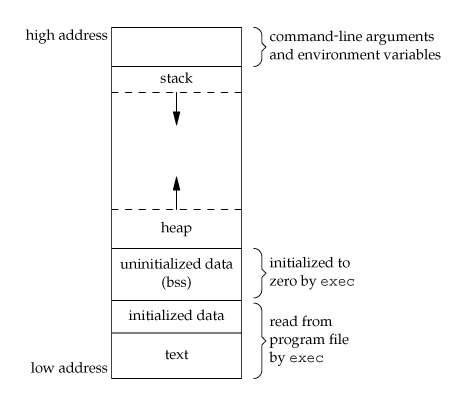

# Memory

## Virtual memory

* This is a process that makes it possible to simulate more memory than there is in reality
* The memory is divided in _**pages**_ ****\(in general 4kb\)
* The _**page table**_ ****maps each _**virtual page**_ ****\(also called _**logical page**_\) to the **physical memory** \(also called _**page frame**_\)
* Translation between the two is done by the _**Memory Management Unit**_ ****\(MMU\)
  * For optimization, recent mapping are kept in the _**Translation Lookaside Buffer**_ ****\(TLB\)
* If the RAM is full, the CPU transfer pages to the hard drive and request them back when they're needed, this is called _**swapping**_
  * Multiple algorithms are used to decide which page to move
  * When the CPU spends more time swapping than executing instruction, we call that _trashing_
* Errors :
  * If we ask for an address than can't be translated to one on the hard drive, we get a `segmentation fault`
  * If the page isn't loaded in the RAM, we get a `page fault`

## Process Memory

* When a program get executed, it's given a memory address space as follows \(this doesn't detail everything\) :

* Command-line args given when launching the program & env var
* The stack, a LIFO list which grows downwards to low addresses
  * Used for parameters, return address & local variables
* The heap, which grows upward to high addresses
  * Used for dynamic allocation
* BSS \(Block Started by Symbol\), uninitialized global & static var
  * Initialized to 0 by the program at the start
* Initialized global & static var
* Text : used by the loader, often read-only

## Sources

* [dhavalkapil.com](https://dhavalkapil.com/blogs/Buffer-Overflow-Exploit/)

