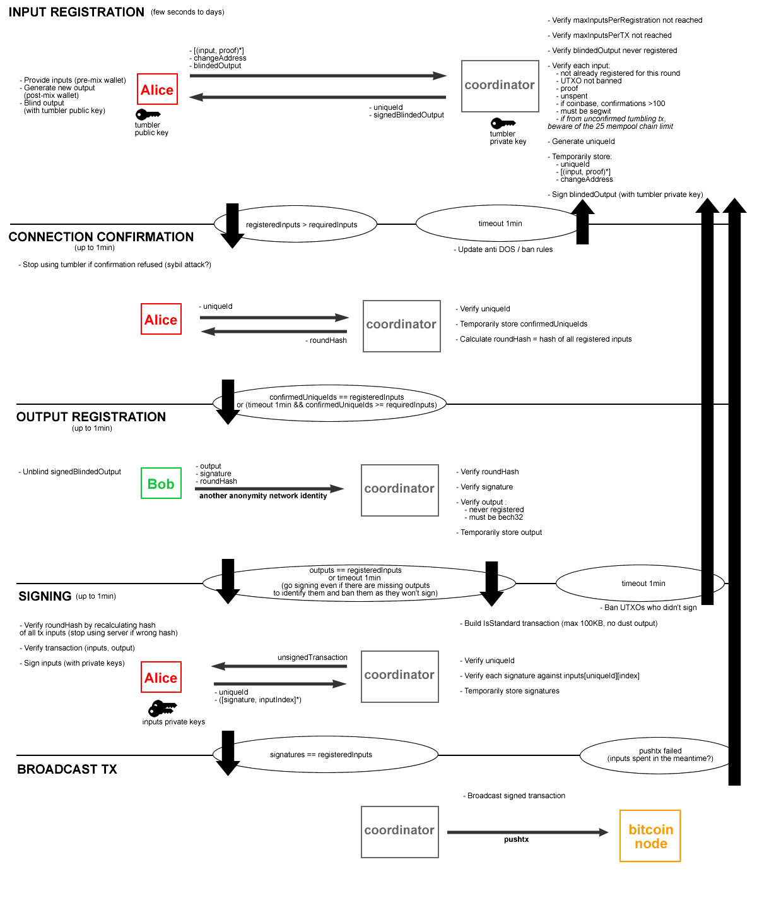

# Bitcoin

## Principe

* Monnaie digitale & décentralisée \(il n'y a pas d'institut unique contrôlant les échanges\)
* Aussi appelé crypto-monnaie, vu qu'elle se base sur des principes de la cryptographie pour fonctionner
* Un historique distribué entre tous les utilisateurs permet de garder trace de chaque transaction et donc des fonds de chacun
* Bitcoin fait référence au protocole/la techno, bitcoins à l'unité en elle-même. 1 coin peut aussi être appelé _unspent transaction output_ \(utxo\)
* Une partie de ce qui est écrit ici s'applique aussi à d'autre crypto-monnaie, j'ignore quelles sont les différences entre chacune.
*  bitcoins is the minimal unit of Bitcoin, and is known as a _satoshi_

### Transaction

* Chaque utilisateur peut rajouter des transactions à l'historique en les broadcastant sur le réseau
  * Elles ne sont valide que si on a les fonds pour \(on ne peut pas être endetté\)

Elles ressemblent à cela \(info datant de 2013, ça a pu changé depuis\) :

```text
{
"hash" : "993830...", # Hash of the following info
"ver" : 1, # version
"vin_sz" : 3, # input size
"vout_sz" : 2, # output size
"lock_time" : 0, # time before finalization
"size" : 552, # size in bits
"in" : [
    {
        "prev_out" :
        {
            "hash" : "3beabc...", # hash of origin transaction
            "n" : 0 # index of origin output
        },
        # signature of transaction + corresponding public key
        "scriptSig" : "304402... 04c7d2..."
    },
    {
        "prev_out" :
        {
            "hash" : "fdae9b...",
            "n" : 0
        },
        "scriptSig" : "304502... 026e15..."
    },
    {
        "prev_out" :
        {
            "hash" : "20c86b...",
            "n" : 1
        },
        "scriptSig" : "304402... 038a52..."
    }],
"out" : [
    {
        "value" : "0.01068000", # amount to transfer
        # script with recipient address
        "scriptPubKey" : "OP_DUP OP_HASH160 e8c306... OP_EQUALVERIFY OP_CHECKSIG"
    },
    {
        "value" : "4.00000000",
        "scriptPubKey" : "OP_DUP OP_HASH160 d644e3... OP_EQUALVERIFY OP_CHECKSIG"
    }]
}
```

Elle est composée de :

* Son propre hash \(qui permet de l'identifier\)
* La liste des inputs, chacun composé de :
  * L'hash de la transaction dont ils sont un ouput
  * L'index de l'output \(afin de savoir quel output utilisé précisément\)
  * La signature de l'input et la clé publique correspondante \(Je ne suis pas sûre de ce qui est signé exactement. Ca me semble étrange de ne signer que l'input mais en même temps la signature est rattachée à celui-ci..\)
* La liste des outputs, chacun composé de :
  * Leur valeur
  * Un script \(utilisant un langage spécifique à Bitcoin\) décrivant le destinataire. 
    * Le hash du milieu est la _bitcoin address_ de celui-ci
    * C'est en fait le hash de sa clé publique

On a besoin de plusieurs input/output en partie car les utxo sont utilisés dans leur entièreté, et un change est ensuite rendu. Ce change est en fait un paiement à soi-même du montant en trop.

### Bloc & Validation

* L'historique est en fait une chaîne de blocs de 2400 transactions chacun
* Pour qu'un bloc soit valide, il doit être composé du hash du bloc précédent, de la liste des transactions et d'un "Proof of Work"
* Celui-ci est un nombre qui ajouté au bloc permet d'obtenir un certain hash \(via SHA256\) suivant une certaine règle. Par exemple d'être inférieur à un nombre donné.
* Cela demande évidemment de la puissance et du temps \(vu que c'est plus ou moins du bruteforce\), et le nombre référence varie de façon à ce qu'un nouveau bloc soit validé environ chaque 10min

### Mineurs

* Les mineurs s'occupent de récupérer les transactions qui sont broadcast, d'en faire des blocs et de chercher ce nombre leur permettant de les valider
* Ils broadcastent ensuite le nouveau bloc
* Si un utilisateur reçoit 2 chaines de blocs contradictoire, il attends de voir laquelle grandit la plus vite et considère que c'est la valide
  * Un bloc est confirmé quand il est fait partit du plus long fork et à 5 bloc après lui
  * Ces contraintes permettent d'empêcher de fausse transaction, car il faudrait qu'un mineur est énormément de puissance pour pouvoir construire tous les blocs nécessaire de son fork alors que tous les autres se concentrent sur l'autre fork.
* On parle de "mineur", car un nombre arbitraire de bitcoin est créé "de toute pièce" et offerts au mineur pour chacun de ces blocs validés
  * Ce nombre diminue par contre au fil du temps pour qu'il n'y ai jamais plus de 21 millions de bitcoin
* Les blocs étant petit, le temps pour les valider long et les transactions nombreuses, les utilisateurs donnent une "taxe" supplémentaire aux mineurs pour être choisit et inséré dans le prochain bloc, donc ceux-ci continueront de gagner de l'argent malgré tout

## Wallets

* Les logiciels/sites permettant de conserver ces bitcoins, il y a en a pour toutes plateformes avec pleins de features différentes
* Chaque porte-monnaie est relié à plusieurs adresses
* Perso j'ai pris Wasabi Wallet, il est simple, passe par tor et permet de coinjoin \(cf en dessous\)

## Anonymat

On dit souvent que Bitcoin est anonyme mais ce n'est pas vraiment le cas. Les adresses bitcoins ne sont pas reliées directement à une personne, mais si jamais on arrive à les déduire, toutes les transactions faites avec celles-ci sont récupérables.

Ils existent différentes techniques pour perdre une transaction dans la masse, afin de couper la chaîne permettant de remonter l'historique. Je vais décrire le _Chaumian Coinjoin_ comme implémenté par _Zero Link_ et utilisé par _Wasabi Wallet_.

Mais avant cela, la règle de base est de systématiquement générer une nouvelle adresses pour chaque transaction afin qu'il soit plus ardu de les reliés.

Le protocole fonctionne globalement ainsi :



En gros, un utilisateur va se faire passer pour 2 utilisateurs différents, A \(ici Alice\) et B \(ici Bob\).

* Phase d'enregistrement des inputs :
  * A va envoyer ces inputs, blindedOutput, change address et tout ce qui va avec au Coordinateur
  * Celui-ci va les valider, signer les blindedOutput et attribuer un id à A
* Phase de confirmation :
  * Quand suffisamment d'utilisateurs ont enregistré des inputs, cette phase peut commencer
  * A va envoyer son id au Coordinateur, en retour de quoi elle va recevoir le hash de tout les inputs enregistrés pour ce tour
* Phase d'enregistrement des output :
  * B va envoyer au Coordinateur 
    * L'output \(en clair cette fois\)
    * La signature que celui-ci lui avait attribué \(lui permettant ainsi de confirmer que B a bien participer à la 1ère étape\)
    * Le hash des inputs \(permettant de confirmer le tour dont il est question\).
* Phase de signature :
  * Le Coordinateur renvoie la transaction non signée à A
  * A utilise le hash du tour pour vérifier que tout est ok et vérifie aussi les inputs/outputs
  * Elle renvoi sa signature avec l'index de l'input correspondant et son id
  * Le Coordinateur accumule les inputs signés et finalise la transaction

Tous les output désirés reçoivent la même quantité de bitcoins, afin qu'on ne puisse savoir de quel input précisément ils proviennent. Les changes par contre sont évidement custom et donc non-anonyme. Dans Wasabi, les output sont en fait les addresses des gens eux-mêmes, ils se renvoient juste des bitcoin plus anonyme. \(Ce qui a du sens car il serait compliqué de trouver pleins de monde ayant besoin de dépenser exactement la même somme au même moment\).

## Acheter des bitcoins

On peut s'en procurer :

* Des choix pour ces 2 options sont donnés sur le site de Bitcoin :
  * Avec des exchanges, qui permettent des virements par compte/paypal/carte bancaire, etc et qui demandent souvent de vérifier l'identité avec un passeport/carte
  * En peer-2-peer, les détails varie en fonction des plateformes
* A des bancomats spécial pour bitcoin
* Via [https://buy.bitcoin.com/](https://buy.bitcoin.com/) qui permet de le faire par carte bancaire sans plus de vérif

## To check

* [Original Bitcoin paper](https://bitcoin.org/bitcoin.pdf) 
* [Block explore](https://blockexplorer.com/)r
* Video by [CuriousInventor](https://youtu.be/Lx9zgZCMqXE)
* Video by [Anders Brownworth](https://youtu.be/_160oMzblY8)
* [Ethereum white paper](https://goo.gl/XXZddT)
* [Merkle Tree](https://en.wikipedia.org/wiki/Merkle_tree)
* Smart Contract

## Sources

* [Bitcoin](https://bitcoin.org/fr/)'s website
* 3Blue1Brown's [video](https://www.youtube.com/watch?v=bBC-nXj3Ng4)
* [http://www.michaelnielsen.org/ddi/how-the-bitcoin-protocol-actually-works/](http://www.michaelnielsen.org/ddi/how-the-bitcoin-protocol-actually-works/)
* [Wasabi Wallet](https://wasabiwallet.io/)'s doc
* [Zero Link](https://github.com/nopara73/ZeroLink/)'s github
* [World Crytp Network](https://www.youtube.com/channel/UCR9gdpWisRwnk_k23GsHfcA)

## 

