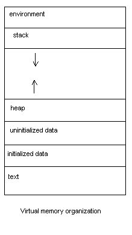

# Memory Allocation \(linux, glibc\)

## Intro

Quand on exécute un programme, celui-ci reçoit un “address space” propre de mémoire virtuelle continue, elle est structurée ainsi :

* environment : variables d’env et arguments de ligne de commande
* stack : argument de fonction, valeur de retour, valeur automatique \(toutes les variables déclarée sans malloc\). Grandit vers le bas \(enfin, le haut si on parle d’adresses\)
* heap : toutes variables dynamiquement allouées, aussi appelée "free store". Grandit vers le haut \(enfin, le bas pour les adresses\)
* uninitialized data : des variables statiques/globales initialisées à 0
* initialized data : des variables statiques/globales initialisées
* text : le programme \(le code\). C’est noté text, mais ca m’etonnerait pas que ce soit le binaire plutôt.

## Mémoire physique

Il existe 2 types de mémoire physique principaux, la mémoire vive \(RAM\) et la mémoire morte \(disque dur\).

La RAM est la _main memory_ et celle utilisée par le CPU. Elle s’appelle _Random Access Memory_ car celui-ci peut accéder à n’importe quelle partie de cette mémoire directement \(cela prendra toujours le même temps\). Les données dans la RAM sont perdues quand on coupe l’alimentation.

La mémoire morte est elle la _secondary memory_ et est bien plus grosse. Elle est aussi conservée sans alimentation.

## Mémoire virtuelle

Elle est divisée en _page_ \(d’en général 4kb\). La _page table_ permet de mapper chaque page virtuelle \(aussi dite logique\) à la mémoire physique \(aussi dite _page frame_\). La traduction entre adresses virtuelles et physiques est gérée par le _Memory Management Unit_ \(MMU\). En guise d’optimisation, il conserve les mapping utilisés récemment dans le _Translation Lookaside Buffer_ \(TLB\).

Si la RAM est pleine, le CPU peut transférer des pages dans la mémoire morte et les récupérer après quand elles sont demandées, c’est ce qu’on appelle le _swapping_. Il existe différent algorithmes permettant de déterminer quelle page déplacer, et quand le CPU passe plus de temps à les échanger qu'à exécuter des instructions, on appelle ça du _trashing_.

Si le processus demande l'accès à une adresse qui ne peut pas être traduite en adresse physique \(car il n’en a pas les droits par exemple\), une `segmentation fault` est générée.

Par contre, si la page correspondante n’est pas chargée dans la RAM \(car elle a été swappée\), cela génère une `page fault`, et il va falloir la récupérer avant de continuer.

Cette utilisation de la mémoire morte, si elle n’est pas excessive, permet de simuler beaucoup plus d’espaces qu’il n’y en a réellement dans la RAM.

## Heap allocation - introduction

Il existe différentes implémentations, tel que le _PartitionAlloc_ de Google Chrome et le _jemalloc_ de FreeBSD. Celles-ci dépendent aussi des plateformes, ainsi le fonctionnement sur Linux et Windows ne sera pas le même.

Ce résumé se concentre sur le _glibc heap allocator_, aka heap allocations pour des applications C/C++ tournant sur Linux. Il se base sur _ptmalloc_, qui est lui-même basé sur _dlmalloc_ \(Doug Lea malloc\).

“malloc” tient pour “memory allocation” évidemment.

## Règles de base pour développeurs

Les développeurs doivent suivre ces règles basiques s’ils veulent éviter des vulnérabilités simples.

En C++, on utilise plutôt `new` et `delete`, mais je suppose que la logique que j’explique par la suite vaut pour eux aussi.

## Arenas

Pour les applications avec plusieurs threads, il faut évidemment faire en sorte d’éviter les “races conditions”. Pour cela, ils lockaient à l’époque toute la heap pour chaque opération le nécessitant, ce qui n’est évidemment pas très performant.

Les arenas ont donc été introduite, ayant chacune leur propre heap, etc. Chacune lock ces ressources pour ces propres instructions, mais elles sont indépendantes les unes des autres, donc les threads se bloquent déjà beaucoup moins.

Logique pour chaque nouveau thread :

1. Essaie de trouver une arena qui n’est attachée à aucun thread et l'attacher au nouveau.
2. S’il n’y en a pas, en créer une nouvelle \(jusqu’à en avoir maximum 2x cpu-cores in 32-bit processes and 8x cpu-cores in 64-bit processes\)
3. Si cette limite est atteinte, attacher le nouveau thread à une arena existante, les forçant ainsi à la partager.

### Subheap

L’arena principale et sa heap sont placées \(en mémoire\) directement après le programme, et étendues \(au début\), grâce à `sbrk`.

Tandis que les nouvelles arenas et heap sont elles créées au moyen de `mmap` avec le flag `PROT_NONE` pour indiquer que l’espace a uniquement besoin d’être réservé, pas encore d’être alloué.

Elles sont ensuite agrandies en utilisant `mprotect` pour changer ce flag à `PROT_READ` ou `PROT_WRITE`.

## Heap Allocation Logic

Quand un programme demande un espace mémoire, le heap manager va lui renvoyer ce qu’on appelle un “chunk” composé de metadata, puis de l’espace demandé, puis des bits d’alignements \(the allocation is always 8-byte aligned on 32-bit systems, or 16-byte aligned on 64-bit systems\), etc. Il renvoie ensuite un pointeur directement vers l’espace demandé.

### Logique d’allocation

1. Si j’ai des “chunks” libre de la bonne taille, les utiliser directement.
2. Sinon, s’il reste de l’espace dans la heap, en créer un.
3. Sinon, demander au kernel d’agrandir la zone de la heap \(avec `sbrk` ou `brk`\).
4. Si cela causerait la heap à entrer en collision avec des zones mémoire réservées, the heap manager will resort to attaching new non-contiguous memory to the initial program heap using calls to `mmap`.
5. Si rien de tout ça n’est possible, renvoyer `NULL` et mettre un flag d’erreur.

Pour des requêtes d’allocations particulièrement grandes, le heap manager utilise directement `mmap` et flag ces chunks différemment. Au moment de `free`, il utilisera directement `munmap`.

### Structure des chunks alloués

Si j’ai bien compris, avoir le _prev\_size_ et le flag _P_ permet de plus rapidement/facilement fusionner les chunks quand il y a en des libres adjacents.

## Free

Quand on appelle `free`, on le fait avec le pointeur sur la zone “user data”, celui-ci y soustrait donc la taille des metadata pour récupérer le chunk en lui-même. Cela ne peut par contre marché que sur un espace mémoire qui a été déclaré par `malloc` \(ou d’autres fonctions équivalentes\).

### Checks

Ainsi, `free` commence d’abord par faire quelques checks \(ceux-ci peuvent être contournés pour des exploits, mais c’est un début\):

1. A check that the allocation is aligned on an 8-byte \(or 16-byte on 64-bit\) boundary
2. A check that the chunk’s size field isn’t impossible–either because it is too small, too large, not an aligned size, or would overlap the end of the process’ address space.
3. A check the chunk lies within the boundaries of the arena.
4. A check that the chunk is not already marked as free by checking the corresponding “P” bit that lies in the metadata at the start of the next chunk.

### Structure des chunks libérés

### Processus de libération

1. Si le flag M est set, directement passé par `munmap`
2. Sinon, si c’est possible merger le chunk \(backward & forward\)
3. Si le nouveau chunk est vers la fin de la heap, l’absorber dans celle-ci plutôt que la mettre dans une heap.
4. Sinon, placer le chunk dans la bin appropriée

Le flag “A” permet de l’aider à trouver dans quelle arena le chunk est. Si ce flag n’est pas set, il provient de la principale, sinon il doit toutes les parcourir ainsi que ces subheap pour le trouver.

Mais j’admets ne pas trop comprendre car soit chaque adresses mémoire est unique, auquel cas il devrait par défaut savoir à quelle arena ça correspond, soit on a la même range d’adresse mémoire pour chaque arena, auquel cas elles ne sont pas unique et on ne peut pas être sûr que celui qu’on a trouvé est le bon non ?

Je vais juste copier son paragraphe en attendant :

> The “A” flag is used to tell the heap manager if the chunk belongs to secondary arena, as opposed to the main arena. During free, the heap manager is only given a pointer to the allocation that the programmer wants to free, and the heap manager needs to work out which arena the pointer belongs to. If the A flag is set in the chunk’s metadata, the heap manager must search each arena and see if the pointer lives within any of that arena’s subheaps. If the flag is not set, the heap manager can short-circuit the search because it knows the chunk came from the initial arena.

### Bins

Au lieu de simplement mettre tous les chunks libérés dans une liste chaînée, `free` en utilise 5 type différents pour optimiser les prochaines allocations : 62 small bin, 63 large bins, 1 unsorted bin, 10 fast bins & 64 tcache bins per thread.

The small, large, and unsorted bins all live together in the same array in the heap manager’s source code.

#### Small Bins

Pour toutes les tailles de 16 à 504 \(par multiple de 8\), il y a une small bin correspondante. Ainsi, les chunks sont automatiquement trié par taille et rapide à récupérer.

#### Large Bins

Il n’est évidemment pas viable de faire cela pour chaque taille possible de chunk, donc les bins plus large représente elle des ranges de taille. Celles-ci ne sont pas les même tout le long du tableau d’ailleurs, mais s’espacent de plus en plus \(l’image sera plus parlante\) :

#### Unsorted Bin

Il arrive souvent que plusieurs chunks soit libéré à la suite pour ensuite ensuite être directement alloué pour à peu prêt la même taille. Pour cette raison, avant de ranger les chunks dans leur bin respectives, il les fusionne avec leur voisin libre puis les range dans la “unsorted bin”. During malloc, each item on the unsorted bin is checked to see if it “fits” the request. If it does, malloc can use it immediately. If it does not, malloc then puts the chunk into its corresponding bin.

#### Fast Bin

Ces bins là sont des cas à part permettant plusieurs optimisation.

They essentially keep recently released small chunks on a “fast-turnaround queue”, intentionally keeping the chunk live and not merging the chunk with its neighbors so that it can be immediately repurposed if a malloc request for that size comes in very soon after the chunk is freed.

Il y en a 10 en tout, pour les tailles 16 à 88 \(par multiple de 8\). \(A verifier, car un moment elle dit "There are 10 such fast bins, covering chunks of size 16, 24, 32, 40, 48, 56, 64, 72, 80, and 88 bytes plus chunk metadata." et à un autre "\[..\] that is larger than a fastbin can service \(i.e., for chunks over 512 bytes or 1024 bytes on 64-bit\) \[..\]"\)

N’étant jamais fusionnées avec leur voisin \(leur “P” flag n’est jamais set\), elles peuvent être des single-linked list au lieu de double.

L’inconvénient est que les chunks ne sont jamais libéré/nettoyé entièrement \(vu qu’il n’y a pas de fusion, etc\), donc régulièrement, le heap manager “consolide” la heap en nettoyant ces bin \(aka merger les chunk et les mettre dans la unsorted bin.\)

Cela arrive quand une allocation est demandée pour un chunk plus grand que ce qu’accepte les fast bin, quand on libère un chunk de plus de 64kb \(valeur heuristique\) ou quand `malloc_trim` ou `mallopt` sont appelés.

#### TCache \(per thread cache\) bin

Le processus pour qu’un thread obtienne le lock sur la heap est apparemment assez long, donc pour contourner cela, chaque thread à 7 tcache bin perso. De ce que je comprends, celles-ci fonctionne assez similairement aux fast bin \(j’ignore leur taille mais elles sont probablement petite aussi\).

Quand un thread n’a pas de chunk de la taille adéquate dans sa tcache, il va passer par les étapes habituelles, mais aussi en profiter pour remplir sa tcache depuis les autres bins avec des chunks de cette taille.

## Processus entier final

### Allocation

1. If the size corresponds with a _tcache bin_ and there is a _tcache chunk_ available, return that immediately.
2. If the request is enormous allocate a chunk off-heap via `mmap`.
3. Otherwise we obtain the arena heap lock and then perform the following strategies, in order:
   1. **Try the fastbin/smallbin recycling strategy**
      * If a corresponding _fast bin_ exists, try and find a chunk from there \(and also opportunistically prefill the _tcache_ with entries from the fast bin\).
      * Otherwise, if a corresponding _small bin_ exists, allocate from there \(opportunistically prefilling the _tcache_ as we go\).
   2. **Resolve all the deferred frees**
      * Otherwise “truly free” the entries in the fast-bins and move their consolidated chunks to the _unsorted bin_.
      * Go through each entry in the _unsorted bin_. If it is suitable, stop. Otherwise, put the unsorted entry on its corresponding small/large bin as we go \(possibly promoting small entries to the _tcache_ as we go\).
   3. **Default back to the basic recycling strategy**
      * If the chunk size corresponds with a large bin, search the corresponding large bin now.
   4. **Create a new chunk from scratch**
      * Otherwise, there are no chunks available, so try and get a chunk from the top of the heap.
      * If the top of the heap is not big enough, extend it using `sbrk`.
      * If the top of the heap can’t be extended because we ran into something else in the address space, create a discontinuous extension using `mmap` and allocate from there
   5. **If all else fails, return NULL**.

### Free

1. If the pointer is NULL, the C standard defines the behavior as “do nothing”.
2. Otherwise, convert the pointer back to a chunk by subtracting the size of the chunk metadata.
3. Perform a few sanity checks on the chunk, and abort if the sanity checks fail.
4. If the chunk fits into a tcache bin, store it there.
5. If the chunk has the M bit set, give it back to the operating system via munmap.
6. Otherwise we obtain the arena heap lock and then:
7. If the chunk fits into a fastbin, put it on the corresponding fastbin, and we’re done.
8. If the chunk is &gt; 64KB, consolidate the fastbins immediately and put the resulting merged chunks on the unsorted bin.
9. Merge the chunk backwards and forwards with neighboring freed chunks in the small, large, and unsorted bins.
10. If the resulting chunk lies at the top of the heap, merge it into the top of the heap rather than storing it in a bin.
11. Otherwise store it in the unsorted bin. \(Malloc will later do the work to put entries from the unsorted bin into the small or large bins\).

## phrack article

* [Once upon a free\(\)](http://phrack.org/issues/57/9.html)
* [Malloc des-maleficarum](http://phrack.org/issues/66/10.html)
* [The house of lore](http://phrack.org/issues/67/8.html)
* [Advance Doug Lea's malloc exploits](http://phrack.org/issues/61/6.html)
* [Yet another free\(\) exploitation technique](http://phrack.org/issues/66/6.html)

## Source

* [Azeria's lab](https://azeria-labs.com/heap-exploitation-part-1-understanding-the-glibc-heap-implementation/)

