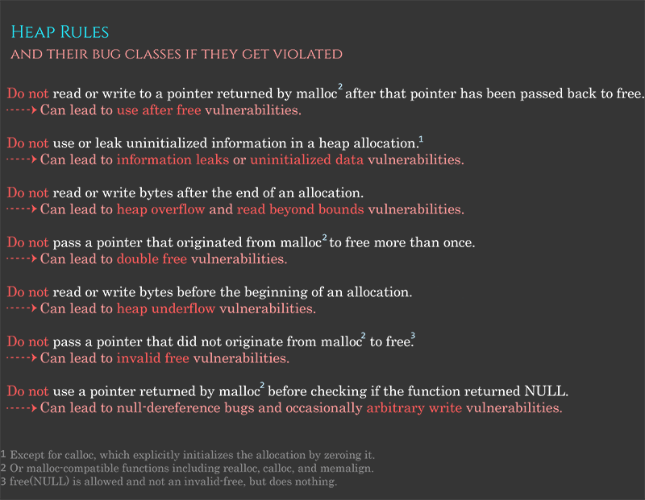

# Memory Allocation \(linux, glibc\)

## Virtual memory

* Divided in _pages_ \(in general 4kb\)
* The _page table_ maps each _virtual page_ \(also called _logical page_\) to the physical memory \(also called _page frame_\)
* Translation between the two is done by the _Memory Management Unit_ \(MMU\)
  * For optimization, recent mapping are kept in the _Translation Lookaside Buffer_ \(TLB\)
* If the RAM is full, the CPU transfer pages to the hard drive and request them back when there're needed, this is called _swapping_
  * Multiple algorithms are used to decide which page to move
  * When the CPU spends more time swapping than executing instruction, we call that _trashing_
* Errors :
  * If we ask for an address than can't be translated to one on the hard drive, we get a `segmentation fault`
  * If the page isn't loaded in the RAM, we get a `page fault`
* With this functionality, we can simulate way more space than there is

## Introduction

* There's multiple implementations of malloc, for example :
  * Google Chrome's _PartitionAlloc_ 
  * FreeBDS's _jemalloc_
* They depend on the platform, so implementation on Windows will be different
* This summary is about the _glibc heap allocator_, so allocation on C/C++ application running on Linux
  * It's based on _ptmalloc_ which is itself based on _dlmalloc_ \(Doug Lea's malloc\)
* Malloc stands for "Memory Allocation"

## Basic rules for dev

* To prevent simple vulnerabilities, devs needs to follow those rules :

* In C++, we use `new` instead of `delete`, but the logic is the same

## Arenas

* For multi-threads applications, we need to prevent race condition
* Before, they simply lock the whole heap for each operation, but it wasn't very efficient
* We now have _arenas_, with each their own heap
  * Each lock it's resources for their own instruction, but they're independent from each other
* Logic for each new thread :
  * Try to find an arena that isn't tied to a thread and tie the new thread to it
  * If there isn't one, create a new one \(max 2x cpu-cores in 32-bit and 8x cpu-cores in 64 bit\)
  * If the limit is reached, tie the new thread to an existing arena, they'll share it

### Subheap

* The main arena and it's heap are stored in memory directly after the program code. They're extended at the start with `sbrk`
* New arenas are created with `mmap` with the flag `PROT_NONE` set to indicate that the space only need to be reserved, not allocated
* After that, we can extend them by changing the flag to `PROT_READ` or `PROT_WRITE`
* Memory structure :

## Allocation process

* When a programs ask for memory space, the heap manager will create a _chunk_ composed of :
  * metadata
  * the space asked
  * alignment bits \(8-byte aligned on 32 bits, and 16-byte aligned on 64 bits\)
* It then returns a pointer to the start of the space ask
* In more details, the process is as follows : 
  * If i have chunks of the right size, use them
  * If not, and there's still space inside the heap, create one
  * If not, and there's not enough space, ask to extend the heap \(with `sbrk` or `brk`\)
  * If that would cause the heap to collide with other reserved memory space, the heap manager resort to attach new non-contiguous memory to the initial program heap with `mmap`
  * If nothing is possible, return `NULL` and an error flag
* For especially big allocation request, the heap manager directly calls `mmap` and flag the chunk differently. \(When it'll free them, it'll directly use `munmap`\)

### Structure of allocated chunks

If I understood correctly, `prev_size` and the P flags help merge chunks more rapidly when free chunks are next to each others

## Free

* Use the pointer to the user data space when calling `free`
* It subtract the size of the metadata to get the chunk address
* This can only work on memory space allocated by malloc or other similar functions

### Checks

* `free` starts by doing some checks \(they can be avoided with certain exploit\)
  * Check that the allocation is aligned on an 8-byte \(or 16-byte on 64-bit\) boundary
  * Check that the chunk’s size field is possible. It would be impossible if :
    * It's too small/large
    * Not an aligned size
    * Overlaps with the end of the process’s address space
    * Check that the chunk lies within the boundaries of the arena
  * Check that the chunk isn't already marked as free by looking at the `P`

### Structure of freed chunks

### Process

* The `A` is not set, the chunk comes from the initial arena
  * Otherwise, it comes from a secondary one and the heap manager must run through each of them to find the pointer given to free
* If the `M` flag is set, use `munmap`
* If not, merge the chunk backward then forward
* If the new chunk is near the end of the heap, absorb it into it
* If not, place it into a bin

### Bins

* Instead of simply putting all freed chunk in a list, `free` uses 5 type :
  * 62 small bins
  * 63 large bins
  * 1 unsorted bin
  * 10 fast bin
  * 64 tcache bins per threads
* The small, large & unsorted bins live in the same array.

#### Small Bins

* There's a small bin for every size from 16 to 504 \(by multiple of 8\)
* Because of that, the chunk are automatically sorted by size and fast to retrieve

#### Large Bins

* You can't do as with the small bins for every possible size, so large bins represent bigger ranges of size
* The range augment as we go through the array, the image will be clearer :

#### Unsorted Bin

* Oftencase, multiple chunks are freed just to be allocated again directly
* Because of that, before putting the chunk into their respective bins, they're merge with their freed neighbors and put into _unsorted bin_
* For each malloc, each item of the unsorted bin is checked to see if it correspond to the request
  * If it does, it's used directly
  * If not, malloc put its into its corresponding bin

#### Fast Bin

* These permit multiple optimization
* They keep small recently released chunks by not merging them with their neighbors to immediately re-use them if the request of the right size comes
* There's 10 of them
* Since they're never merge with their neighbors, they can be single-linked list
* When a request is bigger than the authorized space of a fast bin \(generally 64kb\), the heap manager consolidate them by merging them with their neighbors and putting the resulting chunk into the unsorted bin
  * The same is done when `malloc_trim` or `mallopt` are called

#### TCache \(per thread cache\) bin

* The process for a thread to obtain the heap lock is long, so to avoid that each threads has 7 _tcache bin_
* They function similarly to fast bins
* When a thread doesn't have an adequate chunk in it's tcache, it will use the normal way and fill it's tcache along the way

## Complete process

### Allocation

* If the size corresponds with a _tcache bin_ and there is a _tcache chunk_ available, return that.
* If the request is enormous, allocate a chunk off-heap via `mmap`
* Otherwise we obtain the arena heap lock and then perform the following strategies, in order:
  * **Search in fast bins or small bins**
    * If a corresponding _fast bin_ exists, try and find a chunk from there \(and also opportunistically prefill the _tcache_ with entries from the fast bin\)
    * Otherwise, if a corresponding _small bin_ exists, allocate from there \(opportunistically prefilling the _tcache_ as we go\).
  * **Resolve all the deferred frees**
    * Free the entries in the fast-bins and move their consolidated chunks to the _unsorted bin_.
    * Go through each entry in the _unsorted bin_. 
      * If it is suitable, stop.
      * Otherwise, put the unsorted entry into its corresponding small/large bin as we go \(possibly promoting small entries to the _tcache_ as we go\).
  * **Search the large bins**
  * **Create a new chunk from the top of the heap**
    * If it's not big enough, extend it using `sbrk`
    * If it can’t be extended, create a discontinuous extension using `mmap` and allocate from there
  * **If all else fails, return NULL**.

### Free

* If the pointer is NULL, the C standard defines the behavior as “do nothing”
* Otherwise, convert the pointer back to a chunk by subtracting the size of the chunk metadata
* Perform sanity checks on the chunk, and abort if they fail
* If it fits into a tcache bin, store it there
* If it has the `M` flag set, use `munmap`
* Otherwise we obtain the arena heap lock and then :
  * If the chunk fits into a fast bin, put it there
  * If the chunk is &gt; 64KB, consolidate the fas tbins and put the resulting merged chunks in the unsorted bin
  * Merge the chunk backwards and forwards with neighboring freed chunks in the small, large, and unsorted bins.
  * If the resulting chunk lies at the top of the heap, merge it into the top of the heap rather than storing it in a bin
  * Otherwise store it in the unsorted bin

## phrack article

* [Once upon a free\(\)](http://phrack.org/issues/57/9.html)
* [Malloc des-maleficarum](http://phrack.org/issues/66/10.html)
* [The house of lore](http://phrack.org/issues/67/8.html)
* [Advance Doug Lea's malloc exploits](http://phrack.org/issues/61/6.html)
* [Yet another free\(\) exploitation technique](http://phrack.org/issues/66/6.html)

## Source

* [Azeria's lab](https://azeria-labs.com/heap-exploitation-part-1-understanding-the-glibc-heap-implementation/)

