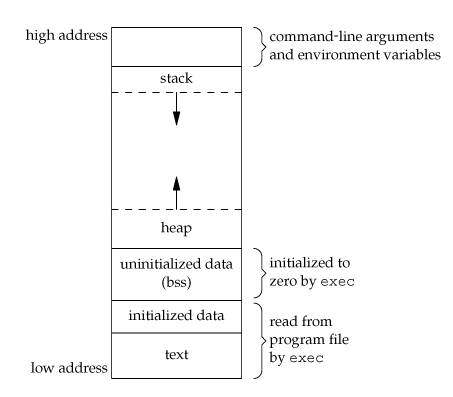

# Process memory

* When a program get executed, it's given a memory address space as follows \(this doesn't detail everything\) :

* Command-line args given when launching the program & env var
* The stack, a LIFO list which grows downwards to low addresses
  * Used for parameters, return address & local variables
* The heap, which grows upward to high addresses
  * Used for dynamic allocation
* BSS \(Block Started by Symbol\), uninitialized global & static var
  * Initialized to 0 by the program at the start
* Initialized global & static var
* Text : used by the loader, often read-only

## Sources

* [dhavalkapil.com](https://dhavalkapil.com/blogs/Buffer-Overflow-Exploit/)

