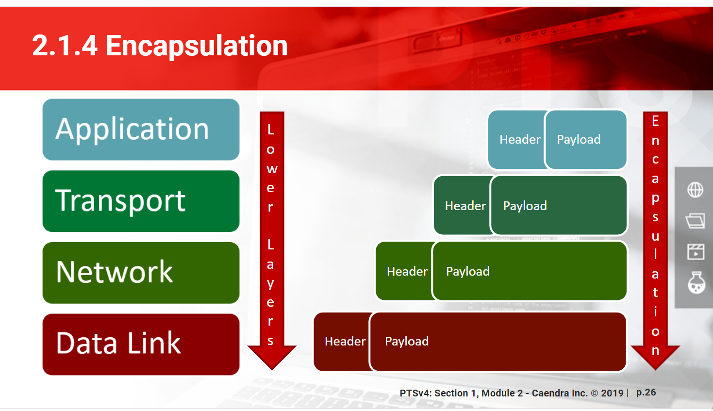

# Modèle & Protocoles

## Généralités

* Technos divisées en couche
* Si une couche inférieur ne fonctionne pas, celle du dessus non plus
* Chaque couche ne communique qu'avec celles adjacentes
* 2 modèles
  * _Open System Interconnect_ \(OSI\) : 7 couches, détaillé mais peu représentatif
  * TCP/IP : 5 couches, détaillé ici

## Layer 1 : Physical

Les cables \(ethernet ou coaxial\), les ondes radios, etc. Il n'y a pas d'intelligence/décision dans cette couche.

## Layer 2 : Datalink

* Transforme les couches supérieurs en signaux à envoyer dans les cables
* Ethernet est le protocole standard
* "A single lump of datalink data is called a _**frame**_"
* It has a _Maximum Transmission Unit_ \(MTU\) defining it's size
  * Older Ethernet equipment have an MTU of 1500 bytes and all gigabit Ethernet support 9000 byte "jumbo" frames.
  * Packets are usually larger than that so they are divided into multiple one that are then reassembled on reception.

### Ethernet

* Broadcast protocol
* A section of Ethernet where all the hosts communicate directly without involving a router is called \(depending on the vendor\) :
  * _broadcast domain_
  * _segment_ 
  * _local area network_ \(LAN\)
* Ethernet cables are ranked by category number, higher ones being better.
  * cat5 is the current standard, at 100 megabits.

### Switch

* Each host is wired to a port on an Ethernet switch. Switch separate _collision domain_ to prevent them.
* Comparé au _Hub_, un Switch transmet les packets uniquement au destinataire \(avant tout le monde les recevaient mais ceux que ça ne concernait pas les ignoraient\)
* Comparé au _Shared Bus_, les appareils sont sur des cables différents qui sont eux reliés au Switch
  * A l'époque du _Shared Bus_, les appareils suivait le CSMA/CD pour gérer les collisions \(en gros tout les appareils se taisaient puis 1 reprenaient la communication après une période aléatoire\)

### MAC Address

* Every device on an Ethernet network needs a unique identifier, called a _MAC address_ or _Ethernet address_.
* 48 bits long
* Usually written in hex like this `52:54:00:3b:2b:25` \(windows uses `-` instead of `:`\)
* The first 6 numbers identifies the Ethernet card manufacturer
* Universally unique

### Speed and duplex

* I don't completely understand but the Ethernet speed isn't how fast the card passes traffic, but how fast the datalink protocol can pass traffic between the network card and the switch \(given that the hardware can keep up\). What that means is that the protocol speed indicate that both sides speak the same language, but not how they actually exchange traffic. Aka, a gigabit card don't actually exchange data at this rate.
* Speed wise, we're generally at 100 megabits/1 gigabit per second for desktop and 10 gigabits for servers
* Half-duplex can either send or receive data while **full duplex** can do both \(all modern connections do full\)
* Both sides must agree on speed and duplex
* Modern equipment **autonegotiate** that and agree on the fastest setting supported by both side. For gigabits equipment, the autonegotation also deals with other stuff and is a mandatory part of the protocol.
* If autonegotiation fails, ethernet cards set themselves by default at 10 megabits, half duplex.

### _ARP - Address Resolution Protocol_

* The glue \(for IPv4\) that attach the network & datalink layers by translating MAC addresses to IPv4 addresses.
* Si l'ip n'est pas dans l'_ARP table_ l'host qui émet la requête broadcast sur tout le _broadcast domain_ en demandant à qui appartient cette IP.
* Un autre host reconnaissant l'adresse réponds et la correspondance est ajoutée à la table ARP
* Le cache expire après quelques temps, et les connexions vers un host dont la MAC address a changée mais dont l'ancienne est encore dans la table n'aboutiront pas

### _ND - Neighbor Discovery_ 

* The glue \(for IPv6\) that attach the network & datalink layers by translating MAC addresses to IPv6 addresses.
* Made to work on all datalink protocols, not just Ethernet \(even though Ethernet is still the most current\).
* Globally similar to ARP, there's just more possible state for addresses :
  * Reachable : Currently live on the network
  * Stale : Were lived but since expired
  * Permanent : Either local or special-purpose that are always present
  * Failed : Searched for but not found

### VLAN

* Pour avoir un host sur plusieurs LAN \(par exemple un firewall ayant accès aux 2 côtés du réseau\), on peut :
  * Doubler les network interfaces \(peu optimale sauf si des questions de sécu & débit rentrent en jeu\)
  * Utiliser des _Virtual LAN_ \(VLAN\)
* Une VLAN permet de simuler plusieurs LAN sur un même équipement physique
* Représentée par un tag supplémentaire dans la frame Ethernet allant de 1 à 4096.
* S'il est absent, la frame appartient à la LAN par défaut, sinon à celle indiquée par le tag
* Les OS utilisent des virtuals interfaces ou sub-interfaces \(le terme varie en fonction de l'os\) pour les gérer. 
* Chaque virtual interface nécessite sa propre configuration IP et le switch doit aussi être configuré en conséquence.
* VLAN are sometimes referenced as 802.1Q as it's the standard that won this protocol war.
* VLAN, tagging and VLAN tagging all refer to VLANs
* Depending on the vendor a _Network Trunk_ :
  * Combine multiple physical layers into one datalink layer \(aka, multiple cables for one connection, so that you have redundancy\)
  * Is one network cable that carries multiple VLANs.

### Datalink Errors

* The datalink layer can go bad without completely failing.
* Les erreurs les plus communes sont :
  * frame errors
  * drops
  * overruns
  * collisions

## Layer 3 : Network

* Maps connectivity between hosts \("How do i get to this host ?", "_Can_ i get to this host ?"\).
* Fournit une interface consistante pour les couches supérieurs, quelle que soit l'implémentation des couches inférieurs.
* "A single chunk of network data is called a _**packet**_".
* Internet utilise l'_Internet Protocol_ \(IP\) qui vient en 2 versions : IPv4 & IPv6.
* Les hosts peuvent utiliser uniquement l'un des 2 protocoles, ou les 2 à la fois, auquel cas ils répondront avec le même protocole que la requête arrivante et suivront leur configuration pour les requêtes sortantes.
* On a local network, you need and IP address & a subnet mask. To communicate beyond that, you also need a default gateway and the address of your DNS is a definite plus.

### Addresses IP

* Each host is given a globally unique \(on it's network\) IP address
* A block of IP addresses is called a _network_ or _subnet_
* Each addresses comes with a netmask indicating the size of the subnet by specifying which part of the address is constant and which part change.
* The first address of the subnet is reserved to be the network address and the last address to be the broadcast one.
* Host can only communicate directly with hosts on the same IP subnet. To reach the outside, they need to go through a router even if they're on the same Ethernet.
* _Internet Service Provider_ \(ISP\) allocates subnet to an organization and a network administrator can further divide it.
* Root DNS server addresses are almost permanent, servers addresses can change but that needs to be coordinated and desktop addresses change as they move around the network or reboot.
* Un certain nombre d'addresses IP sont réservées pour différentes utilisations

#### IPv4 addresses

* 32-bit number, generally expressed in this format `203.0.113.1`
* Each subnet contains a number of addresses equal to a power of 2.
* The netmask also is a 32-bit number, generally expressed in this format `255.255.255.0` or `/24` \(in this case\).
* The `192.0.2.1/24` notation is called the _Classless Inter-Domain Routing_ \(CIDR\) notation.
* Elles étaient avant divisées en classes mais c'était trop restrictif.

_**Private addresses & NAT**_

* IPv4 only has so many adresses available and not all hosts need to access the public Internet which is why we reserved some adresses for private use, these 3 networks :
  * 10.0.0.0/8
  * 172.16.0.0/12
  * 192.168.0.0/16
* Pour accéder à Internet malgré l'utilisation d'une de ces ip, l'host doit passer par un proxy ou un _Network Address Translation_ \(NAT\)
  * NAT rewrites packets in flight
  * Maintains a table of connections and track their state to properly open & close them
  * Most home routers are NAT device
  * It's efficient, but it implies lying to all side of the network connection, which not all protocols handle. FTP and VoIP need special handling in NAT.
  * You can apply filters to block some traffic
  * Not really secure

#### IPv6 addresses

* 128-bit addresses, usually written like this : `2a03:2880:2130:cf05:face:b00c:0:`
  * Leading zeros aren't written so `:0:` = `:0000:`.
  * Consecutive blocks of `:0000:` can be written with `::` \(but only once per addresses\)
* Globalement similaire à l'IPv4
* Avant, on pouvait déduire la MAC address depuis la dernière partie de l'addresse, but for privacy reasons it's not the case anymore \(normally\). \(C'était en cours de changement quand le livre était écrit, j'ignore où ça en est depuis\)
* En plus de son adresse primaire, un host peut aussi avoir plusieurs addresses temporaires. This helps with the privacy issue of tying an IP address to hardware. Before that the burden of this question lied on the protocols.
* There's no NAT in IPv6 because there's no shortage of addresses and the security that NAT could add disappeared years ago
* IPv6 has features that change IP addresses in flight \(like prefix translation\), but it's for redundancy, routing or resilience.
* Les subnet sont généralement séparé au niveau des ":", donc par multiple de 16 : /16, /32, /64, ...
* /64 est le subnet standard
* Généralement, les 48 premier bits sont utilisés pour l'host, les 16 suivant pour le subnet id et les 64 derniers pour l'interface id \(le client\).
* Quand le livre a été écrit, IPv6 n'était pas encore bien établi partout donc ce traffic était des fois transféré via des tunnels IPv4, auquel cas c'est pas super performant.

_**autoconfiguration & link-local addresses**_

* Basic network configuration is built into the protocol.
* IPv6 clients on a /64 network automatically learn their IPv6 address and discover the router.
* They can autoconfigure themselves even without a router present
* All addresses beginning with _fe8_ are _link-local addresses_, valid only on that specific interface's broadcast domain.
* So IPv6 hosts on that Ethernet network can find each other and communicate via the link-local address. 
* They're always /64
* The OS attach the interface name to the link-local address, it's often written as `%interface_nb` at the end of the address
* Server with static addresses should be careful with IPv6 autoconfiguration.

### Loopback and localhost

* All host have a _Loopback interface_ that is only logical \(pure software\), without hardware representation and an underlying layer 2.
* In IPv4 the whole 127.0.0.1/8 is _localhost_ 
* In IPv6 it's the `::1` address
* This address let the machine connect to itself. An host can only connect to it's own loopback interface, not others.

### Router

* Sends traffic from one IP subnet to another
* Might also convert one physical layer to another
* They can connect to multiple subnets and make intelligent routing decision
* When an host needs to get to a system that's not on the local network, it will send it's packet to the _default gateway_ which is usually the router.

#### Multihoming and aliases

An host can :

* Have different interfaces on different subnets \(multihomed\)
* Attache multiple IP adresses to one network interface \(alias\)
* Both
* Localement, les 2 utilisent une adresse correspondant au subnet avec lequel ils communiquent
* Pour rejoindre l'extérieur, un multihomed utilisera l’adresse la plus proche du default gateway alors qu'un host avec alias utilisera son adresse "primaire".
* A multihomed host can be transformed into a router if packet forwarding is enabled.

## Layer 4 : Transport

* C'est là que le transfert se fait 
* "A piece of transport layer data is called a _**segment**_". \(But generally we speak of UDP or TCP packets, referencing a segment already wrapped inside an IP packet\)
* _Transport Control Protocol_ runs over IP but the name TCP/IP refers to the whole family of protocols related to these two : ICMP, UDP and even SCTP, ESP, AH, etc.
* Transport protocols run over both IPv4 & IPv6. The headers change but the concept remains the same.

### _ICMP - Internet Control Message Protocol_

* Low-level connectivity message between hosts \(availability, routing, status messages, etc\)
* Tous les hosts implémentant IP doivent aussi implémenter ICMP. Il tourne silencieusement en arrière-plan.
* Vital, don't block it \(intruders can get information other ways anyway\)
* Transmit similar kind of message over IPv4 & IPv6 but internally very different
* Exemple d'utilisation :
  * Ping
  * Datalink error message \(for example frame is too large\)
  * Tell traffic to go another way

### _UDP - User Datagram Protocol_

* Most minimal transport protocol \(0 verifications/feedback\)
* UDP is used for applications that do their own data flow error management
* VPNs use it when they don't use VPN specific protocols like IPSec.

#### Flaws

* It considers each packet has being independent from the others, there's no notion of "data stream". \(It's sometime called _connectionless_\). The packets have no defined order and won't react to others having problems.
* The source of a packet is easily forged \(which is why they are often heavily filtered\).
* A host transmitting UDP packets has no way to tell if it actually reaches its destination.

#### Advantages

* It lets the applications build their own correction mechanismes tuned exactly to their needs.
* It's really fast

### _TCP - Transmission Control Protocol_

* Carry data between hosts and includes error checking, congestion control and retransmission of lost data
* More complex than UDP
* _connected_ protocol since it consider packets as a stream
* Application using TCP expects that exactly the traffic sent is delivered.
* Includes much of the error handling UDP lacks :
  * The receiver acknowledges every packet received
  * The sender retransmits any packet not acknowledged
  * Packets have a specific order \(switches and router might send them out of order but the receiver will re-arrange them back before transmitting to the application\)

**Handshakes**

The _three-way handshale_ establish a connection between 2 hosts :

1. _SYN-SENT_. A _synchronization request_ \(SYN request\) is sent by the client. It comes from a random high-numbered port on the client to a specific port on the server. A random _seq_ number is chosen
2. _SYN-ACK_. The server acknowledge the request \(the _ack_ number is the initial syn seq one + 1\) and respond with it's own SYN request \(with another randon seq number\). The request comes from the requested port on the server to the client source port. 
3. _ACK_. The client acknowledge the server SYN request, the connection is established. \(Also by upping the seq number by 1\)


* The OS forward the data stream to a program only after the three-way handshake is done. So if the connection stop after it, the problem lies in the server program but if it fails before, the OS didn't complete the connection.
* A SYN flood attack consist of sending lots of SYN request that never goes past the SYN-ACK stage.
* When the server and client finished exchanging data, both sides request and acknowledge teardown with states like _CLOSE_, _WAIT, TIME\_WAIT, FIN\_WAIT & LAST\_ACK \(\_four-way hanshake_\).

**TCP failures**

* If a server or firewall rejet/block a connection, it generate a "connection refused" message on the client
* If the server simply ignores it, the client has a "connection timed out" message
* If the client or server has a problem during the connection, they can send a _TCP reset_ message. With that, they don't do the teardown shuffle.

#### Logical Ports

* TCP & UDP use _logical ports_ to multiplex connections between machines, permitting one host to serve many different services to many hosts.
* For example, when a web server starts, it _binds_ to one or more logical port. \(I think that only one service can listen to a port at a time\)
* A port is a number between 0 & 65'535
* TCP & UDP ports aren't the same \(but the range is\)
* Each internet service has a standard port defined by the _Internet Assigned Numbers Authority_ \(IANA\)
* A connexion is defined by the IP address + port of the source and the IP address + port of the destination.
  * In IPv4 it's written ip:port
  * In IPv6 \[ip\]:port
* Client should use port in the 49'152 - 65'535 to connect to services because those aren't attributed to anything

### Services File

* `/etc/services/` On Unix
* `C:\\Windows\System32\drivers\etc\services` On windows
* List services commonly used on the machine and port normally used for them
* Some programs use this file to see on what port they should bind on and `tcpdump` use it look up which services are running and on what
* 5 fields by line :
  * Name of the protocol
  * Port number
  * Transport protocol \(separated from the port number by a /\)
  * Other name of the service \(optional\)
  * `# Comments`
* You're not obliged to follow it and not doing it might be a bypass for badly configured firewalls
* However some programs/host won't accept any port and you might get strange result by using non standard port

### Socket

* Communication endpoint for a process
* Virtual construction to plug communication into
* Used beside the network
* Both Windows & Linux have _local sockets_ : system entities on the filesystem or memory that accept connections from other programs
* _Inter-Process Communication_ \(IPC\) is another socket protocol, contained entirely in memory
* In TCP/IP, sockets listen for a network connection
* A process \(for example a web server\) open a socket on the port they listen to
* One process can open any number of sockets as long as the OS doesn't object
* _network socket_ is synonym to "open TCP/IP port"
* A socket waiting for a connection is said to be _open_ or _listening_
* Unlike a physical socket, a network one can accept any numbers of connections so long as all the clients have unique source IP addresses & ports

### Root User

* Most Unix systems only permit the root account to open TCP & UDP ports below 1024 \(because those are normally assigned to the most popular & important Internet services\)
* Unprivileged users can run servers on higher port numbers
* If an intruder takes control of a software listening on a port, it gains the privilege of the user running the process -&gt; **Don't run process listening to port as root**
* There's a trick to start as root and drop the privilege afterwards, etc, pour éviter cela
* Windows doesn't reserve port for admin \(but there's a registry setting to enable that\) so you should never run process as it

### More Transport Protocol

There's a lot more than just these 3 protocols and you can find a list in :

* `C:\Windows\System32\drivers\etc\protocol`
* `/etc/protocols` \(a lot of those are now out of date\).

Each protocol has an assigned number used when analyzing & filtering packets.

## Layer 5 : Application

Le modèle OSI sépare cette couche en 3 \(session, présentation & application\), mais dans les faits ils sont souvent mélangés, comme dans le modèle TCP/IP.

Cela peut être HTTP, LDAP, SMTP, etc.

### HTTP

#### Request

```text
GET /api/stats/overview HTTP/1.1
Host: www.hackthebox.eu
User-Agent: Mozilla/5.0 (Windows NT 10.0; Win64; x64; rv:73.0) Gecko/20100101 Firefox/73.0
Accept: application/json, text/javascript, */*; q=0.01
Accept-Language: fr,fr-FR;q=0.8,en-US;q=0.5,en;q=0.3
Accept-Encoding: gzip, deflate
X-Requested-With: XMLHttpRequest
Connection: close
Referer: https://www.hackthebox.eu/
Cookie:  hackthebox_session=eyJpdiI6IkJBTlJ0bzNRVGowUDVrOUZNejl2K3c9PSIsInZhbHVlIjoiNlNUOUlUTlkwXC9GWEhpWXhpQzhmSUtHczFvWDlLYTYyMk5Tc0RNTDBFcm8rdjA2YmJwdDF5blwvSkl5OFB6emxVIiwibWFjIjoiMTY1NDNjMDI0NzhkOTI4ZDVlNzE2Y2MwOTYwZGE5NzZhOTIxNzQ3NTQ3ODk3YjNkNmJmMjA2ZWZhMjdmZjQ5ZCJ9
```

* HTTP Verb :
  * `GET` Demande une ressource, prends des paramètres avec ?key=value après le lien
  * `POST` Submit form data \(celle-ci sont dans le message body\)
  * `HEAD` Demande uniquement les en-têtes d'une réponse et non la réponse au complet
  * `PUT` Upload a file to the server
  * `DELETE` Remove a file from the server
  * `OPTIONS` Query the server for accepted Verbs
  * `TRACE`
* Path
* Protocol Version
* `Host` Domain of the requested ressource
  * The behavior of the serveur might change depending on that field even if it points to the same ressource \(for example, using the ip address instead of the hostname\)
* `User-Agent` Client software issuing the request
* `Accept` Expected format of the response
* `Accept-Language` Expected \(human\) language of the response
* `Accept-Encoding` Expected encoding \(aka compression method\)
* `Connection` What to do with it, with `keep-alive` it will be re-use next time \(i think\)
* `Referer` Last page visited \(i think\)

#### Response

```text
HTTP/1.1 200 OK
Date: Mon, 23 Mar 2020 18:35:27 GMT
Content-Type: application/json
Connection: close
Vary: Accept-Encoding
Cache-Control: no-cache, private
X-Frame-Options: SAMEORIGIN
X-XSS-Protection: 1; mode=block
X-Content-Type-Options: nosniff
CF-Cache-Status: DYNAMIC
Expect-CT: max-age=604800, report-uri="https://report-uri.cloudflare.com/cdn-cgi/beacon/expect-ct"
Strict-Transport-Security: max-age=0; includeSubDomains
Server: cloudflare
CF-RAY: 578a4096ab09c795-AMS
Content-Length: 48

{"users":"286k","machines":154,"challenges":111}
```

* Protocol version
* Status
  * 200 Ok
  * 301 Moved Permanently
  * 302 Found \(temporarily moved\)
  * 400 Bad Request
  * 401 Unauthorized
  * 403 Forbidden
  * 404 Not Found
  * 405 Method Not Allowed
  * 408 Request Time-Out
  * 500 Internal Server Error
  * 501 Method Not Implemented
* `Date`
* `Cache-Control` Cache policy
* `Content-type` Describe the format
* `Content-Encoding` Describe the encoding \(the compression method\)
* `Server` \(Optionnal\) Header of the server generating the response
* `Content-Length` Lenght of the message body in bytes

#### HTTPS

* Stands for HTTP Secure, it's run through over SSL/TLS

#### Cookies

* Set par le serveur via une en-tête `Set-Cookie` dans la réponse :

  `Set-Cookie: name=value; expires=Mon, 23-Mar-2020 20:35:24 GMT; Max-Age=7200; path=/; secure`

* Ils peuvent avoir tout ces attributs :
  * `Secure` Ne sera transmis que pour des requêtes https
  * `HttpOnly` Ne peut pas être récupéré par du js \(pas supporté par tous les navigateurs\)
  * `Domain` Définit le domaine pour lequel le cookie sera envoyé. Par défaut le _host name_ du serveur générant le cookie. Il est transmis pour le domaine et ces sous-domaines \(ex: s’il est set à app.mydomain.com, il sera aussi transmis pour plop.app.mydomain.com, mais pas pour tut.mydomain.com\).
  * `Path` Définit le chemin plus précis \(dans le serveur web\) pour lequel le cookie sera envoyé \(ex : /myapp/\).
  * `expires` Par défaut, les cookies ne sont valide que pour la session active du navigateur et sont supprimé à la fin de celle-ci \(j’imagine quand on ferme le navigateur ?\). Avec ce flag, on peut définir une date précise d’expiration pour les rendre plus persistant.
* Les cookies ne sont envoyés qu'au domain/chemin correspondant quand ils ne sont pas expirés et que la situation corresponds à leur flag

#### Session

* Session keeps the state & information of the client server-side.
* Ca permet d'éviter tout les échanges de données dû au cookies.
* When you logging \(for exemple\), your're only given a session id cookie, which is subsequently used to retrieve your info \(instead of having a cookie for each info\).
* \(Session id can also be sent via GET parameters\)

## Communication entre couche

Chaque "paquet" d'information \(sens global du terme\) est composé de l'header du protocol + son payload. Pour passer d'une couche à l'autre, les informations sont encapsulée et le combo devient le payload de la prochaine couche.



Les informations de la data link \(la mac adresse\), est modifiée à chaque hop, tandis que celle de l'ip de destination reste pour tout le trajet.

## Troubleshooting

| Layer | Tools |
| :--- | :--- |
| Physical | link light, ipconfig/ifconfig, cable replacement |
| Datalink | arp, ND, tcpdump |
| Network | ping, traceroute |
| Transport | netstat, netcat, tcpdump |
| Application | Logs, debuggers |

